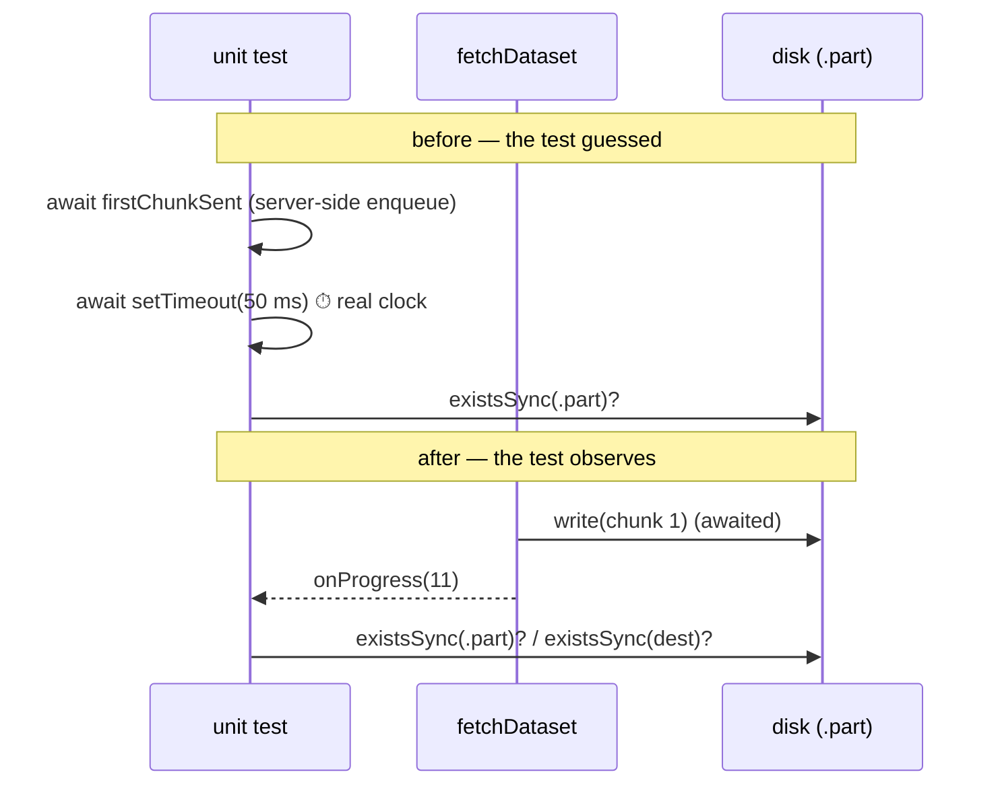

## Summary

`common/data_cache_test.ts` asserted the mid-flight state of an atomic download after a fixed
`await new Promise((resolve) => setTimeout(resolve, 50))` — a real wall-clock guess at how long the
runtime takes to pump the first chunk through `pipeTo`. That shape breaches the "Unit Tests vs
Benchmarks" rule in `AGENTS.md` (no real-time waits in the unit suite), and it held up
`deno test --parallel` on every CI run and every local `./quality.sh`.

Fix (a) from the issue: the test now observes the real event instead of guessing. `fetchDataset`
gained an optional `onProgress(bytesWritten)` callback — invoked once per chunk, after that chunk's
write to the `<path>.part` scratch file has been awaited, with the cumulative byte count. The
atomic-write test awaits the first report, then inspects the on-disk state. No clock is consulted
anywhere in the file. Closes #852.

Implementation detail: `response.body.pipeTo(file.writable)` became a chunk-by-chunk loop over the
body (`streamToFile`), so progress is reportable. Back-pressure is unchanged — each write is still
awaited before the next chunk is read — and any failure is rethrown so the caller still cleans up
the scratch file and falls through to the next mirror.



## Evidence

Backend/library change with no web interface to screenshot. Evidence is the test suite:

```
$ deno test --allow-net --allow-read --allow-write common/data_cache_test.ts
ok | 14 passed | 0 failed (37ms)
```

The whole file now completes in tens of milliseconds; it previously carried an unconditional 50 ms
sleep. `./quality.sh` passes end to end ("All examples passed!"), including `deno fmt`, `deno lint`,
`deno check` and the parallel unit run.

Red-before-green was observed: with the tests written first, `deno check` reported
`TS2353 … 'onProgress' does not exist in type 'FetchDatasetOptions'` (4 errors) against the unfixed
`common/data_cache.ts`, and the suite passed only after the seam was implemented.

## Test Plan

- **Modified**
  `common/data_cache_test.ts::fetchDataset writes atomically — final path never sees
  partial bytes`
  — the 50 ms sleep is replaced by `await Promise.race([firstChunkOnDisk,
  fetchPromise])`, where
  `firstChunkOnDisk` is resolved by `onProgress`. Racing the fetch promise keeps a failed download
  loud rather than hanging. Every original assertion is retained (final path absent mid-flight,
  `.part` present mid-flight, `.part` cleaned up, final bytes correct).
- **Added**
  `common/data_cache_test.ts::fetchDataset reports cumulative bytes written via
  onProgress` —
  happy path: reports are monotonically increasing, the last equals the total served bytes, and the
  final file holds every byte.
- **Added**
  `common/data_cache_test.ts::fetchDataset does not call onProgress when the URL is
  rejected` —
  error path: a `file://` URL rejects before any I/O, so no progress is reported.
- No test was removed, commented out, or weakened.
- Docs updated in the same change: the `common/data_cache.ts` behaviour list in `AGENTS.md` and a
  `### Changed` entry in `CHANGELOG.md`.
