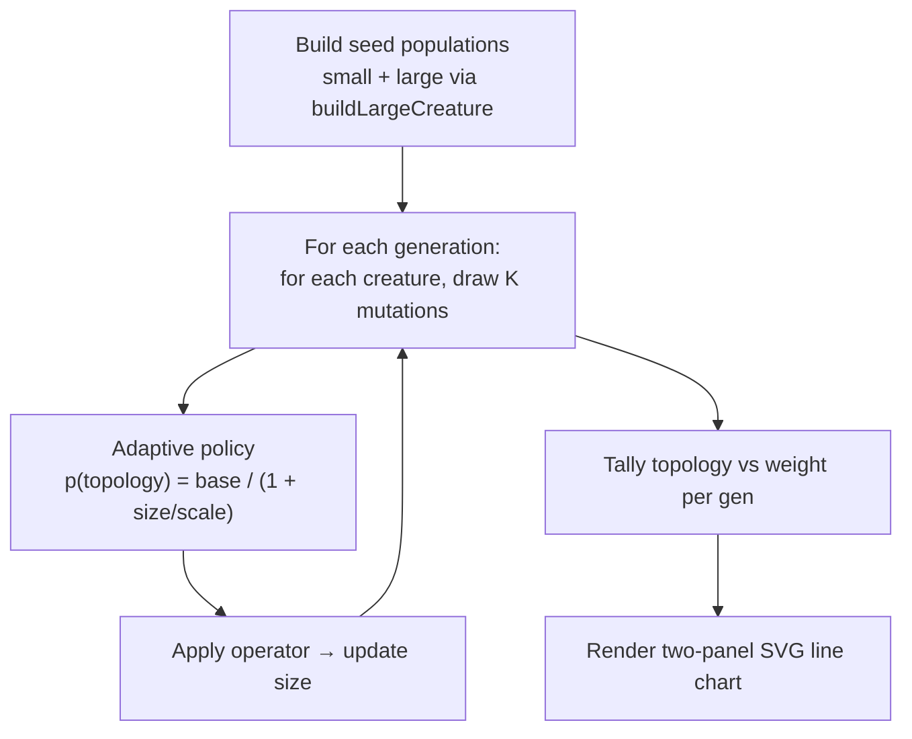

## Summary

Add an `adaptive_mutation/` example that visualises NEAT-AI's size-driven shift from topology
mutations (add/remove neuron/synapse) toward weight/bias mutations as a creature grows. Two
evolution loops run on the same synthetic task — one starting from a small creature (~5 hidden
neurons via `buildLargeCreature`), one starting from a large creature (~256 hidden, ~10k synapses
via `buildLargeCreature` defaults) — and each generation's topology vs weight share is rendered as a
two-panel line chart. Closes #86.

## Evidence

The demo is a deterministic CLI; the rendered SVG is the visual evidence. Sample output from a local
run on the default seed:

```
small initial size  hidden=5    synapses=24
large initial size  hidden=256  synapses=10255
small mean topology share = 0.3682
large mean topology share = 0.0052
shift (small - large)     = 0.3630
```

The mean topology share is **70× higher** in the small-creature run than in the large-creature run,
satisfying the issue acceptance criterion that "topology share is lower in the large-creature run
than in the small-creature run".




The whole demo runs in ~50ms — well under the 90-second budget specified in the issue.

## Test Plan

- Added `adaptive_mutation/adaptive_mutation_test.ts` with 21 tests covering:
  - `topologyProbability` is monotonically decreasing in size and rejects invalid policies.
  - `chooseOperator` is biased toward topology operators on tiny creatures and toward weight
    operators on huge creatures (statistical sampling, 1000 draws).
  - `applyOperator` updates hidden/synapse counts by the documented deltas and refuses to drop below
    1 hidden / 1 synapse.
  - `runSingleEvolution` records exactly `generations` records; `topologyRate + weightRate` always
    equals 1; total mutations per generation equals `mutationsPerGeneration × populationSize`.
  - `runAdaptiveMutationDemo` satisfies the acceptance criterion — small mean topology share
    strictly exceeds large mean topology share — and is byte-deterministic across reruns.
  - `renderAdaptiveMutationSVG` produces a well-formed SVG with both panels and four polylines
    (small + large × topology + weight); rejects empty / mismatched record arrays.
- Added `adaptive_mutation` to `EXAMPLE_DIRS` and the `Adaptive Mutation` example name to
  `readme_structure_test.ts` so the existing README structure tests cover the new directory.
- Wired the new runner into `quality.sh` (cleanup list + `run_example` call) so future quality runs
  exercise the demo end-to-end.
- Ran the new module's tests locally:
  `deno test --no-check --allow-read --allow-write --allow-env adaptive_mutation/` → 21 passed.
- Ran the example end-to-end: `./adaptive_mutation/run.sh` → completes in ~50ms; writes
  `docs/screenshots/adaptive_mutation.svg` and `.adaptive-mutation/output/adaptive_mutation.svg`.

## Notes

The "evolution" here is a deterministic mutation walk over creature sizes — no actual NEAT-AI
training pass is invoked. That keeps the demo self-contained, byte-deterministic, and well under the
90-second budget while still illustrating the size-driven shift the library performs internally.
This is the same approach used by `memetic_evolution/` and is consistent with the existing example
pattern.
