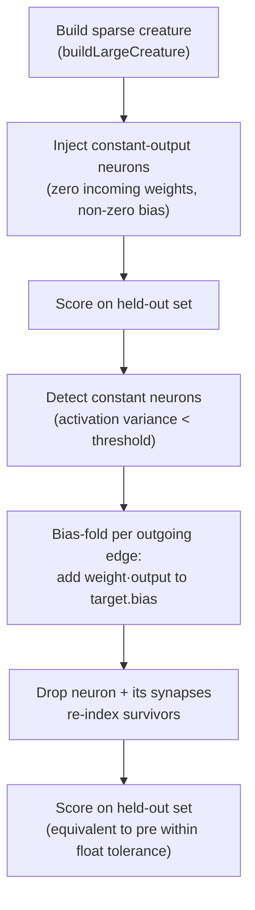

# Neuron Pruning Demo — Constant-Activation Removal With Bias Fold

## Summary

Adds a new `neuron_pruning/` example showing how NEAT-AI keeps large creatures lean by detecting
hidden neurons whose activations don't vary on a held-out dataset and folding their constant
contribution into the surviving downstream neurons' biases. The folded creature is mathematically
equivalent on the sampled records — score doesn't regress, neuron count drops. Closes #87.

The example follows the existing pattern (`synthetic_synapse/`, `crispr_injection/`, …):
`neuron_pruning.ts` with the algorithm, `svg.ts` with the renderer, `*_test.ts` with 20 unit tests,
`README.md` with the walkthrough, and `run.sh` as the runner. The SVG mirrors to
`docs/screenshots/neuron_pruning.svg` and `.neuron-pruning/output/neuron_pruning.svg`. The main
README, `readme_structure_test.ts`, and `quality.sh` are updated to register the new example.

## Evidence



End-to-end run output (default config: 4 inputs, 16 hidden, 2 outputs, 5 injected constants):

```
   pre-prune  neurons=22  score=-0.00369736
   post-prune neurons=17  score=-0.00369736
   delta      neurons=5   score=0.000

   pruned neurons (index → bias-fold targets):
     #8  (output=0.3679) → [9, 21]
     #11 (output=-0.6209) → [15, 21]
     #14 (output=0.5543) → [17, 20, 21]
     #16 (output=-0.5617) → [17]
     #18 (output=-0.3868) → [20]
```

Pre and post score match to 6 decimals, neuron count drops by 5, and every pruned neuron is audited
with its bias-fold targets. The rendered SVG sits at
[`docs/screenshots/neuron_pruning.svg`](screenshots/neuron_pruning.svg) and is also embedded in the
main README and the new `neuron_pruning/README.md`.

This is a CLI/library change with no web UI, so a Playwright screenshot is not applicable — the SVG
output and test results are the visual and behavioural evidence.

## Test Plan

20 new unit tests in `neuron_pruning/neuron_pruning_test.ts` covering:

- `forward` — finite outputs of correct shape, rejects mismatched input length.
- `injectConstantNeurons` — drops every incoming synapse on the chosen neurons; rejects oversized
  counts.
- `detectConstantNeurons` — flags zero-input hidden neurons as constant; rejects negative
  thresholds.
- `pruneConstantNeurons` — empty-input no-op, **bias-fold preserves forward outputs to
  floating-point** (the central correctness property), records bias-fold targets sorted ascending.
- `runNeuronPruningDemo` — strictly reduces neuron count, post-prune score does not regress within
  1e-4, deterministic for the same config, rejects invalid config values, finite scores.
- `cloneNetwork`, `heldOutScore`, `DEFAULT_NEURON_PRUNING_CONFIG` sanity checks.
- `renderNeuronPruningSVG` — well-formed SVG with topology + summary + legend, rejects inconsistent
  topology, byte-deterministic.

Quality gate verified locally:

- `deno lint` — clean (101 files).
- `deno fmt --check` — clean (195 files).
- `deno check **/*.ts` — clean.
- `deno test` — **672 passed, 0 failed**.
- `./neuron_pruning/run.sh` — runs in ~25 ms, generates the SVG, prints the per-neuron audit.
