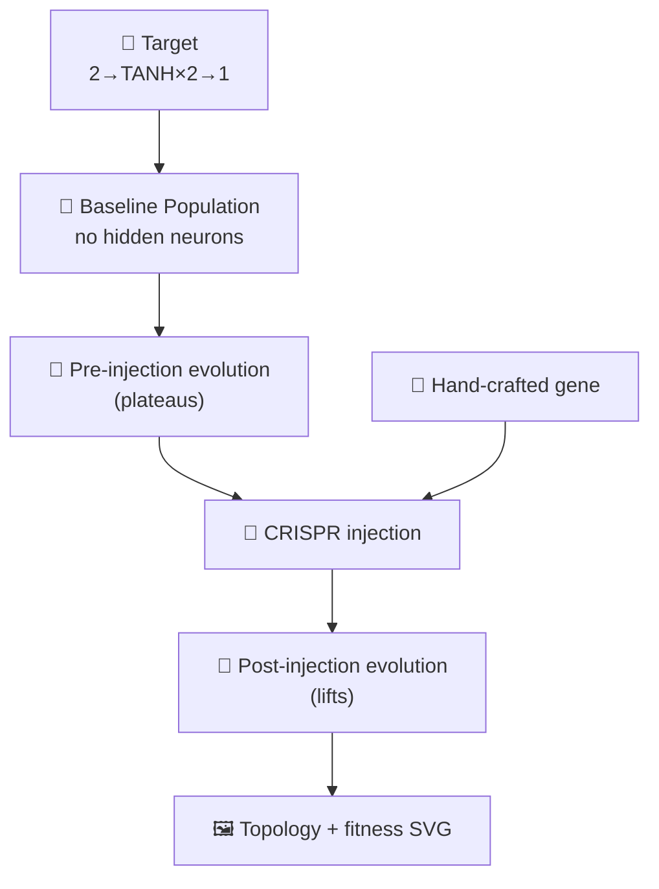

# Add CRISPR gene injection demo

## Summary

Adds a new `crispr_injection/` worked example that demonstrates a structural intervention unique to
NEAT-style neuroevolution: a hand-crafted "edit gene" — two TANH hidden neurons with their input and
output synapses — is spliced directly into a stalled population mid-evolution, after which fitness
lifts sharply because the missing topology now has weights to tune. Random weight mutation alone
cannot construct this structure quickly because the absent neurons have no path to follow;
CRISPR-style injection bypasses that by inserting the structure wholesale. The runner emits a
combined SVG with the gene's topology in the top panel and the fitness-vs-generation curve (with a
vertical injection marker) below. Closes #88.

## Evidence

The change is a backend/CLI example — there is no web UI to capture. Evidence is provided by the
embedded SVG snapshot and the unit tests.

## Test Plan

Added `crispr_injection/crispr_injection_test.ts` with 14 "what" tests covering:

- `createTargetCreature` builds a valid 2→TANH×2→1 creature whose hidden UUIDs match the gene.
- `createBaselineJSON` has zero hidden neurons and produces deterministic weights for the same seed.
- `injectGene` adds the gene's hidden neurons, preserves host synapses, is idempotent under
  re-injection, does not mutate the host JSON, and yields a creature that validates.
- `mutateMember` perturbs synapse weights without altering structure.
- `runCrisprExperiment` records one entry per pre-generation + the injection generation + one per
  post-generation, lifts best fitness post-injection above the at-injection value, retains at least
  one gene UUID in a descendant, and is deterministic for the same seed.
- `runCrisprExperiment` rejects invalid configurations.
- `renderCrisprSVG` produces a well-formed SVG containing the gene topology group and the injection
  marker, and throws on empty input.
- `createGene` returns the canonical TANH neuron pair.

Updated `readme_structure_test.ts` and `docs/archive_test.ts` to register the new example directory,
screenshot path, and PR summary file. The full `./quality.sh` pipeline (lint, format, type check,
unit tests, every example runner) passes.
