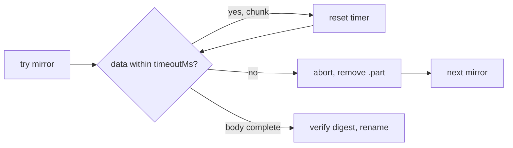

# PR Summary — fetchDataset stall timeout (#886)

## Summary

Closes #886

Before this change, `fetchDataset` called `fetch(url, { redirect: "error" })` without an abort
signal. A mirror that accepted the connection and then never sent anything left the call hanging
forever, and the next mirror was never tried.

Each mirror attempt now has a **stall timeout**. The attempt is aborted when no data arrives for
`timeoutMs`, which defaults to `DEFAULT_TIMEOUT_MS = 60_000`. That covers waiting for the response
headers and the gaps between body chunks. The failure goes through the existing per-URL `catch`, so
the next mirror is tried and the final error lists every URL. The `.part` scratch file is removed.

**Design choice:** I did not use a whole-request `AbortSignal.timeout(60_000)`. The issue itself
notes the risk that such a cap would abort a slow but healthy download of a large dataset. Instead
the timer resets on every chunk received, so a download that keeps making progress is never cut off.

- [x] Optional `timeoutMs` option, validated as a positive finite number before any network I/O.
- [x] The timer is cleared in `finally` for every mirror, so no timers leak (Deno's sanitiser
      passes).
- [x] Documented in the `fetchDataset` JSDoc and in the `common/data_cache.ts` section of
      `AGENTS.md`.

## Evidence

`deno test -A common/data_cache_test.ts`: **19 passed, 0 failed**. Five of these tests are new, and
all of them test behaviour against the local test server:

| Test                                     | What it proves                                                   |
| ---------------------------------------- | ---------------------------------------------------------------- |
| fails over when a mirror never responds  | A mirror that sends no headers is abandoned; the next one wins.  |
| fails over when a mirror stalls mid-body | A body that stops mid-stream is abandoned; no `.part` remains.   |
| names the timeout when the only mirror…  | The error reports `no data received for 50 ms`.                  |
| rejects a non-positive timeout…          | `0`, `-1`, `NaN` and `Infinity` are rejected with zero requests. |
| keeps a slow download that never stalls  | 8 chunks 25 ms apart finish under a 150 ms stall timeout.        |

The slow-download test fails if the timer is not reset on each chunk, which is how a whole-request
cap would behave. That confirms it guards the issue's stated risk.

`./quality.sh`: **passed** ("All examples passed!").

## Test Plan

- `deno test -A common/data_cache_test.ts < /dev/null`
- `./quality.sh < /dev/null`

## Security self-check

- [x] Input validation: `timeoutMs` is type- and range-checked before use.
- [x] No secrets or hidden files staged.
- [x] No new injection surface; URL validation (#420) is unchanged and still runs first.
- [x] Error messages name only the URL and the timeout, with no internal state.
- [x] No new dependencies. It uses the built-in `AbortController` and `setTimeout`.
