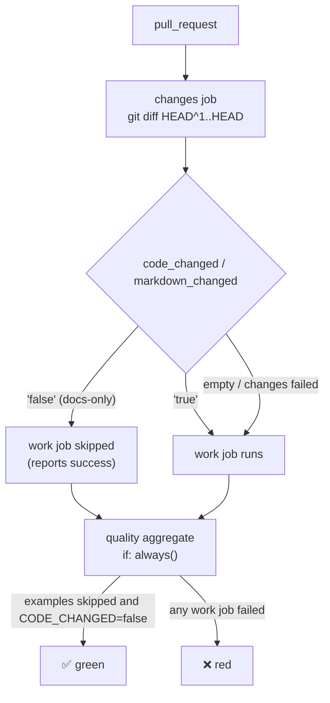

## Summary

Eight PR-gate workflows ran their full suites on every pull request, including one that touches only
Markdown or images. Now a cheap `changes` job classifies the PR's changed paths, and the expensive
work jobs are gated on its verdict. Closes #888.

- **New `.github/actions/detect-changes`** is a composite action. It diffs the PR merge commit
  against its first parent (`HEAD^1..HEAD`, `fetch-depth: 2`, no token) and feeds the path list to
  `.github/scripts/detect_code_changes.sh`.
  - `code` mode reports `false` only when every path is docs (`*.md`, images, `LICENSE`).
  - `markdown` mode reports `true` when any `*.md` path changed, or the markdownlint config, its
    workflow or the classifier itself.
  - Any event other than `pull_request` (schedule, `workflow_dispatch`) always reports `true`.
- **Gated jobs:**
  - `actionlint`, `deno-audit`, `dependency-review`, `semgrep` and `shellcheck` skip on docs-only
    PRs.
  - `markdown-lint` skips when no Markdown changed.
  - In `quality.yml`, `examples` skips on docs-only PRs. `unit-tests` still runs, but its Rust
    scorer build steps are skipped, so it falls back to the JS scorer.
- **The fail-safe gate is**
  `if: ${{ !cancelled() && needs.changes.outputs.code_changed != 'false' }}`. Only a positive
  `'false'` verdict skips a job. A failed or empty classification still runs the work.
- **Required checks stay green:**
  - A job skipped by `if:` reports success. A workflow-level `paths:` filter would leave a required
    check pending forever, so none is used.
  - The aggregate `quality` job keeps `if: ${{ always() }}` (#677). It accepts a skipped `examples`
    only when `CODE_CHANGED == "false"`.

> **Deliberate deviations**
>
> - **`static-checks` stays ungated.** It takes about 14 s, and `deno fmt` formats Markdown too, so
>   a docs-only PR still needs it.
> - **`unit-tests` still runs on docs-only PRs.** The docs-contract tests read the Markdown (README
>   tables, PR-summary archive), so they are exactly what a docs PR can break. Only the Rust scorer
>   build is skipped; the tests use the JS scorer (`ensure_rust_scorer_supports_cost` returns 0 when
>   the binary path is empty).
> - **`gitleaks` stays ungated.** A secret can be pasted into a doc as easily as into code, and the
>   scan is cheap.

## Evidence

- `deno test --allow-all .github/`: `ok | 138 passed (50 steps) | 0 failed`.
  - Seven new classifier tests in `.github/detect_code_changes_test.ts` cover docs-only, mixed,
    empty-input fail-safe, markdown mode and unknown-mode fail-loud.
  - `quality_workflow_test.ts` now pins the `changes` job, the examples gate, and the aggregate's
    `always()` and `needs`.
  - The existing workflow policy tests (SHA pins, timeouts, `persist-credentials`, strict-mode
    `run:` blocks, npm lifecycle scripts) now cover the new composite action and jobs.
- `actionlint`: clean. `shellcheck .github/scripts/detect_code_changes.sh`: clean.
- `deno fmt --check .github`: clean.
- `./quality.sh`: exit 0, `ok | 1453 passed (54 steps) | 0 failed`, "All examples passed!".

## Test Plan

- [x] Classifier unit tests pass (docs-only → `false`; any code path → `true`; empty → `true`).
- [x] Workflow structure tests pass for `quality.yml`.
- [x] actionlint and shellcheck are clean.
- [x] `./quality.sh` passes.
- [ ] On this PR (it changes code), every gated job runs.
- [ ] On a later docs-only PR, gated jobs show as skipped and the required checks are green.
