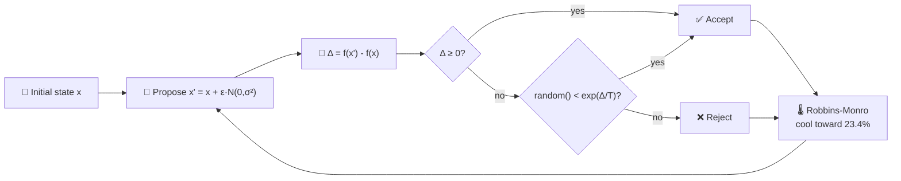

# Add MCMC Mutation Acceptance Demo (Issue #89)

## Summary

Adds a new `mcmc_acceptance/` worked example that visualises NEAT-AI's Metropolis-Hastings mutation
acceptance dynamics: probabilistically accepting worse-fitness moves with a cooling temperature
schedule, with the moving-average acceptance rate converging toward the canonical **23.4%** optimum
from Roberts/Gelman/Gilks (1997). Closes #89.

The runner walks a synthetic 10-dimensional quadratic fitness landscape using an MH proposal kernel
and a Robbins-Monro temperature controller that cools on accepts and warms on rejects. It records
every proposal (`accepted`, `temperature`, `Δfitness`) and renders a dual-axis SVG to
`docs/screenshots/mcmc_acceptance.svg`.

## How It Works



## Evidence

This is a backend/CLI example with no web UI. Verified by:

- `./quality.sh` passes end-to-end (lint, fmt, type check, all tests, every example runner including
  the new one).
- `mcmc_acceptance/mcmc_acceptance_test.ts` covers 10 "what" tests: proposal record shape,
  determinism for a fixed seed, acceptance rate bounds, late-window convergence to 23.4%,
  moving-average correctness and edge cases, SVG well-formedness, target-line presence, and
  empty-input rejection.
- Sample run summary (default seed):

  ```
  iterations          = 4000
  target acceptance   = 23.4%
  final acceptance    = 23.0%
  best fitness        = -0.3309
  final temperature   = 0.8548
  ```

- The committed SVG `docs/screenshots/mcmc_acceptance.svg` shows the blue moving-average acceptance
  line settling onto the green dashed 23.4% target while the orange temperature curve climbs from
  `T₀ = 0.01` toward equilibrium.


## Test Plan

- [x] `deno test mcmc_acceptance/` — 10/10 pass.
- [x] `deno fmt --check` — clean.
- [x] `deno lint` — clean.
- [x] `deno check **/*.ts` — clean.
- [x] `./mcmc_acceptance/run.sh` — emits the SVG and prints the acceptance/temperature summary.
- [x] `./quality.sh` — full suite passes (all 12 examples, including the new MCMC demo).

## Files Added / Modified

- **Added** `mcmc_acceptance/mcmc_acceptance.ts` — adaptive MH sampler with Robbins-Monro
  temperature controller.
- **Added** `mcmc_acceptance/svg.ts` — dual-axis chart renderer.
- **Added** `mcmc_acceptance/mcmc_acceptance_test.ts` — unit tests.
- **Added** `mcmc_acceptance/README.md` — explanation of MH and the 23.4% optimal acceptance result.
- **Added** `mcmc_acceptance/run.sh` — runner script.
- **Added** `docs/screenshots/mcmc_acceptance.svg` — committed chart.
- **Modified** `README.md` — adds the new example to the table, the screenshots gallery, and both
  Mermaid diagrams.
- **Modified** `quality.sh` — wires the new runner into the pipeline and cleans up
  `.synthetic-mcmc/` between runs.
- **Modified** `readme_structure_test.ts` — adds `mcmc_acceptance` to the example-directory and
  screenshot-path lists.
