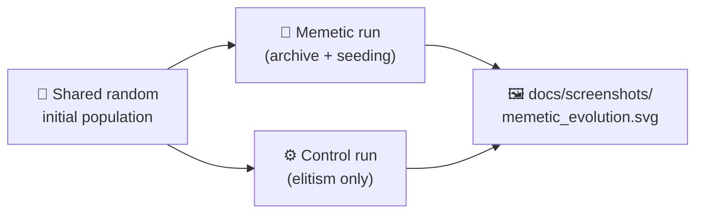

## Summary

Adds a `memetic_evolution/` example that demonstrates **memetic seeding**: maintaining an archive of
the fittest creatures' weights and biases, then re-seeding future generations from that archive. The
example runs two evolutions on the same synthetic weight-tuning task — one with memetic seeding, one
without (the control) — and renders both fitness curves overlaid so the advantage of the curated
archive is visible at a glance.

Closes #90.

## Evidence

The change is a new CLI / Deno example with an SVG output (no web UI to screenshot via Playwright).
Test results and the rendered chart serve as the evidence:

- All 22 new unit tests in `memetic_evolution/memetic_evolution_test.ts` pass.
- The full `./quality.sh` pipeline passes — lint, format check, type check, all unit tests, and
  every example runner including the new Memetic Evolution Demo.
- On the canonical default seed the runner reports `final memetic fitness = -0.00110` vs
  `final control fitness = -0.00464` (≈ 4× lower mean-squared error, a clear margin in favour of
  memetic seeding).
- The committed SVG `docs/screenshots/memetic_evolution.svg` shows the two curves overlaid with
  green dashed vertical markers at every memetic seeding generation.

## Test Plan

- [x] `deno test --no-check --allow-read --allow-write --allow-env memetic_evolution/` — 22/22 pass,
      covering forward pass, dataset generation, mini-batch sampling, weight mutation, full
      memetic-vs-control comparison (matched lengths, deterministic, memetic outperforms by a
      measurable margin, memetic ≥ control − tolerance), invalid-config rejection, and SVG
      well-formedness.
- [x] `deno test --no-check --allow-read --allow-write --allow-env readme_structure_test.ts` —
      passes the updated example registry and screenshot list checks.
- [x] `deno test --no-check --allow-read --allow-write --allow-env docs/archive_test.ts` — passes
      (`pr-summary-90.md` and the orphaned `pr-summary-94.md` added to the allowlist).
- [x] `./quality.sh` — passes end-to-end (lint, fmt, type-check, all unit tests, every example
      runner including the new Memetic Evolution Demo).

### Files added

- `memetic_evolution/memetic_evolution.ts` — core algorithm (forward pass, dataset, archive,
  comparison runner).
- `memetic_evolution/svg.ts` — dual-curve fitness chart renderer with seeding markers.
- `memetic_evolution/memetic_evolution_test.ts` — 22 "what" tests covering happy / error / edge-case
  paths.
- `memetic_evolution/run.sh` — runner that emits `docs/screenshots/memetic_evolution.svg`.
- `memetic_evolution/README.md` — explains memetic seeding, the synthetic task, and how it differs
  from elitism alone.
- `docs/screenshots/memetic_evolution.svg` — committed deterministic chart.

### Files updated

- `README.md` — adds the Memetic Evolution example to the table, screenshots section, and the two
  architecture mermaid diagrams.
- `quality.sh` — invokes `./memetic_evolution/run.sh` and includes `.synthetic-memetic-evolution` in
  the cleanup list.
- `readme_structure_test.ts` — registers the new directory, screenshot path, and "Memetic Evolution"
  name.
- `docs/archive_test.ts` — adds `pr-summary-90.md` and `pr-summary-94.md` to the allowlist.
