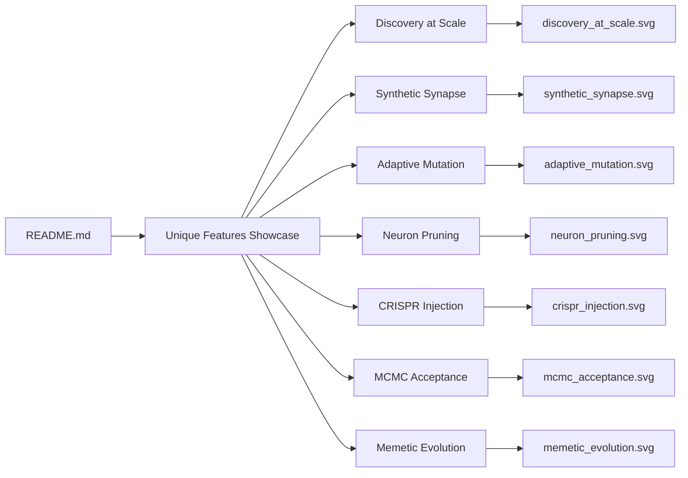

## Summary

Added a "🌟 Unique Features Showcase" section to the root `README.md` so visitors can find
demonstrations of NEAT-AI's distinctive capabilities at a glance. The section is a four-column table
(Feature, Demo, What it shows, Screenshot) with one row per consolidated unique-feature demo:
Discovery at Scale, Synthetic Synapse, Adaptive Mutation, Neuron Pruning, CRISPR Injection, MCMC
Acceptance, and Memetic Evolution. Each row links to the per-example README and embeds the example's
existing `docs/screenshots/*.svg`. Closes #91.

## Evidence

This is a documentation-only change. The behaviour is verified by new structural tests in
`readme_structure_test.ts` rather than a screenshot:

- `README.md has a Unique Features Showcase section` — confirms the new heading is present.
- `Unique Features Showcase row exists for <name>` — one assertion per demo, confirming both the
  per-example README link and the embedded screenshot live within the showcase section slice.
- `Unique Features Showcase screenshot <path> exists on disk` — one assertion per demo, confirming
  each referenced SVG is a non-empty committed file.

Quality gate (`deno lint`, `deno fmt --check`, `deno check`, `deno test`) passes with 849 unit tests
green.

## Test Plan

- `readme_structure_test.ts` — added the `UNIQUE_FEATURE_SHOWCASE` table and one row of assertions
  per entry covering: showcase heading present, per-example link present in the showcase slice,
  screenshot embedded in the showcase slice, and screenshot exists on disk.
- All existing assertions in `readme_structure_test.ts` continue to pass; no test was removed or
  weakened.
