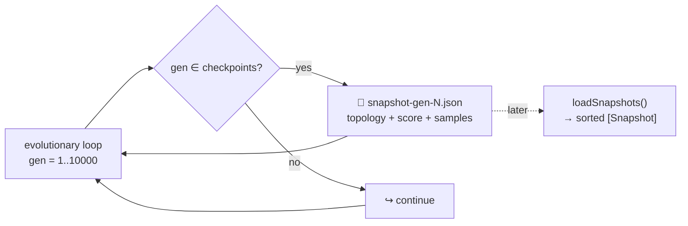

## Summary

Added `common/evolution_snapshot.ts`, a shared helper that captures creature state (topology, score,
optional sample outputs) at configurable generation checkpoints (default
`[1, 10, 100, 1000, 10000]`). Every evolutionary example can now produce snapshot data in a single
consistent format for the upcoming evolution-progression visualisation. Snapshots are
byte-deterministic — no timestamps, no run-specific paths — so reruns with the same seed produce
identical files. Closes #93.

## Evidence

Backend / CLI change — no UI to screenshot. Verified by the new `common/evolution_snapshot_test.ts`
"what" tests, all of which pass under `deno test`:

```
running 5 tests from ./common/evolution_snapshot_test.ts
captureSnapshot writes a file for each checkpoint generation ... ok
captureSnapshot writes nothing for non-checkpoint generations ... ok
loadSnapshots round-trips captureSnapshot output sorted by generation ... ok
captureSnapshot is reproducible — identical inputs yield byte-identical files ... ok
loadSnapshots returns an empty array for a missing or empty directory ... ok
ok | 5 passed | 0 failed
```



## Test Plan

- Added `common/evolution_snapshot_test.ts` with five "what" tests:
  - **Happy path** — capture at gen 1, 10, 100; assert the three files exist with correct contents
    (including `sampleOutputs`).
  - **Skip non-checkpoint generations** — gen 2, 7, 999 produce no files and return `null`.
  - **Round-trip** — `loadSnapshots` reads back what `captureSnapshot` wrote, sorted by generation
    regardless of write order.
  - **Reproducibility** — two independent capture sequences with the same inputs produce
    byte-identical files.
  - **Missing directory** — `loadSnapshots` on a missing/empty directory returns `[]`.
- Updated `AGENTS.md` to list the new helper under "📦 Shared Utilities" and in the project
  structure.
- Added `pr-summary-93.md` and `pr-summary-88.md` (pre-existing leftover) to the
  `docs/archive_test.ts` allowlist.
- No new third-party dependencies introduced — uses `@std/fs` and `@std/path` already in
  `deno.json`.
