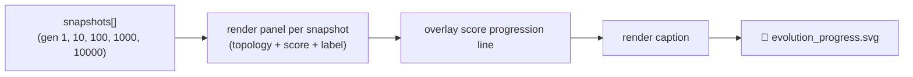

# PR Summary — Issue #94

## Summary

Adds `common/evolution_progress_svg.ts`, a shared multi-panel animated SVG renderer that consumes
`Snapshot[]` (from `common/evolution_snapshot.ts`) and emits a horizontal strip — one panel per
snapshot — visualising how the network and its score evolved from the first checkpoint generation
through to the last. Each panel renders a small network topology diagram (inputs → hidden →
outputs), a generation label (e.g. "Gen 1", "Gen 10000"), and the score formatted to a configurable
precision. A score-progression polyline links the panels, an optional caption summarises the run
(final score, total generations, wall-clock time), and SMIL `<animate>` elements pulse each panel's
background in sequence so the eye is led from gen 1 → gen 10000. Output is byte-deterministic for
identical inputs and adds no third-party dependencies. Closes #94.

## Evidence

This is a backend/CLI change with no web UI to screenshot. Evidence:

- **Validation**: the rendered SVG passes `xmllint --noout` (well-formed XML).
- **Unit tests**: seven "what" tests in `common/evolution_progress_svg_test.ts` cover the four
  acceptance-criteria cases plus three additional scenarios (caption overlay, SMIL `<animate>`
  sequencing, defensive handling of `nodes`/`connections` aliases). The full suite of 575 tests
  passes under `deno test`.
- **Quality gate**: `deno fmt --check`, `deno lint`, and `deno check **/*.ts` all pass.

## Test Plan

Tests added in `common/evolution_progress_svg_test.ts`:

- `happy path emits one panel per snapshot with generation labels` — three fixture snapshots produce
  three `<g class="panel">` groups and the expected "Gen N" labels.
- `empty snapshot list raises a clear error` — the renderer throws an `Error` mentioning "at least
  one snapshot".
- `score progression polyline endpoints match first and last scores` — parses the polyline `points`
  attribute and asserts that the endpoints match the min/max Y values within rounding tolerance.
- `caption overlay summarises the run when supplied` — caption fields for final score, total
  generations, and wall-clock time appear in the rendered output.
- `SMIL <animate> sequences panel highlights` — at least one `<animate>` element per panel.
- `deterministic — identical input yields byte-identical SVG` — two renders with the same input
  produce byte-identical strings.
- `handles creature JSON with 'nodes'/'connections' aliases` — the renderer accepts both the
  `neurons`/`synapses` and `nodes`/`connections` shapes without producing `NaN`.

Documentation updated in `AGENTS.md` under "📦 Shared Utilities" with a usage example.
