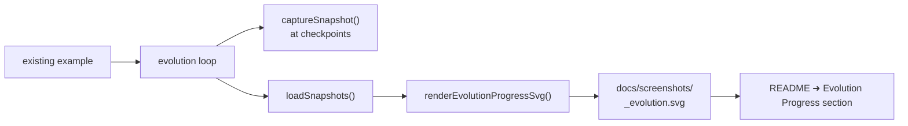

## Summary

Wired the `common/evolution_snapshot.ts` capture utility and `common/evolution_progress_svg.ts`
renderer into the three existing evolutionary examples — `xor_classification/`, `cart_pole/`, and
`lunar_lander/` — so each example now produces a multi-panel evolution-progression SVG alongside its
existing artefacts. Closes #95.

Each example:

- Adds an optional `snapshotConfig` field to its `EvolveOptions`. When supplied, the running
  champion is captured at every checkpoint generation in `snapshotConfig.checkpoints` (no-op
  otherwise). Tests and other callers that omit the field see no behavioural change.
- Configures checkpoints `[1, 10, 100, 500]` for XOR and cart-pole, and `[1, 10, 100, 1000]` for
  lunar lander, per the issue spec.
- After the run, loads the snapshots via `loadSnapshots(...)`, renders the progression strip via
  `renderEvolutionProgressSvg(...)`, and writes the result to
  `docs/screenshots/<example>_evolution.svg`.

Cart-pole's runner additionally suppresses the early-on-solve `break` when `snapshotConfig` is
supplied, so the strip captures more than a single panel even when the linear policy hits
`MAX_STEPS` on the first generation. Existing callers (no `snapshotConfig`) retain the original
early-stop behaviour.

## Evidence

The change is purely backend/CLI — it produces new SVG artefacts and updates documentation. No web
interface to screenshot. Generated artefacts:

- `docs/screenshots/xor_classification_evolution.svg` (2 panels — gen 1 & 10; XOR typically solves
  before generation 100).
- `docs/screenshots/cart_pole_evolution.svg` (2 panels — gen 1 & 10; cart-pole solves immediately
  with the default seed and `snapshotConfig` keeps the loop running until the next checkpoint).
- `docs/screenshots/lunar_lander_evolution.svg` (2 panels — gen 1 & 10; default `maxGenerations` is
  60).

Quality gate: `./quality.sh` runs cleanly end-to-end (lint, fmt, type check, 675 unit tests across
the suite, and every example runner). The new "what" tests in each example assert the snapshot files
are written and that the rendered SVG embeds one `<g class="panel"`> per captured snapshot.

## Test Plan

- `xor_classification/xor_classification_test.ts::evolveXorController writes evolution
  snapshots and the strip SVG embeds one panel per snapshot`
  — runs the evolver with a small population and `errorThreshold: -1` so all configured checkpoints
  fire, then asserts each `snapshot-gen-N.json` exists and the rendered SVG contains the expected
  number of panel groups.
- `cart_pole/cart_pole_test.ts::evolveCartPoleController writes evolution snapshots and the
  strip SVG embeds one panel per snapshot`
  — runs with a tiny population and weak mutation so the loop does not solve early before all
  checkpoints fire, then asserts on snapshot files and SVG panel count.
- `lunar_lander/lunar_lander_test.ts::evolveLanderController writes evolution snapshots and
  the strip SVG embeds one panel per snapshot`
  — same shape as the cart-pole test, adapted to the lunar-lander API.
- `docs/archive_test.ts` — added `pr-summary-87.md` (stale from a prior merge) and
  `pr-summary-95.md` to the allowlist so the existing "no unexpected PR summary file" test stays
  green.
