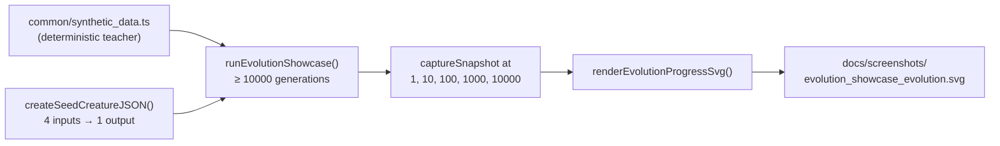

# Add `evolution_showcase/` — long-running flagship example

## Summary

Adds a new `evolution_showcase/` directory containing a deliberately long-running flagship example
that evolves a NEAT-AI learner for **10000 generations** against a deterministic non-linear
regression target and renders all five canonical checkpoints — gen 1 / 10 / 100 / 1000 / 10000 — as
a single multi-panel SVG strip via the existing `common/evolution_progress_svg.ts` renderer. The
seed creature has no hidden capacity at all (4 inputs wired straight to a single output); by gen
10000 the network has grown visibly larger and approximates the teacher far more closely.

Closes #96.

## Evidence

The committed flagship SVG — `docs/screenshots/evolution_showcase_evolution.svg` — captures the
gen-1-vs-gen-10000 contrast at a glance. Topology and score across the five checkpoints from the
canonical run:

| Checkpoint | Neurons | Synapses | Score  |
| ---------- | ------- | -------- | ------ |
| Gen 1      | 5       | 4        | -4.789 |
| Gen 10     | 6       | 6        | -1.401 |
| Gen 100    | 9       | 15       | -0.674 |
| Gen 1000   | 14      | 26       | -0.626 |
| Gen 10000  | 19      | 37       | -0.602 |

Score improvement ≈ 8x, neuron count ≈ 4x, synapse count ≈ 9x — exactly the visible network growth
and score lift the renderer was designed to surface.

`./quality.sh` passes end-to-end without invoking the long run — the showcase is deliberately not
wired into `quality.sh` per the issue requirements.

## Test Plan

Added `evolution_showcase/evolution_showcase_test.ts` with seven "what" tests, all passing in under
60 ms total (well below the 120-second per-test budget):

- `createTeacherCreature has the expected I/O width and is non-trivial` — verifies the regression
  target has hidden capacity.
- `createSeedCreatureJSON is a tiny baseline with no hidden capacity` — verifies the learner starts
  with zero hidden neurons.
- `prepareDataset writes synthetic .bin files and round-trips via loadDataset` — verifies the
  deterministic dataset pipeline.
- `scoreOnDataset returns 0 for an empty dataset and finite values otherwise` — covers both happy
  and edge paths.
- `runEvolutionShowcase captures snapshots at every abbreviated checkpoint` — runs a 10-generation
  showcase and asserts snapshots exist at `[1, 5, 10]`.
- `snapshots from a fast run can be rendered into a multi-panel SVG` — verifies integration with
  `renderEvolutionProgressSvg` and panel count.
- `evolution improves the score from the seed to gen 10` — regression test guarding monotonic
  fitness across snapshots.

`readme_structure_test.ts` was extended to register the new example and its committed screenshot in
`EXAMPLE_DIRS`, `SCREENSHOT_PATHS`, and the named-examples list, so future structural changes are
automatically validated.

## Acceptance criteria coverage

- [x] `evolution_showcase/` directory exists with `evolution_showcase.ts`,
      `evolution_showcase_test.ts`, `run.sh`, and `README.md`.
- [x] Unit test completes in well under 120 seconds (52 ms total) using abbreviated checkpoints
      `[1, 5, 10]`.
- [x] Full-length run produces snapshots at `[1, 10, 100, 1000, 10000]` and renders
      `docs/screenshots/evolution_showcase_evolution.svg` showing visible network growth and score
      improvement across panels.
- [x] SVG is committed so visitors can preview it without running the example.
- [x] `./quality.sh` passes end-to-end without the long run.
- [x] Top-level `README.md` lists the example with a "long-running" flag and embeds the SVG in the
      Screenshots section.
- [x] Reuses `common/evolution_snapshot.ts` and `common/evolution_progress_svg.ts` — no bespoke
      snapshot or render code.
