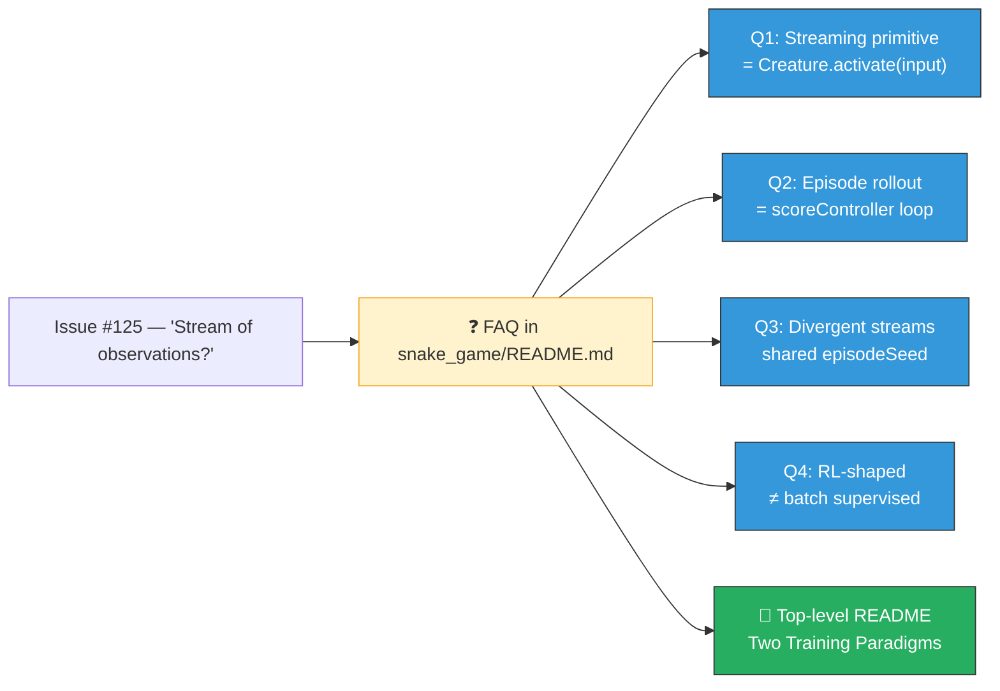

## Summary

Adds an **❓ FAQ — Streaming observations vs batch supervised training** section to
`snake_game/README.md`, just above **🧠 Tacit Knowledge**, that answers the four conceptual
questions raised in [#125](https://github.com/stSoftwareAU/NEAT-AI-Examples/issues/125):

1. Is the NEAT-AI API set up for a stream of observations? — `Creature.activate(input)` is the
   per-tick streaming primitive.
2. How is this normally done? — episode rollout, with `scoreController` as the canonical 15-line
   implementation.
3. Does each creature get a different observation stream? — yes, divergent trajectories from a
   shared per-generation seed (`episodeSeed`).
4. Is this different from "20 GiB of training data"? — yes; this is RL-shaped rather than batch
   supervised.

The new section cross-links to the top-level
[**🧭 Two Training Paradigms**](../README.md#-two-training-paradigms--supervised-vs-agent-evolution)
section added in #126, anchoring the answers in the canonical worked example so future readers find
them where they would naturally look. Closes #128.

The PR also picks up two pre-existing repository hygiene fixes that were blocking the quality gate:

- `docs/pr-summary-112.md` re-flowed by `deno fmt` (it was failing the format check).
- `docs/archive_test.ts` allowlist extended to include the existing `pr-summary-91.md`,
  `pr-summary-112.md`, `pr-summary-132.md`, and the new `pr-summary-128.md`.

## Evidence

Documentation-only change — no UI or performance impact to capture. Verified by the new
`snake_game/readme_faq_test.ts` (8 tests, all passing) plus the unchanged `readme_structure_test.ts`
and `mermaid_diagrams_test.ts` suites.

## Test Plan

- New `snake_game/readme_faq_test.ts` covers:
  - FAQ heading exists and sits before the **Tacit Knowledge** heading.
  - Each of the four questions appears with the key terms (`Creature.activate`, `scoreController`,
    `seed`, `Reinforcement Learning`, `training data`).
  - The section cross-links to `../README.md` (relative link, optionally anchored).
  - Word count for the section stays under 400 words.
- Existing `readme_structure_test.ts`, `readme_paradigms_test.ts`, and `mermaid_diagrams_test.ts`
  continue to pass — the snake README still begins with a level-1 heading, mentions `run.sh`, and is
  still linked from the top-level README.
- `deno lint`, `deno fmt --check`, `deno check **/*.ts`, and the full `deno test` suite (857 tests)
  pass cleanly.
