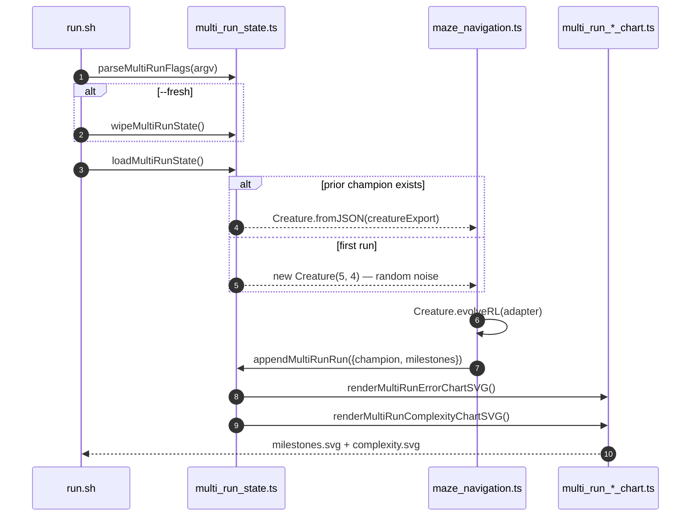

## Summary

Wires `maze_navigation` to the multi-run persistence helpers from
[`common/multi_run_state.ts`](../common/multi_run_state.ts) and the aggregate chart renderers from
[`common/multi_run_error_chart.ts`](../common/multi_run_error_chart.ts) /
[`common/multi_run_complexity_chart.ts`](../common/multi_run_complexity_chart.ts). The first
invocation seeds evolution from random noise; subsequent invocations reload the saved champion via
`Creature.fromJSON` and append fresh milestones to the merged history with a
monotonically-increasing `cumulativeGen`. Both chart SVGs are re-rendered after every run.

Closes #322.

### Behaviour changes

- New `--fresh`, `--timeout=<minutes>`, `--target-error=<value>` flags (parsed via
  `parseMultiRunFlags`). Defaults: 5-minute timeout, target error 0.01.
- Replaces the unconditional `new Creature(INPUT_COUNT, OUTPUT_COUNT)` seed with a load-or-create
  flow. The library's seed creature is built via `Creature.fromJSON(creatureExport)` when prior
  multi-run state exists, otherwise the uniform-random minimal genome is used.
- New persisted artefacts under `docs/data/maze_navigation/` (champion JSON + merged milestones
  JSON) and `docs/screenshots/maze_navigation/` (error + complexity SVGs).
- Retires the legacy single-run `docs/screenshots/maze_navigation_milestones.svg` (superseded by the
  new multi-run error chart).
- Adds a `MAZE_QUICK=1` env override (mirroring `LUNAR_QUICK=1`) so `quality.sh` runs the example
  with `iterations: 3` under a temp directory — the committed canonical artefacts are never
  overwritten by a CI run.

### Test plan

- New unit tests in `maze_navigation/maze_navigation_test.ts`:
  - `multi-run chart paths sit under the maze_navigation slug directory`
  - `milestoneToMultiRunSample maps reward into error and copies topology`
  - `milestoneToMultiRunSample clamps error into [0, 1]`
  - `evolveMazeController honours seedCreatureExport — accepts the export and produces a valid run`
  - `runMultiRunMaze resume flow loads prior creature, appends milestones, and renders charts` — the
    explicit resume-path test required by the issue: pre-seeds state via `appendMultiRunRun`, drives
    `runMultiRunMaze` with `iterations: 1` and a `baseDir` override, then asserts that
    `outcome.resumed === true`, the new run's milestones land at `runIndex === 2`, `cumulativeGen`
    is monotonic, and both chart SVGs are written.
  - `runMultiRunMaze --fresh wipes prior artefacts before running`
- Updated the legacy `MILESTONE_SVG_PATH points at the documented milestone chart` test to assert on
  the new multi-run constants (the path constant itself was removed).
- All 46 maze_navigation tests pass; `deno fmt`, `deno lint`, `deno check **/*.ts` clean.

### Evidence

The committed artefacts are from real evolution runs (5-minute first run + a 1-minute resume run on
a commodity laptop). Final merged history: **21 milestones across 2 runs**, error climbs from 1.0
(gen 1, random noise) → 0.018 (gen 200, optimal 18-step path) → polished further across cumulative
generations 10 001 – 11 000.

The committed `docs/data/maze_navigation/milestones.json` is the ground-truth artefact and the new
charts derive from it.

Multi-run charts (committed):

The animated champion-run SVG
([`docs/screenshots/maze_navigation.svg`](./screenshots/maze_navigation.svg)) is unchanged in
purpose — still rendered every run, still shows the champion walking from start to goal.

### Pre-PR Security Self-Check

- [x] No new external input surfaces — all CLI flags are parsed by the existing `parseMultiRunFlags`
      and `Number()` coerced.
- [x] No secrets, `.env`, or `.config*.json` files staged.
- [x] No SQL / shell / HTTP user-input concatenation.
- [x] No new dependencies added.
- [x] File writes use `safeWriteJson` (via the multi-run helper) and `Deno.writeTextFile` — all
      paths derive from the example slug and base directory, neither of which is user-controlled.
