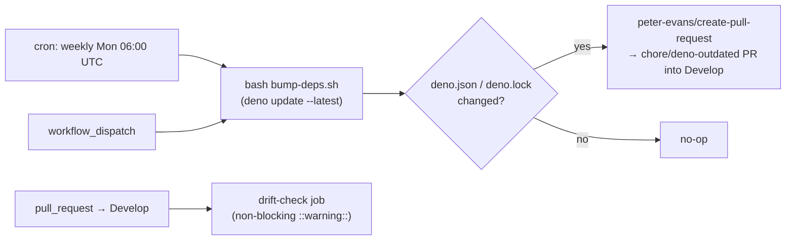

## Summary

Automated Deno dependency updates for NEAT-AI-Examples, mirroring the `deno-outdated` automation in
stSoftwareAU/NEAT-AI. The existing `deno-outdated.yml` workflow only warned about drift on pull
requests — it never raised a bump PR — so pins had to be refreshed by hand. The workflow now adds a
weekly scheduled run that invokes `./bump-deps.sh` on `Develop` and, if any pins change, opens a
pull request via `peter-evans/create-pull-request` (pinned to commit SHA
`5f6978faf089d4d20b00c7766989d076bb2fc7f1`, v8.1.1, published 2026-04-10 — well past the 24-hour
supply-chain quarantine window).

The PR drift-check behaviour is preserved as a separate job gated on
`github.event_name == 'pull_request'`, so reviewer-facing drift warnings still fire on every PR.

Closes #362.

## Evidence

Backend/CI-only change — no UI to screenshot. Verified by:

- `deno fmt --check` — clean (320 files).
- `deno lint` — clean (108 files).
- `deno check **/*.ts` — clean.
- `.github/deno_outdated_workflow_test.ts` — 5/5 tests pass; assert triggers, job gating,
  `bump-deps.sh` invocation, and that `peter-evans/create-pull-request` is pinned to a 40-char SHA.
- YAML structure double-checked by parsing via `@std/yaml` (`on:` is parsed as a string key, not a
  boolean alias).

## Test Plan

Added `.github/deno_outdated_workflow_test.ts` with five tests:

1. `runs on a weekly schedule` — asserts the cron is `0 6 * * 1`.
2. `supports manual dispatch` — asserts `workflow_dispatch` is declared.
3. `keeps PR drift-check job` — asserts the existing drift-check job is gated on `pull_request` and
   still present.
4. `auto-bump job runs on schedule and dispatch` — asserts the new job is gated on
   `schedule || workflow_dispatch` and requests `contents: write` + `pull-requests: write`
   permissions.
5. `auto-bump invokes bump-deps.sh and peter-evans/create-pull-request` — asserts a step runs
   `bump-deps.sh`, the PR action is pinned to a 40-character commit SHA, and PR targets `Develop` on
   branch `chore/deno-outdated`.

The full `./quality.sh` runs every example (40+ minutes) and is not exercised by this YAML-only
change; the targeted Deno checks above cover the modified surface.
