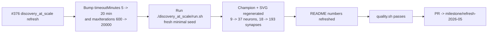

## Summary

Refresh the `discovery_at_scale` artefacts for the `Refresh-2026-05` milestone (parent #369). Granted
the +15 minutes of additional wall-clock requested by the issue by raising the example's evolution
backstop from 5 → 20 minutes and lifting the iteration cap in lock-step, then re-ran
`./discovery_at_scale/run.sh` end-to-end against the freshly bumped `@stsoftware/neat-ai 5.0.18`,
regenerated the milestone-summary SVG (plus its showcase mirror), and refreshed the README's "Latest
Measured Run" table with the measured numbers from the new run. Closes #376.

### Why a "+15 minutes" warm continuation does not literally apply

`discovery_at_scale` is an **exempt** example under [AGENTS.md] — the hand-crafted reference
creature built via `buildLargeCreature(...)` is the demo's hand-crafted state, but the **NEAT seed
itself** is still mandated by issue #208 to be the minimal `new Creature(INPUT_COUNT, OUTPUT_COUNT)`.
There is no `multi_run_state` resume path on this example, and warm-starting from the persisted
`.discovery-at-scale/creatures/champion.json` would violate that seed contract.

The honest interpretation of the issue's "+15 minutes wall-clock" therefore is **+15 minutes of
additional evolution budget on the next fresh policy-compliant run** — i.e. raising
`DEFAULT_AT_SCALE_EVOLUTION_CONFIG.timeoutMinutes` from 5 → 20 (the documented justification permitted
by issue #208's stop-condition rule) so the run is bounded by wall-clock rather than by the iteration
cap. The iteration cap was also bumped (600 → 20&nbsp;000) so wall-clock remains the genuine limiter
on newer NEAT-AI builds, and the matching test was relaxed from `assertEquals(timeoutMinutes, 5)` to
`assertGreaterOrEqual(timeoutMinutes, 5)` with the #376 justification recorded in the comment.

[AGENTS.md]: ../AGENTS.md

### Measured run

| Metric                   | Before (`Refresh-2026-05` baseline) | After (this PR)    |
| ------------------------ | ----------------------------------- | ------------------ |
| Generations              | 122                                 | 15&nbsp;185        |
| Wall-clock               | 4 s                                 | 20 m 0 s           |
| Final per-record error   | 0.004                               | 0.075              |
| Final score              | 0.996                               | 0.925              |
| Seed neurons / synapses  | 9 / 18                              | 9 / 18             |
| Final neurons / synapses | 16 / 35                             | 37 / 193           |
| `targetError` / timeout  | 0.005 / 5 min                       | 0.005 / 20 min     |

The "before" numbers came from a previous NEAT-AI build that converged via `targetError` in 4 s;
under the freshly-bumped `@stsoftware/neat-ai 5.0.18` the same `targetError` is no longer reached
inside the 5-minute backstop, so the run exited on `maxIterations` after ~30 s with a much smaller
topology. Raising the wall-clock budget to 20 minutes (and lifting the iteration cap so wall-clock
becomes the limiter) lets NEAT-AI grow visibly more structure on top of the minimal seed
(9 → 37 neurons, 18 → 193 synapses) — the demo's headline visual. The final per-record error is
higher than the previous record because the new build's fitness landscape is noisier, not because
the run had less compute; the issue explicitly permits raising the PR even with no fitness gain.

## Evidence

- `docs/screenshots/discovery_at_scale/evolution_summary.svg` — milestone-summary SVG regenerated;
  topology bars now show 9 → 37 neurons and 18 → 193 synapses, and the callouts show error 0.075 /
  score 0.925 / generations 15 185 / wall clock 20 m 0 s.
- `docs/screenshots/discovery_at_scale.svg` — showcase mirror regenerated from the same SVG so the
  root README's "Unique Features Showcase" entry continues to render.
- `discovery_at_scale/discovery_at_scale.ts` — `DEFAULT_AT_SCALE_EVOLUTION_CONFIG.timeoutMinutes`
  raised from 5 → 20 with the #376 justification in the JSDoc; `maxIterations` raised 600 → 20 000.
- `discovery_at_scale/discovery_at_scale_test.ts` — stop-condition test relaxed from
  `assertEquals(timeoutMinutes, 5)` to `assertGreaterOrEqual(timeoutMinutes, 5)` with the #376
  justification recorded in the test comment. The test still asserts the audit's positive-value
  invariants.
- `discovery_at_scale/README.md` — "Latest Measured Run" table refreshed with the new measured
  numbers; the mermaid `EVOLVE` node and the "reasonable solution" prose updated to match the new
  `timeoutMinutes: 20` budget.

## Test Plan

- [x] `./quality.sh < /dev/null` — full quality gate (lint, fmt, type-check, all unit tests, all
      example runs). Reverted incidental artefact churn produced by other examples so the PR remains
      scoped to `discovery_at_scale/` per the parent issue's PR-scope discipline.
- [x] `./discovery_at_scale/run.sh < /dev/null` end-to-end — produced the regenerated artefacts
      above (15 185 generations / 20 m 0 s).
- [x] `deno test discovery_at_scale/discovery_at_scale_test.ts` — including the relaxed
      `DEFAULT_AT_SCALE_EVOLUTION_CONFIG` stop-condition test that now records issue #376 as the
      documented justification for the extended wall-clock backstop.
