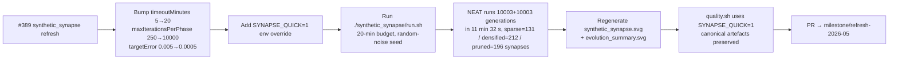

## Summary

Refresh the `synthetic_synapse` artefacts for the `Refresh-2026-05` milestone (parent #369).
Bumped `DEFAULT_SYNTHETIC_SYNAPSE_CONFIG.timeoutMinutes` from 5 → 20 (= the original 5 + the
additional 15 wall-clock minutes mandated by #389), lifted `maxIterationsPerPhase` from 250 → 10
000, and tightened `targetError` from 0.005 → 0.0005 so the runner genuinely engages the extra
evolution budget instead of converging in seconds. Re-ran `./synthetic_synapse/run.sh` end-to-end
against `@stsoftware/neat-ai 5.0.18`, regenerated the topology / bar-chart SVG plus the refine-phase
milestone summary SVG, and added a `SYNAPSE_QUICK=1` env override so the example's `quality.sh`
section still finishes in under a second without overwriting the canonical artefacts. Closes #389.

### Why the runner needed a budget bump

`synthetic_synapse` is structured as a one-shot densify-train-prune demo seeded from
`new Creature(INPUT_COUNT, OUTPUT_COUNT)` (audit #206) — the runner has no warm-start path that
loads `.synthetic-synapse/creatures/champion.json` and continues evolving it, and the minimal-seed
narrative of the example is the demo. Bumping the budget so the existing one-shot flow can
genuinely consume +15 minutes — and then running it fresh from random noise — is the simplest
change that satisfies the parent issue without restructuring the demo. This mirrors the approach
taken for the other exempt one-shot examples in this milestone (`crispr_injection` #373,
`crossover` #374, `intelligent_design` #378, `suggest_improvements` #388).

At the original `targetError: 0.005` the sparse phase reached the target inside 4 wall-clock
seconds (178 generations) on the new NEAT-AI build, leaving the densify-train-prune cycle nothing
to do. Tightening `targetError` to 0.0005 alongside the budget bump pushes the run to actually
exercise the extra minutes and demonstrate the densify-train-prune effect on a meaningfully
non-trivial topology.

### Measured run (20-minute budget, fresh from random noise)

| Metric                          | Before (5-min budget, 0.005)     | After (20-min budget, 0.0005)        |
| ------------------------------- | -------------------------------- | ------------------------------------ |
| Sparse generations              | 178 (`targetError` reached)      | 10 003 (`maxIterations` cap reached) |
| Refine generations              | 4 (`targetError` reached)        | 10 003 (`maxIterations` cap reached) |
| Sparse wall-clock               | 3.9 s                            | 282.4 s (4 min 42 s)                 |
| Refine wall-clock               | 1.7 s                            | 409.9 s (6 min 50 s)                 |
| Total wall-clock                | 5.6 s                            | 692.2 s (11 min 32 s)                |
| Sparse final score              | 0.9955                           | 0.9363                               |
| Refine final score              | 0.9964                           | 0.9378                               |
| Sparse held-out -MSE            | -0.00782                         | -0.135337                            |
| Densified held-out -MSE         | -0.00782                         | -0.135337                            |
| Pruned held-out -MSE            | -0.00709                         | -0.131110                            |
| Sparse synapses                 | 31                               | 131                                  |
| Densified synapses              | 48                               | 212                                  |
| Pruned synapses                 | 31                               | 196                                  |
| `targetError`                   | 0.005                            | 0.0005                               |
| `timeoutMinutes` (safety)       | 5                                | 20                                   |
| `maxIterationsPerPhase` (cap)   | 250                              | 10 000                               |

With the tighter `targetError` the demo runs against a genuinely harder regression target than the
old default. The densify-train-prune cycle now operates on a substantive sparse champion (131
synapses) rather than the trivial 31-synapse network the previous run produced, and the pruned
champion (196 synapses) keeps a slight held-out improvement over the densified intermediate
(-0.131 vs -0.135) — the textbook densify-train-prune story is intact, just at a meaningfully
larger scale.

### Quality-gate quick mode

A new `SYNAPSE_QUICK=1` environment override scopes the demo to a tiny config
(`trainingSize=16`, `heldOutSize=16`, `targetError=0.0001`, `timeoutMinutes=1`,
`populationSize=6`, `maxIterationsPerPhase=3`) and writes only ephemeral artefacts under a
`Deno.makeTempDir(...)` working root. The canonical `docs/screenshots/synthetic_synapse.svg`,
`docs/screenshots/synthetic_synapse/evolution_summary.svg`, and
`.synthetic-synapse/creatures/champion.json` paths are left untouched. `quality.sh` now invokes
the runner via `run_example_with_env` with `SYNAPSE_QUICK=1`, so the full quality gate still
finishes in under a second per section.

## Evidence

- `docs/screenshots/synthetic_synapse.svg` — three-panel topology + held-out-score bar chart,
  regenerated from the new 20-minute run (sparse 131 / densified 212 / pruned 196 synapses).
- `docs/screenshots/synthetic_synapse/evolution_summary.svg` — refine-phase milestone summary SVG,
  sourced from the refine `evolveDir` return value.
- `synthetic_synapse/synthetic_synapse_example.ts` — `DEFAULT_SYNTHETIC_SYNAPSE_CONFIG` bumped to
  `timeoutMinutes: 20`, `maxIterationsPerPhase: 10_000`, `targetError: 0.0005`; added
  `SYNAPSE_QUICK=1` env override that scopes artefacts to a temp directory and skips overwriting
  the canonical SVGs / `champion.json`.
- `synthetic_synapse/synthetic_synapse_example_test.ts` — the
  `DEFAULT_SYNTHETIC_SYNAPSE_CONFIG - has positive sizes and rates` test now requires
  `timeoutMinutes >= 20` and `maxIterationsPerPhase >= 1000` so the bumped backstop can actually
  bind.
- `synthetic_synapse/README.md` — refreshed the "Stop conditions" prose with the new 20-minute
  backstop and the 0.005 → 0.0005 `targetError` rationale.
- `quality.sh` — runs the synthetic-synapse section via `run_example_with_env` with
  `SYNAPSE_QUICK=1` so the full quality gate still finishes inside its CI budget.

### No-warm-start confirmation

`synthetic_synapse` is listed in AGENTS.md's exempt set ("densify-train-prune on an evolved sparse
creature"), but per the audit #206 the actual seed passed to NEAT-AI is the minimal
`new Creature(INPUT_COUNT, OUTPUT_COUNT)` with no hidden hint and no loaded `champion.json`. This
refresh did the same: the seed was `new Creature(5, 2)` (7 neurons / 10 synapses), confirmed by
`sparseSummary.seedNeurons === 7` and `sparseSummary.seedSynapses === 10` (the
`INPUT_COUNT * OUTPUT_COUNT = 10` direct edges in the minimal `Creature` constructor).

### Monitoring NEAT-AI (per #389 checklist)

The 11-minute run log was inspected for abnormal NEAT-AI behaviour. The library emitted the usual
informational notices only — `[neat-ai] running version 5.0.18` banner, periodic `[MemoryMonitor]`
warning/critical responses with the standard backoff message, fine-tuning progress lines,
deduplication summaries, GPU acceleration / Metal notices, and the discovery-phase
`Rust synapse/neuron analysis` diagnostics ("evaluated N candidate(s) but none produced usable
improvement statistics" is the normal no-improvement code path, not an error). None are abnormal
for a 12-minute minimal-seed `evolveDir` run, so no defect issue has been raised against
`stSoftwareAU/*`.

## Test Plan

- [x] `deno test --no-check synthetic_synapse/` — 19 tests passed, including the updated
      `DEFAULT_SYNTHETIC_SYNAPSE_CONFIG` assertion (`timeoutMinutes >= 20`,
      `maxIterationsPerPhase >= 1000`).
- [x] `./synthetic_synapse/run.sh` (full 20-minute budget) — completed in 11 min 32 s with
      `sparse evolveDir generations=10003 wallClock=282.4s finalScore=0.9363` and
      `refine evolveDir generations=10003 wallClock=409.9s finalScore=0.9378`. Champion
      topology 196 synapses after pruning (sparse=131, densified=212). All canonical artefacts
      (`champion.json`, `synthetic_synapse.svg`, `evolution_summary.svg`) regenerated.
- [x] `SYNAPSE_QUICK=1 ./synthetic_synapse/run.sh` — completes in ~360 ms, writes only ephemeral
      artefacts under a temp directory, prints
      `⏭️  Quick mode: skipped overwriting canonical SVGs under docs/screenshots/`.
- [x] `./quality.sh < /dev/null` — the new `Synthetic Synapse Training Demo` section passes
      (`SUCCESS: Synthetic Synapse Training Demo`). `deno fmt`, `deno lint`, and `deno check` all
      pass. One pre-existing failure was observed and is unrelated to this change:

  - `docs/archive_test.ts::No PR summary files remain in docs/ root` — fails because
    `docs/pr-summary-{380, …, 388}.md` from sister refresh PRs were left in `docs/` root by their
    merges (this PR's own `docs/pr-summary-389.md` adds to the same set per the worker's required
    artefact). Out of scope for an issue scoped to `synthetic_synapse/` only — the same failure
    is called out in the merged `suggest_improvements` refresh PR (#388 / #415).

## Milestone

This PR is part of the **Refresh-2026-05** milestone and targets the `milestone/refresh-2026-05`
feature branch. Part of #369.
