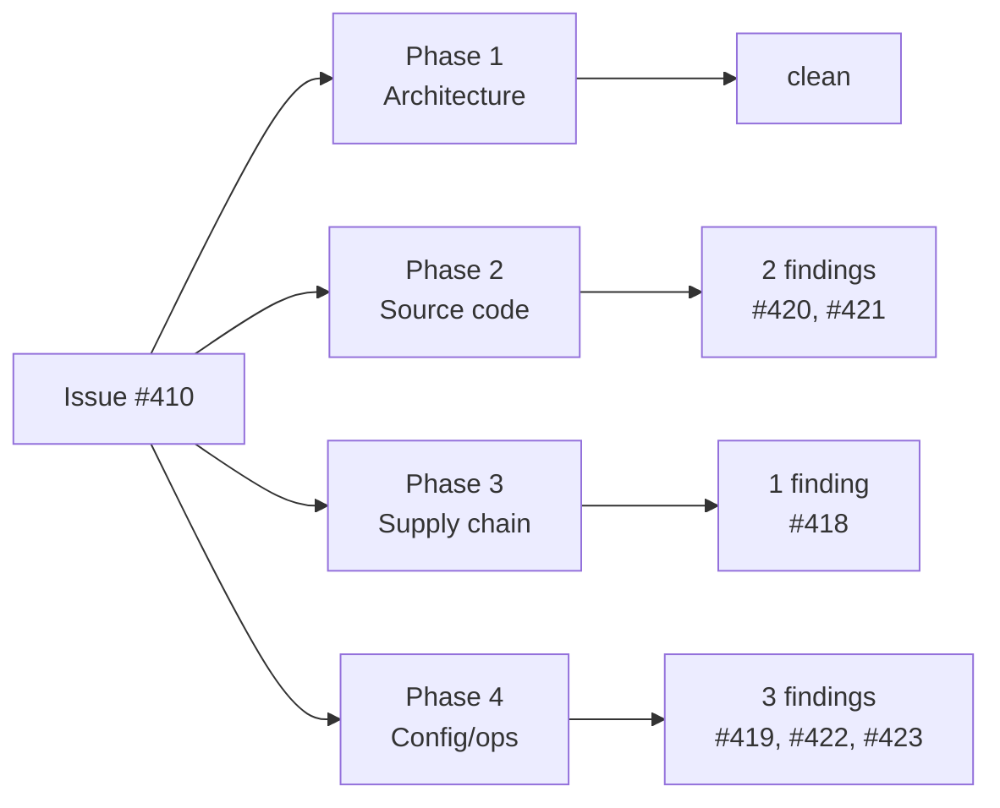

## Summary

Ran the four-phase MythOS-style security-in-depth audit against `stSoftwareAU/NEAT-AI-Examples` and
filed six evidence-backed findings as separate GitHub issues. No code changes were required for this
PR — the audit is the deliverable; remediation lives in the spawned issues. Closes #410.

This PR commits the audit report (this file) as permanent documentation of what was reviewed, what
was found, and what was deemed clean. No production source files were modified.

## Evidence

Source repo head reviewed: branch `issue-410-run-security-scan-on-stsoftwareau-neat-ai-examples` at
the time of the scan.

Scope of review:

- 7 GitHub Actions workflows under `.github/workflows/`
- 22 shell scripts (`*.sh` + every example `run.sh`)
- `deno.json`, `deno.lock`, `.gitignore`
- All `common/*.ts` helpers (with focus on `data_cache.ts`, `multi_run_state.ts`)
- Per-example TypeScript entrypoints (grep sweep for `eval`, `new Function`, `Deno.Command`,
  `Deno.run`, `Math.random` in security paths, `fetch()` callers)

### Findings filed

| #       | Severity | Title                                                                                 | Issue |
| ------- | -------- | ------------------------------------------------------------------------------------- | ----- |
| F5/F6   | High     | Commit `deno.lock` and use `--frozen` in CI                                           | #418  |
| F10/F11 | Medium   | Tighten over-broad Deno permission flags in `run.sh` wrappers                         | #419  |
| F1      | Medium   | Validate URL scheme/host in `common/data_cache.ts` to prevent SSRF                    | #420  |
| F2      | Low      | Write to `.part` then rename in `common/data_cache.ts` (atomic write)                 | #421  |
| F9      | Medium   | Extend `.gitignore` to common credential filenames                                    | #422  |
| F14     | Low      | Avoid direct `${{ github.base_ref }}` interpolation in gitleaks workflow `run:` block | #423  |

### Categories with no findings

- **Phase 1 — Architecture & threat modelling**: no inbound HTTP listener, no auth, no DB, no user
  data plane; only trust boundaries are JSR registry and two hardcoded HTTPS dataset hosts.
- **Code injection / eval / unsafe deserialisation**: zero matches for `eval(`, `new Function(`,
  `Deno.Command`, `Deno.run`, `child_process`, `execSync` across the TypeScript sources.
- **Insecure cryptography**: the only `crypto.subtle.digest("SHA-256", ...)` use is for integrity
  checking and is correct.
- **GitHub Actions pinning**: every `uses:` is pinned to a 40-character SHA with a version comment.
  No floating `@v2`/`@main`.
- **Workflow trigger safety**: no `pull_request_target` anywhere. The only workflow with
  `contents: write` (`deno-outdated.yml`) is correctly gated by
  `github.event.pull_request.head.repo.full_name == github.repository`.

### Why no code changes in this PR

The issue (`#410`) tasked the scan with filing findings as _new issues_ — explicit wording: "and
file evidence-backed findings as new issues." Remediation is scoped per-finding so that each fix can
be reviewed and shipped independently. Mixing six unrelated security fixes into a single PR would be
hard to review and any single regression would block the others.

## Test Plan

This is an audit deliverable — no executable behaviour changed. Verification consists of:

- [x] All six filed issues (#418–#423) reference concrete file paths and line numbers from this
      repository.
- [x] Each finding includes a code snippet that matches the current source at HEAD.
- [x] Categories marked "clean" were verified by grep sweeps (zero matches for the listed dangerous
      patterns).
- [x] The PR summary itself is the documentation artefact and lives at `docs/pr-summary-410.md`.

No changes to `quality.sh`-gated code paths, so existing CI gates remain authoritative.
