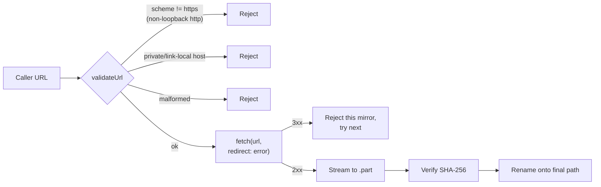

## Summary

Hardened `common/data_cache.ts::fetchDataset` against SSRF and local-file
disclosure. Every supplied URL is now validated before any network I/O,
and `fetch` is invoked with `redirect: "error"` so a 3xx response from a
legitimate host can no longer be transparently followed to an internal
target. Closes #420.

Validation rules enforced:

- **Scheme**: only `https://` is accepted. `http://` is tolerated only
  against loopback hosts (`localhost`, `127.0.0.1`, `::1`) so the
  in-process test server in `data_cache_test.ts` keeps working.
  `file://`, `ftp://`, `data:`, and any other scheme are rejected.
- **Host**: literal-IP hostnames in RFC1918 private networks (10/8,
  192.168/16, 172.16/12), the IPv4 link-local range (169.254/16, where
  the AWS / GCP / Azure instance-metadata service lives), IPv6
  link-local (`fe80::/10`), IPv6 unique-local (`fc00::/7`), and the
  `metadata.google.internal` / `metadata.goog` DNS aliases are rejected
  even when the scheme is `https`.
- **Redirects**: `fetch(url, { redirect: "error" })` makes any 3xx a
  per-URL failure, so the next mirror is tried (or the call rejects)
  rather than silently following the redirect to wherever the server
  points.
- **Malformed URLs**: rejected up-front with `fetchDataset: invalid URL …`.

The JSDoc on `fetchDataset` and the `common/data_cache.ts` section of
`AGENTS.md` now document that callers must still verify URL provenance
(hard-coded constants or a digest-pinned manifest) — the new defences
catch accidental misuse but are not a substitute for careful inputs.

The two existing callers (`mnist_classification.ts`, `stock_market.ts`)
already pass hard-coded `https://storage.googleapis.com/...` constants
and digest-pin every download, so they are unaffected.

## Evidence

Backend / library change — no UI surface to screenshot. Verified via the
new unit tests below, which call `fetchDataset` with each forbidden URL
shape and assert the call rejects without writing anything to disk.

## Test Plan

New `Deno.test` cases in `common/data_cache_test.ts` (all "what" tests
that call `fetchDataset` and assert on the rejection):

- **`fetchDataset rejects non-https schemes to prevent SSRF`** — asserts
  `file:///etc/passwd`, `ftp://example.com/x`, and
  `http://example.com/x` all reject with an error mentioning `https`,
  and that no file is written.
- **`fetchDataset rejects private and link-local hosts to prevent SSRF`**
  — asserts `https://169.254.169.254/…` (AWS metadata),
  `https://10.0.0.1`, `https://192.168.1.1`, `https://172.16.0.1`,
  `https://[fe80::1]`, `https://[fc00::1]`, and
  `https://metadata.google.internal` are all rejected.
- **`fetchDataset rejects malformed URLs without invoking fetch`** —
  asserts `"not a url"` rejects with `invalid URL`.
- **`fetchDataset refuses to follow redirects`** — starts a local server
  that returns `302 Location: http://169.254.169.254/`, asserts the
  call rejects and no file is written.

All eight pre-existing `data_cache_test.ts` cases continue to pass
unchanged (download, cache, mirror fallback, digest verification,
atomic write via `.part`, scratch-file cleanup on success and on
mismatch, digest-as-cache-hit), confirming the new validation does not
regress the happy path.
