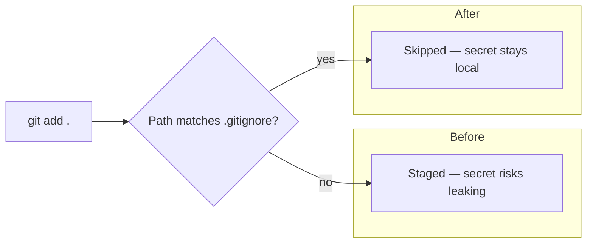

# PR Summary — Issue #422

## Summary

Extended `.gitignore` to cover common non-dot credential filenames so a
contributor running an example that emits or accepts `config.json`,
`credentials.json`, `service-account.json`, `*.pem`, `*.key`,
`id_rsa`, etc. cannot accidentally stage the secret with `git add .`.
The previous rule set only excluded dotfiles via `.*`, which left these
well-known names exposed. Closes #422.

## Evidence

Backend / CLI-only change — no UI surface to screenshot. The new
behaviour is exercised by a behavioural test that uses
`git check-ignore --no-index` against a throwaway repo populated with
the project's real `.gitignore`, so we assert on git's actual answer
rather than on the text of the file.

`.gitignore` now appends:

```
config.json
credentials.json
secrets.json
service-account.json
*.pem
*.key
id_rsa
id_rsa.pub
```

`quality.sh` now grants the unit-test runner `--allow-run=git` so the
new behavioural test can shell out to `git init` /
`git check-ignore` inside a temp directory.

Before-and-after behaviour, captured by the failing-then-passing test
run:



## Test Plan

- Added `common/gitignore_credentials_test.ts` with two `Deno.test`
  cases:
  - **`common credential filenames are gitignored (issue #422)`** —
    creates `config.json`, `credentials.json`, `secrets.json`,
    `service-account.json`, `server.pem`, `private.key`, `id_rsa`,
    `id_rsa.pub` (plus several at nested depths) inside a fresh
    git repo seeded with the project `.gitignore`, then asserts
    `git check-ignore --no-index` reports every one of them as
    ignored.
  - **`ordinary repository files are still tracked (issue #422)`** —
    sanity check that the new patterns do not accidentally ignore
    `README.md`, `deno.json`, `quality.sh`, or
    `common/working_dirs.ts`.
- Test run output (after the `.gitignore` change):

  ```
  running 2 tests from ./common/gitignore_credentials_test.ts
  common credential filenames are gitignored (issue #422) ... ok
  ordinary repository files are still tracked (issue #422) ... ok
  ok | 2 passed | 0 failed
  ```

- Verified no currently tracked file in the repo matches any of the
  new patterns (`git ls-files | grep -E ...` returned no matches), so
  the new rules do not retroactively ignore anything that is already
  in git.
- The pre-existing `common/lockfile_test.ts` (issue #418) still
  passes — the new patterns do not affect `deno.lock`.
