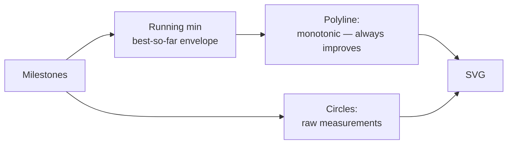

## Summary

The multi-run error chart could appear to regress between runs: when an example resumes
evolution, the loaded champion is re-evaluated against fresh stochastic episodes and may
score slightly worse than its last-run measurement. That noise drew an upward spike in
the chart, contradicting the "evolution progress should always improve" story the
captured milestones are meant to tell.

This PR changes the error series to a **best-error-so-far envelope** — the polyline
plots `min(error so far)` over cumulative generations, which is monotonically
non-increasing by construction. Raw milestone errors are still surfaced as circle
markers, so the re-evaluation noise remains visible without misleading the polyline.

Closes #431.

## Evidence

Reference chart regenerated from the existing `docs/data/cart_pole/milestones.json`
(which contains the exact noise spike from the issue — error 0.567 at end of run 1
followed by 0.7058 at start of run 2):

The footnote on the chart now reads "line is best error so far · dots are raw milestone
measurements" so viewers can interpret the dots vs the line correctly.

## Test Plan

- `common/multi_run_error_chart_test.ts`
  - Updated the happy-path assertion: one envelope polyline instead of one-per-run
    segments (documented inline that this reflects the monotonic envelope).
  - **Added** `envelope polyline is monotonically non-increasing even when raw error
    spikes between runs (issue #431)` — reproduces the cart_pole regression
    (0.6 → 0.8 across the run boundary) and asserts the polyline Y coordinates are
    non-decreasing left → right (SVG Y grows downward), and that the raw circle
    markers still expose every sample.
  - **Added** `footnote documents the best-error-so-far envelope (issue #431)` —
    asserts the explanatory footnote includes "best error so far".
- Full `deno test` suite: 757 passed / 0 failed.
- `deno fmt`, `deno lint`, `deno check` on the changed files: clean.
- Regenerated SVGs under `docs/screenshots/*/milestones.svg` from existing
  `milestones.json` so the published docs reflect the new envelope rendering.
