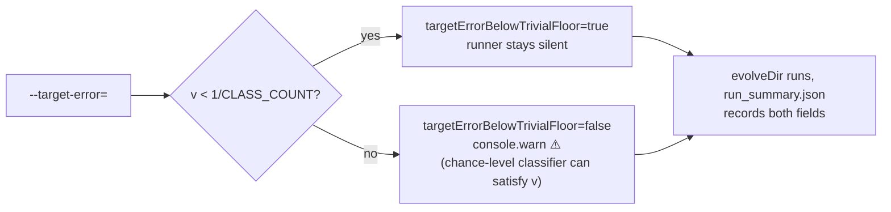

## Summary

Clarifies what `Creature.evolveDir`'s `error` field means for the MNIST 10-way one-hot classifier and stops a too-lenient `--target-error` from silently producing chance-level (≈10 %) test accuracy. For a `K`-way one-hot target the per-record MSE has a **trivial floor of `1 / K`** — an all-zero output predictor satisfies MSE = `1/10 = 0.1` while remaining at chance on argmax. Run 18 of the campaign in #446 hit `evolveDirError = 0.099926` against `targetError = 0.1` and reported 10.34 % test accuracy precisely because the requested threshold sits at the trivial floor.

This PR adds:

- A new public helper `trivialOneHotMseFloor(classCount)` in `mnist_classification.ts` returning `1 / classCount` with a clear docstring explaining why a `targetError` ≥ this value is satisfied by a chance-level classifier.
- Two new fields on `MnistMultiRunResult` and `MnistRunSummary` — `trivialErrorFloor` and `targetErrorBelowTrivialFloor` — so the operator can tell from the persisted JSON whether the run's early-stop threshold was tight enough to be meaningful.
- A `console.warn` in `runMultiRunMnist` when `targetError >= trivialErrorFloor`, pointing the operator at issue #446.
- README documentation of the trivial-floor caveat right next to the `--target-error` flag, with the explanation of why `0.001` (the default) is below the floor and `0.1` is not.
- A regression test (`DEFAULT_MULTI_RUN_TARGET_ERROR is strictly below the 10-way trivial floor`) that fails if the default is ever loosened above `1 / CLASS_COUNT`.

The MNIST default `targetError` (`0.001`) is already comfortably below the trivial floor, so the canonical demo's behaviour is unchanged. Operators who deliberately set `--target-error=0.1` (as the campaign in this issue did) now see a clear warning and can read `targetErrorBelowTrivialFloor: false` in `run_summary.json`.

Closes #446.

## Evidence

CLI / library change with no UI surface — verified via the unit-test suite under `mnist_classification/mnist_classification_test.ts`:

- `trivialOneHotMseFloor returns 1/K for K-class one-hot` — exercises the new helper for `K ∈ {2, 4, 10, 100}`.
- `trivialOneHotMseFloor for MNIST's CLASS_COUNT is exactly 0.1` — pins the numerical answer.
- `trivialOneHotMseFloor rejects classCount < 2 with a clear error` — covers the invalid-input path.
- `DEFAULT_MULTI_RUN_TARGET_ERROR is strictly below the 10-way trivial floor` — regression-guards the default.
- `runMultiRunMnist flags targetErrorBelowTrivialFloor=false when --target-error reaches the 1/K floor (issue #446)` — captures `console.warn` and asserts the warning fires.
- `runMultiRunMnist flags targetErrorBelowTrivialFloor=true and stays silent for the tight default target (issue #446)` — confirms the default does not warn.
- `MnistRunSummary round-trips the multi-run + evolveDir milestone fields` — extended to cover the two new schema fields.

## Test Plan

- [x] Added `trivialOneHotMseFloor returns 1/K for K-class one-hot` in `mnist_classification/mnist_classification_test.ts`.
- [x] Added `trivialOneHotMseFloor for MNIST's CLASS_COUNT is exactly 0.1`.
- [x] Added `trivialOneHotMseFloor rejects classCount < 2 with a clear error`.
- [x] Added `DEFAULT_MULTI_RUN_TARGET_ERROR is strictly below the 10-way trivial floor`.
- [x] Added `runMultiRunMnist flags targetErrorBelowTrivialFloor=false when --target-error reaches the 1/K floor (issue #446)` — captures the warning.
- [x] Added `runMultiRunMnist flags targetErrorBelowTrivialFloor=true and stays silent for the tight default target (issue #446)`.
- [x] Extended `MnistRunSummary round-trips the multi-run + evolveDir milestone fields` to cover the two new fields.
- [x] `deno test mnist_classification/` — 41 tests passing locally.
- [x] `./quality.sh` — clean (lint, fmt, type-check, full example suite).
