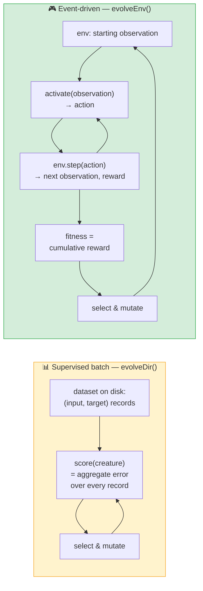

# 🧭 Event-Driven Evolution — Paradigm Split

> **Navigation page.** This doc summarises how the examples in this repository split between
> **supervised batch evolution** (`Creature.evolveDir()`-style) and **reinforcement / event-driven
> evolution** (`Creature.evolveEnv()`-style), and links each existing example to its category. The
> full API spec for `evolveEnv()` lives upstream — see
> [`stSoftwareAU/NEAT-AI` → `docs/event-driven-evolution.md`](https://github.com/stSoftwareAU/NEAT-AI/blob/Develop/docs/event-driven-evolution.md).
> Parent issue: [#230](https://github.com/stSoftwareAU/NEAT-AI-Examples/issues/230).

## 🗂️ Two paradigms

NEAT-AI runs the same evolutionary loop in two very different ways. Knowing which fits your problem
is the difference between calling `evolveDir()` and calling `evolveEnv()`.

| Example                                                     | Paradigm                        | API                                        |
| ----------------------------------------------------------- | ------------------------------- | ------------------------------------------ |
| [`mnist_classification`](../mnist_classification/README.md) | 📊 Supervised batch             | `Creature.evolveDir()` / `evolveDataSet()` |
| [`xor_classification`](../xor_classification/README.md)     | 📊 Supervised batch             | `Creature.evolveDir()` / `evolveDataSet()` |
| [`stock_market`](../stock_market/README.md)                 | 📊 Supervised batch             | `Creature.evolveDir()` / `evolveDataSet()` |
| [`cart_pole`](../cart_pole/README.md)                       | 🎮 Reinforcement / event-driven | `Creature.evolveEnv()`                     |
| [`mountain_car`](../mountain_car/README.md)                 | 🎮 Reinforcement / event-driven | `Creature.evolveEnv()`                     |
| [`snake_game`](../snake_game/README.md)                     | 🎮 Reinforcement / event-driven | `Creature.evolveEnv()`                     |
| [`maze_navigation`](../maze_navigation/README.md)           | 🎮 Reinforcement / event-driven | `Creature.evolveEnv()`                     |
| [`lunar_lander`](../lunar_lander/README.md)                 | 🎮 Reinforcement / event-driven | `Creature.evolveEnv()`                     |

## 🔬 Why the split matters

The two paradigms cannot share a scoring loop because they make incompatible assumptions about how
fitness is measured.

- **Supervised batch (`evolveDir()`).** The dataset is a pre-generated, forward-only stream of
  `{input, target}` records sitting on disk as chunked little-endian Float32 (see
  [`docs/binary_training_stream.md`](binary_training_stream.md)). Every creature scores against the
  **same** records; the order is fixed and the inputs do not depend on the creature's previous
  outputs. Fitness is the aggregate error / accuracy over the corpus. Parallelism is trivial because
  each record is independent.

- **Reinforcement / event-driven (`evolveEnv()`).** Fitness is a per-trajectory rollout against a
  stepping environment. The next observation is produced by `env.step(action)` and depends on the
  creature's previous output, so once two creatures diverge they see entirely different observation
  streams. There is no on-disk dataset to mmap — the "data" is the trajectory the creature itself
  induces. Fitness is the cumulative reward (or survival score) for the rollout.

Practical consequences:

- A supervised-batch loop cannot score an event-driven example, because the observations a cart-pole
  controller sees on tick `t+1` are determined by what it did on tick `t`. There is no fixed dataset
  to score against.
- An event-driven loop cannot exploit `evolveDir()`'s binary-stream fast path, because the
  trajectory cannot be pre-generated — the creature is part of the data-generating process.
- Both loops parallelise per-creature: each rollout (or each batch sweep) is independent, so workers
  scale linearly with the population size.

## 🚀 What `evolveEnv()` provides

This page is just the navigation entry point for Examples readers. The full API spec — argument
shape, termination guards, telemetry hooks, exception contracts, and worked migration examples —
lives upstream in
[`stSoftwareAU/NEAT-AI`'s `docs/event-driven-evolution.md`](https://github.com/stSoftwareAU/NEAT-AI/blob/Develop/docs/event-driven-evolution.md).
Read that doc when you are migrating an event-driven example off its hand-rolled generation loop and
onto the first-class API.

The five reinforcement / event-driven examples in this repository will migrate one-by-one as the
upstream API stabilises; the per-example sub-issues below track the actual code changes.

## ✅ Migration status

The five event-driven examples each have their own migration sub-issue. The list below is the
at-a-glance scoreboard — tick a box when the corresponding sub-issue closes.

- [ ] [`cart_pole` → `evolveEnv()` — #236](https://github.com/stSoftwareAU/NEAT-AI-Examples/issues/236)
- [ ] [`mountain_car` → `evolveEnv()` — #237](https://github.com/stSoftwareAU/NEAT-AI-Examples/issues/237)
- [ ] [`snake_game` → `evolveEnv()` — #238](https://github.com/stSoftwareAU/NEAT-AI-Examples/issues/238)
- [ ] [`maze_navigation` → `evolveEnv()` — #239](https://github.com/stSoftwareAU/NEAT-AI-Examples/issues/239)
- [ ] [`lunar_lander` → `evolveEnv()` — #240](https://github.com/stSoftwareAU/NEAT-AI-Examples/issues/240)
      (run last)

When every box is ticked, the repository is fully migrated and the per-example hand-rolled evolution
loops can be retired.
