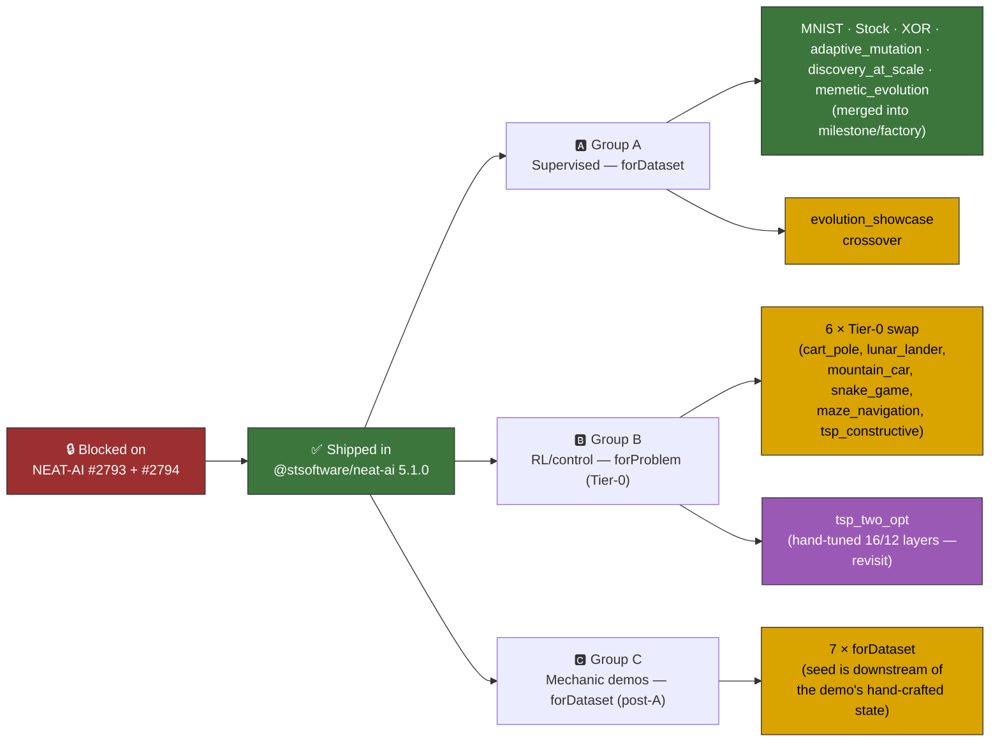

# 🏭 NEAT-AI Factory Adoption Across Examples

This page is the canonical decision record for tracking issue
[#517](https://github.com/stSoftwareAU/NEAT-AI-Examples/issues/517) — adopting the NEAT-AI
**creature factory** across the example suite.

The factory landed upstream in `@stsoftware/neat-ai@5.1.0`
([stSoftwareAU/NEAT-AI#2794](https://github.com/stSoftwareAU/NEAT-AI/issues/2794)) with the
output-activation / loss coupling
([stSoftwareAU/NEAT-AI#2793](https://github.com/stSoftwareAU/NEAT-AI/issues/2793)). It exposes two
entry points:

```ts
import { Creature } from "@stsoftware/neat-ai";

// Supervised — scans the first records of the training stream
const seed = Creature.forDataset(records, { cost: "BINARY_CROSS_ENTROPY" });

// RL / no dataset — Tier-0 only (cost → output activation + fan-in init)
const seed = Creature.forProblem({ inputs, outputs, cost: "MSE" });
```

The factory **only seeds the initial creature** — evolution (`evolveDir`, `evolveRL`, `evolveEnv`)
is unchanged. The factory chooses topology, output activation, and weight-init scaling from
problem-intrinsic facts (observation count, output count, cost, and — for `forDataset` — a scan of
the first training records). It never copies architecture from a dataset-specific benchmark.

## ⚠️ Interaction with the no-warm-start policy

`AGENTS.md` requires every in-scope example to start evolution from **uniform-random noise**.
Adopting the factory deliberately departs from that policy: the factory chooses a topology and
weight-init scaling from problem-intrinsic facts before evolution begins, instead of a bare
`new Creature(input, output)` with zero hidden neurons.

This departure is **milestone-sanctioned under this tracking issue** — smoke-testing the factory's
seed output _is_ the demonstration. Per the merged XOR adoption
([#520](https://github.com/stSoftwareAU/NEAT-AI-Examples/issues/520)), every factory adoption PR
must call out the deliberate departure in its summary. Seed weights and biases remain random; only
the topology and scaling are factory-derived, and all structural growth beyond the seed still comes
from the unchanged mutation operators.

## 📋 Adoption status

### Group A — Supervised / dataset-driven (full `forDataset`)

These examples train on a labelled dataset (CSV, `.bin`, or in-memory truth table) and can use the
full data-scanning factory.

| Example                | Status      | Issue                                                               | Notes                                                                                                                                                                                                                       |
| ---------------------- | ----------- | ------------------------------------------------------------------- | --------------------------------------------------------------------------------------------------------------------------------------------------------------------------------------------------------------------------- |
| `mnist_classification` | ✅ Migrated | [#518](https://github.com/stSoftwareAU/NEAT-AI-Examples/issues/518) | `Creature.forDataset(records, { cost: "CROSS_ENTROPY" })` — dropped hardcoded `[128, 64]` hidden seed.                                                                                                                      |
| `stock_market`         | ✅ Migrated | [#519](https://github.com/stSoftwareAU/NEAT-AI-Examples/issues/519) | Regression seed — `IDENTITY` output activation, target-mean bias warm-start.                                                                                                                                                |
| `xor_classification`   | ✅ Migrated | [#520](https://github.com/stSoftwareAU/NEAT-AI-Examples/issues/520) | Smoke-test — `BINARY_CROSS_ENTROPY` → `LOGISTIC` output + small RELU hidden layer.                                                                                                                                          |
| `adaptive_mutation`    | ✅ Migrated | [#533](https://github.com/stSoftwareAU/NEAT-AI-Examples/issues/533) | 4-bit even-parity classifier (4 → 1, binary) — `BINARY_CROSS_ENTROPY` → `LOGISTIC` output + factory hidden layer.                                                                                                           |
| `evolution_showcase`   | 🟡 Planned  | [#534](https://github.com/stSoftwareAU/NEAT-AI-Examples/issues/534) | Long-form flagship run; needs a deliberate departure write-up given its "noise → competent" framing.                                                                                                                        |
| `discovery_at_scale`   | ✅ Migrated | [#535](https://github.com/stSoftwareAU/NEAT-AI-Examples/issues/535) | `evolveDir` over a binary `.bin` set built from a `buildLargeCreature(...)` reference — `BINARY_CROSS_ENTROPY` → LOGISTIC outputs (match the reference's LOGISTIC labels) + factory hidden layer.                           |
| `memetic_evolution`    | ✅ Migrated | [#536](https://github.com/stSoftwareAU/NEAT-AI-Examples/issues/536) | Two `evolveDir` runs (memetic + control) — both seeds built via `BINARY_CROSS_ENTROPY` → `LOGISTIC` output (matches the oracle's `[0, 1]` targets) + factory hidden layer; bare baseline kept as `buildRandomSeedCreature`. |
| `crossover`            | 🟡 Planned  | [#537](https://github.com/stSoftwareAU/NEAT-AI-Examples/issues/537) | NEAT seed for the second stage of the crossover demo is a minimal `new Creature(...)`.                                                                                                                                      |

### Group B — RL / control (Tier-0 `forProblem` only, no data scan)

These examples drive `Creature.evolveRL()` or `Creature.evolveEnv()` with an environment, not a
labelled dataset. The data-scan path does not apply; only the Tier-0 factory (`Creature.forProblem`)
— which still couples output activation to the cost and applies fan-in weight init — is available.

| Example            | Seed today                                                                                                     | Decision                                                                                                                                                                                                                                                               |
| ------------------ | -------------------------------------------------------------------------------------------------------------- | ---------------------------------------------------------------------------------------------------------------------------------------------------------------------------------------------------------------------------------------------------------------------- |
| `cart_pole`        | `new Creature(INPUT_COUNT, OUTPUT_COUNT)`                                                                      | **Tier-0 candidate.** Bare seed, no hand-tuning beyond the constructor. Open follow-up issue when prioritised.                                                                                                                                                         |
| `lunar_lander`     | `new Creature(INPUT_COUNT, OUTPUT_COUNT)`                                                                      | **Tier-0 candidate.** Identical pattern to `cart_pole`.                                                                                                                                                                                                                |
| `mountain_car`     | `new Creature(INPUT_COUNT, OUTPUT_COUNT)`                                                                      | **Tier-0 candidate.** Bare seed; clean swap.                                                                                                                                                                                                                           |
| `snake_game`       | `new Creature(INPUT_COUNT, OUTPUT_COUNT)`                                                                      | **Tier-0 candidate.** Bare seed; clean swap.                                                                                                                                                                                                                           |
| `maze_navigation`  | `new Creature(INPUT_COUNT, OUTPUT_COUNT)`                                                                      | **Tier-0 candidate.** Bare seed; clean swap.                                                                                                                                                                                                                           |
| `tsp_constructive` | `new Creature(INPUT_COUNT, OUTPUT_COUNT)`                                                                      | **Tier-0 candidate.** Bare seed; clean swap.                                                                                                                                                                                                                           |
| `tsp_two_opt`      | `new Creature(INPUT_COUNT, OUTPUT_COUNT, { layers: [{count:16,squash:"TANH"},{count:12,squash:"LOGISTIC"}] })` | **Out of scope (revisit).** The example deliberately hand-picks a two-layer 16/12 `TANH+LOGISTIC` stack as part of the demo. Tier-0 would discard that hand-tuning. Defer until the owner decides whether to keep the hand-layered seed or accept the topology change. |

**Group B summary:** six of seven (everything except `tsp_two_opt`) are eligible for Tier-0
`Creature.forProblem(...)`. Migrations are not blocking the tracking issue acceptance criteria; they
will be picked up per-example once Group A is complete.

### Group C — Mechanic demos

`AGENTS.md` classifies these as **exempt** from the no-warm-start policy because hand-crafted state
is the entire point of the demo. In every case, though, the hand-crafted state lives **outside the
NEAT seed** (a reference creature, a spliced gene, deliberately-constant neurons, an evolved
champion, an analytical sampler), and the NEAT seed itself is still a bare
`new Creature(input, output)` feeding an `evolveDir` over a labelled `.bin` dataset. The seed is
therefore eligible for `Creature.forDataset(records, { cost })` without breaking the demo's exempt
rationale.

| Example                | Seed today                                | What is hand-crafted (per `AGENTS.md`)                                      | Decision                                                                                                  |
| ---------------------- | ----------------------------------------- | --------------------------------------------------------------------------- | --------------------------------------------------------------------------------------------------------- |
| `discovery`            | `new Creature(INPUT_COUNT, OUTPUT_COUNT)` | Reference creature that labels the training set.                            | **`forDataset` candidate.** Seed is downstream of the hand-crafted reference; safe to migrate.            |
| `suggest_improvements` | `new Creature(INPUT_COUNT, OUTPUT_COUNT)` | _(not exempt — bare-seed demo with a `.bin` set)_                           | **`forDataset` candidate.** Standard supervised pattern — straightforward migration.                      |
| `crispr_injection`     | `new Creature(INPUT_COUNT, OUTPUT_COUNT)` | The edit gene spliced into the stalled population.                          | **`forDataset` candidate.** Pre-splice seed is bare; spliced gene remains the demo's hand-crafted state.  |
| `intelligent_design`   | `new Creature(INPUT_COUNT, OUTPUT_COUNT)` | The squash-improvement scan run on the evolved champion.                    | **`forDataset` candidate.** Hand-crafted state is downstream of the NEAT seed.                            |
| `neuron_pruning`       | `new Creature(INPUT_COUNT, OUTPUT_COUNT)` | Deliberately-constant neurons injected for pruning to remove.               | **`forDataset` candidate.** Constant-neuron injection happens after evolution; seed is bare.              |
| `synthetic_synapse`    | `new Creature(INPUT_COUNT, OUTPUT_COUNT)` | The densify-train-prune cycle on an evolved sparse creature.                | **`forDataset` candidate.** Phase-1 NEAT seed is bare.                                                    |
| `mcmc_acceptance`      | `new Creature(INPUT_COUNT, OUTPUT_COUNT)` | The analytical Metropolis-Hastings sampler (runs outside any NEAT-AI loop). | **`forDataset` candidate for the second stage only.** Analytical sampler is out-of-scope for the factory. |

**Group C summary:** all seven NEAT seeds are `forDataset` candidates. The hand-crafted state each
demo protects lives outside the seed in every case, so adopting the data-derived factory does not
break the exemption listed in `AGENTS.md`. Migrations will be opened as per-example issues once
Group A is complete.

## 🗺️ Adoption flow



## 🔗 Cross-references

- Tracking issue: [#517](https://github.com/stSoftwareAU/NEAT-AI-Examples/issues/517)
- Upstream factory: [stSoftwareAU/NEAT-AI#2794](https://github.com/stSoftwareAU/NEAT-AI/issues/2794)
- Upstream output/loss coupling:
  [stSoftwareAU/NEAT-AI#2793](https://github.com/stSoftwareAU/NEAT-AI/issues/2793)
- No-warm-start policy:
  [`AGENTS.md`](../AGENTS.md#-no-warm-starts--evolution-must-start-from-random-noise)
