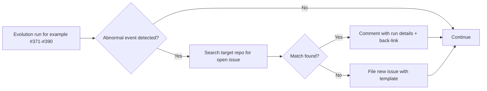

# Monitoring NEAT-AI during re-evolve runs

This document defines the procedure the worker follows when monitoring
[NEAT-AI](https://github.com/stSoftwareAU/NEAT-AI) and its `stSoftwareAU/*` supporting libraries
during the re-evolve runs tracked in issues #371–#390. It is the single reference the running worker
reads before raising a defect issue in a library repo.

## 1. In-scope repos

Defect issues may be filed in the following `stSoftwareAU/*` repos:

- [`stSoftwareAU/NEAT-AI`](https://github.com/stSoftwareAU/NEAT-AI) — the main library, published as
  `@stsoftware/neat-ai` on JSR.
- [`stSoftwareAU/NEAT-AI-core`](https://github.com/stSoftwareAU/NEAT-AI-core) — the Rust core,
  referenced as the `neatCore` field in NEAT-AI's `deno.json`.
- [`stSoftwareAU/TagsTS`](https://github.com/stSoftwareAU/TagsTS) — published as `@stsoftware/tags`
  on JSR and consumed by NEAT-AI.

**Out of scope.** Third-party dependencies (`@std/*`, anything not under the `stSoftwareAU/*` GitHub
organisation) are explicitly out of scope. Do not raise defect issues against them — record the
symptom on the originating re-evolve issue instead.

### Refreshing the list

The list above must track NEAT-AI's own dependency graph. To refresh it without letting the doc
silently rot, a future contributor should:

1. Open NEAT-AI's [`deno.json`](https://github.com/stSoftwareAU/NEAT-AI/blob/main/deno.json).
2. Note the `neatCore` field — this is the `stSoftwareAU/NEAT-AI-core` revision and stays in scope.
3. Scan the `imports` map for every `@stsoftware/*` JSR specifier. Each one maps to an
   `stSoftwareAU/*` repo on GitHub (for example, `@stsoftware/tags` ↔ `stSoftwareAU/TagsTS`).
4. Add any new `stSoftwareAU/*` repo to section 1 above and remove any that NEAT-AI no longer
   depends on.

Third-party JSR or npm specifiers (`@std/*`, anything outside the `@stsoftware/*` scope) stay out of
scope.

## 2. What counts as an abnormal event

The worker should treat any of the following as a library-level defect worth filing during
evolution:

- **Hard failures** — out-of-memory errors / heap exhaustion, process crashes, creature corruption,
  data loss, persistence write failure.
- **Numerical pathologies** — NaN fitness, fitness going to `-Infinity`, or unrecoverable
  divergence.
- **Stability** — silent stalls (no progress for an unreasonable window), repeated or recurring
  warnings, deadlocks, hung workers.
- **Catch-all** — anything the worker reasonably judges to be a library-level defect rather than an
  example-level configuration problem.

Worker judgement applies. When the symptom looks like an example-configuration issue (wrong fitness
function, mis-shaped dataset), fix it in `NEAT-AI-Examples` rather than filing a library defect.

## 3. De-duplication procedure

Before filing a new defect issue in a target repo the worker **MUST** search for an existing open
issue first:

```bash
gh issue list \
  --repo stSoftwareAU/<target> \
  --state open \
  --search "<terms>"
```

Use a small set of likely matching terms — the error class, a signature keyword, or the symptom
phrase. Two or three searches with different phrasings is reasonable.

- If a matching open issue exists, **comment on it** with this run's specifics (link to the
  originating `NEAT-AI-Examples` re-evolve issue, the NEAT-AI version, the stack trace or signature,
  and the reproduction context) rather than filing a duplicate.
- If no match exists, **file a new issue** using the template in section 4.

## 4. Defect issue template

Use this body when raising a new issue in a target repo:

```markdown
## Originating run

- Re-evolve issue: stSoftwareAU/NEAT-AI-Examples#<NNN> (one of #371–#390)
- NEAT-AI version: <pinned per #370, e.g. @stsoftware/neat-ai@x.y.z>
- NEAT-AI-core revision: <commit SHA, if relevant>

## Error signature

<stack trace, error class, or one-line symptom description>

## Reproduction context

- Example: <e.g. lunar_lander>
- Configuration: <population size, mutation rate, anything non-default>
- Approximate evolution time before the event: <e.g. ~12 min, gen ~430>

## Severity / category

<one of: hard failure / numerical / stability / other>
```

Every field is required. A back-link to the originating re-evolve issue is non-negotiable — it is
how the human triager finds the run artefacts.

## 5. Checklist snippet (for injection into re-evolve issues #371–#390)

The block below is the exact Markdown to inject into each re-evolve issue body's
`Acceptance Criteria` section. The HTML comment markers make the injection idempotent: a re-run of
the injector replaces the existing block in place instead of appending a second copy.

<!-- MONITOR-NEAT-AI-START -->

- [ ] Monitor NEAT-AI behaviour during this run and, on any abnormal event, raise a deduplicated
      defect issue in the responsible `stSoftwareAU/*` repo per
      [`docs/monitoring-neat-ai.md`](../docs/monitoring-neat-ai.md).

<!-- MONITOR-NEAT-AI-END -->

## Procedure overview


