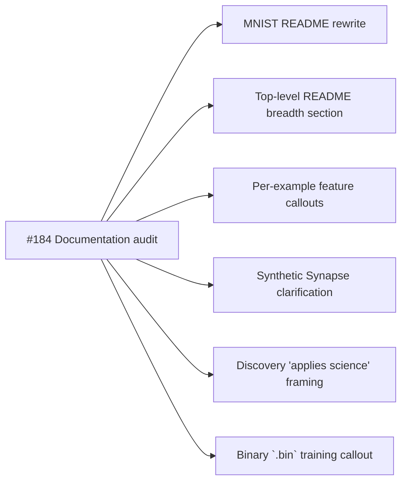

# 📋 NEAT-AI Feature Audit — README Cross-Reference

> **Status — verdicts verified as at 2026-08-12.** Source-of-truth audit produced for issue
> [#184](https://github.com/stSoftwareAU/NEAT-AI-Examples/issues/184) (parent
> [#182](https://github.com/stSoftwareAU/NEAT-AI-Examples/issues/182)). This file does **not**
> rewrite any README; it lists every gap, inaccuracy, and opportunity so that the follow-up
> sub-issues can fix the documentation consistently rather than one passage at a time.
>
> Two kinds of content live here, and they age differently
> ([#790](https://github.com/stSoftwareAU/NEAT-AI-Examples/issues/790)):
>
> - **Verdicts and the register are live.** Which capability each example demonstrates, which README
>   is misrepresenting NEAT-AI, and which READMEs exist are re-checked against the repository by
>   [`neat_ai_feature_audit_test.ts`](neat_ai_feature_audit_test.ts). A row whose follow-up has
>   landed is marked **✅ Resolved** and its superseded wording is struck through as ~~"like this"~~
>   — the tests fail if struck wording is still in the README, or if a live accusation quotes
>   wording the README no longer contains.
> - **Un-struck quoted passages are #184-era snapshots.** READMEs have been rewritten many times
>   since; a quote outside a resolved row may have been reworded by unrelated work without the
>   verdict changing. Trust the verdict, then re-read the README before acting on a quote.

## 🎯 Why this audit exists

The reporter on issue #182 pointed out that several READMEs in this repository read as if NEAT-AI
were "just textbook NEAT" — e.g. that
[`mnist_classification/README.md`](../mnist_classification/README.md) reads as if NEAT-AI lacks back
propagation, when in fact backprop is one of many training features inside NEAT-AI (see the upstream
[COMPARISON.md](https://github.com/stSoftwareAU/NEAT-AI/blob/Develop/COMPARISON.md)). The reporter's
three concrete points:

1. **Back propagation** is implemented in NEAT-AI; the MNIST README should not imply otherwise.
2. **Binary training data** is one of the speed-up vectors NEAT-AI uses — the production training
   pipeline expects on-disk `.bin` chunks rather than CSV, which is materially faster than the
   analytical SGD some examples use.
3. [**NEAT-AI-Discovery**](https://github.com/stSoftwareAU/NEAT-AI-Discovery) "applies a bit of
   science to the structural changes" — beneficial mutations are searched for using GPU-accelerated
   activation analysis (saturated, dead, dormant, bottleneck neurons) rather than purely random
   structural mutation.

This audit is the foundation; the follow-up sub-issues consume it.

## 🗺️ Capability map (search · training · structure · scale · interop)

The Mermaid summary groups every NEAT-AI capability from upstream `COMPARISON.md` into the five
categories called out in the issue. Categories are deliberately broad — many features (e.g.
`Synthetic Synapse Training`) sit at the boundary between _training_ and _structure_ and are placed
where their primary effect lies.

```mermaid
flowchart TD
    subgraph search [🔎 Search]
        SP[Speciation]
        HM[Historical Marking]
        MCMC[MCMC Mutation Acceptance]
        ME[Memetic Evolution]
        BR[Advanced Breeding]
        FS[Fitness Sharing]
        SS[Stagnant Species Retirement]
        SQ[Fitness-Driven Squash Mutation]
        APS[Adaptive Population Sizing]
        EN[Ensemble Diversity]
        AQ[Adaptive Quantum Steps]
    end
    subgraph training [🎓 Training]
        BP[Backpropagation]
        SPT[Sparse Training]
        BAT[Batch Processing]
        ES[Early Stopping]
        PC[Predictive Coding]
        DR[Dropout]
        L12[L1/L2 Regularisation]
        KF[K-Fold Cross-Validation]
        SY[Synthetic Synapse Training]
        MUON[Muon-Style Orthogonalised Updates]
        HSA[Hyperparameter Self-Adaptation]
    end
    subgraph structure [🧱 Structure]
        DISC[GPU-Accelerated Discovery]
        DCACHE[Discovery Caching]
        CRIS[CRISPR Gene Injection]
        GR[Grafting]
        NP[Neuron Pruning]
        UAF[Unique Activation Functions]
        AGG[Improved Aggregate Gradient Flow]
        FOT[Forward-Only Topology Enforcement]
        NUM[Numerical Stability Clamps]
    end
    subgraph scale [⚡ Scale]
        UUID[UUID-Based Indexing]
        DE[Distributed Evolution]
        PB[Parallel Batch Creature Evaluation]
        BIN[Binary `.bin` Training Stream]
        DSM[Disk Space Monitoring]
        WPR[WASM Panic Recovery]
        LL[Lifelong Learning]
        RUST[Optional Rust CLI Scorer]
    end
    subgraph interop [🔌 Interop]
        ONNX[ONNX Format Export]
        TL[Transfer Learning]
        DNA[DNA-Sharing Primitives]
        CORE[NEAT-AI-core Pin & Parity Gate]
    end

    search --> training
    training --> structure
    structure --> scale
    scale --> interop
```

## 🚦 NEAT-AI capability vs example coverage

This table is the central artefact of the audit. Every capability listed in upstream `COMPARISON.md`
("What We've Implemented") is included; for each capability we record whether an example currently
demonstrates it, which README mentions it, and whether any README misrepresents the capability as
absent.

| Capability                                         | Demonstrated by                                                                                                                                                                                                                                                                             | Mentioned in README                                                                                                                                                                          | Misrepresented as absent in NEAT-AI?                                                                                                                                                                                                                                                                                           |
| -------------------------------------------------- | ------------------------------------------------------------------------------------------------------------------------------------------------------------------------------------------------------------------------------------------------------------------------------------------- | -------------------------------------------------------------------------------------------------------------------------------------------------------------------------------------------- | ------------------------------------------------------------------------------------------------------------------------------------------------------------------------------------------------------------------------------------------------------------------------------------------------------------------------------ |
| Evolutionary Topology Search                       | every in-scope example                                                                                                                                                                                                                                                                      | most READMEs                                                                                                                                                                                 | No.                                                                                                                                                                                                                                                                                                                            |
| Speciation                                         | not yet demonstrated                                                                                                                                                                                                                                                                        | none                                                                                                                                                                                         | No, but no example explains it either — opportunity for a callout.                                                                                                                                                                                                                                                             |
| Historical Marking                                 | implicit in `crossover/`                                                                                                                                                                                                                                                                    | [crossover/README.md](../crossover/README.md)                                                                                                                                                | No.                                                                                                                                                                                                                                                                                                                            |
| Backpropagation                                    | demonstrated by `synthetic_synapse/`                                                                                                                                                                                                                                                        | [synthetic_synapse/README.md](../synthetic_synapse/README.md)                                                                                                                                | ✅ **Resolved** — [`mnist_classification/README.md`](../mnist_classification/README.md) read as if NEAT-AI lacked backprop (~~"SGD beats NEAT"~~); reframed by [#185](https://github.com/stSoftwareAU/NEAT-AI-Examples/issues/185) (PR [#194](https://github.com/stSoftwareAU/NEAT-AI-Examples/pull/194)).                     |
| Sparse Training                                    | not yet demonstrated                                                                                                                                                                                                                                                                        | none                                                                                                                                                                                         | No.                                                                                                                                                                                                                                                                                                                            |
| Batch Processing                                   | not yet demonstrated                                                                                                                                                                                                                                                                        | [mnist_classification/README.md](../mnist_classification/README.md) (mini-batch SGD)                                                                                                         | No.                                                                                                                                                                                                                                                                                                                            |
| Early Stopping                                     | implicit in many examples (accuracy targets)                                                                                                                                                                                                                                                | [mnist_classification/README.md](../mnist_classification/README.md), and others                                                                                                              | No.                                                                                                                                                                                                                                                                                                                            |
| Memetic Evolution                                  | demonstrated by `memetic_evolution/`                                                                                                                                                                                                                                                        | [memetic_evolution/README.md](../memetic_evolution/README.md)                                                                                                                                | No.                                                                                                                                                                                                                                                                                                                            |
| Error-Guided Structural Evolution                  | demonstrated by `discovery_at_scale/`                                                                                                                                                                                                                                                       | [discovery_at_scale/README.md](../discovery_at_scale/README.md)                                                                                                                              | ✅ **Resolved** — the "science-driven" framing from issue #182 opens the README again ([#189](https://github.com/stSoftwareAU/NEAT-AI-Examples/issues/189), restored under [#797](https://github.com/stSoftwareAU/NEAT-AI-Examples/issues/797)).                                                                               |
| Predictive Coding                                  | not yet demonstrated                                                                                                                                                                                                                                                                        | none                                                                                                                                                                                         | No, but no example explains it.                                                                                                                                                                                                                                                                                                |
| Dropout                                            | not yet demonstrated                                                                                                                                                                                                                                                                        | none                                                                                                                                                                                         | No.                                                                                                                                                                                                                                                                                                                            |
| L1/L2 Weight & Bias Regularisation                 | not yet demonstrated                                                                                                                                                                                                                                                                        | none                                                                                                                                                                                         | No.                                                                                                                                                                                                                                                                                                                            |
| K-Fold Cross-Validation                            | not yet demonstrated                                                                                                                                                                                                                                                                        | none                                                                                                                                                                                         | No.                                                                                                                                                                                                                                                                                                                            |
| Gradient Accumulation Normalisation                | not yet demonstrated                                                                                                                                                                                                                                                                        | none                                                                                                                                                                                         | No.                                                                                                                                                                                                                                                                                                                            |
| Synthetic Synapse Training                         | demonstrated by `synthetic_synapse/`                                                                                                                                                                                                                                                        | [synthetic_synapse/README.md](../synthetic_synapse/README.md)                                                                                                                                | ✅ **Resolved** — the comparison-table heading ~~"Pure NEAT"~~ now reads "Textbook NEAT" ([#188](https://github.com/stSoftwareAU/NEAT-AI-Examples/issues/188), PR [#225](https://github.com/stSoftwareAU/NEAT-AI-Examples/pull/225)).                                                                                          |
| MCMC Mutation Acceptance                           | demonstrated by `mcmc_acceptance/`                                                                                                                                                                                                                                                          | [mcmc_acceptance/README.md](../mcmc_acceptance/README.md)                                                                                                                                    | No.                                                                                                                                                                                                                                                                                                                            |
| Muon-Style Orthogonalised Gradient Updates         | not yet demonstrated                                                                                                                                                                                                                                                                        | none                                                                                                                                                                                         | No.                                                                                                                                                                                                                                                                                                                            |
| UUID-Based Indexing                                | implicit in `crispr_injection/`                                                                                                                                                                                                                                                             | [crispr_injection/README.md](../crispr_injection/README.md)                                                                                                                                  | No.                                                                                                                                                                                                                                                                                                                            |
| Distributed Evolution                              | not yet demonstrated                                                                                                                                                                                                                                                                        | none                                                                                                                                                                                         | No.                                                                                                                                                                                                                                                                                                                            |
| Lifelong Learning                                  | not yet demonstrated                                                                                                                                                                                                                                                                        | none                                                                                                                                                                                         | No.                                                                                                                                                                                                                                                                                                                            |
| CRISPR Gene Injection                              | demonstrated by `crispr_injection/`                                                                                                                                                                                                                                                         | [crispr_injection/README.md](../crispr_injection/README.md)                                                                                                                                  | No.                                                                                                                                                                                                                                                                                                                            |
| Grafting                                           | not yet demonstrated                                                                                                                                                                                                                                                                        | none                                                                                                                                                                                         | No.                                                                                                                                                                                                                                                                                                                            |
| Neuron Pruning                                     | demonstrated by `neuron_pruning/`                                                                                                                                                                                                                                                           | [neuron_pruning/README.md](../neuron_pruning/README.md)                                                                                                                                      | No.                                                                                                                                                                                                                                                                                                                            |
| GPU-Accelerated Discovery                          | demonstrated by `discovery/`, `discovery_at_scale/`                                                                                                                                                                                                                                         | [discovery/README.md](../discovery/README.md), [discovery_at_scale/README.md](../discovery_at_scale/README.md)                                                                               | ✅ **Resolved** — both READMEs open with the _science-driven_ framing (activation analysis → targeted rewire / replace / prune / split) the reporter highlighted, enforced by [`discovery_readme_framing_test.ts`](../discovery_readme_framing_test.ts) ([#797](https://github.com/stSoftwareAU/NEAT-AI-Examples/issues/797)). |
| Discovery Caching                                  | not yet demonstrated                                                                                                                                                                                                                                                                        | none                                                                                                                                                                                         | No.                                                                                                                                                                                                                                                                                                                            |
| Disk Space Monitoring                              | not yet demonstrated                                                                                                                                                                                                                                                                        | none                                                                                                                                                                                         | No.                                                                                                                                                                                                                                                                                                                            |
| Ensemble Diversity                                 | not yet demonstrated                                                                                                                                                                                                                                                                        | none                                                                                                                                                                                         | No.                                                                                                                                                                                                                                                                                                                            |
| Adaptive Quantum Steps                             | not yet demonstrated                                                                                                                                                                                                                                                                        | none                                                                                                                                                                                         | No.                                                                                                                                                                                                                                                                                                                            |
| Unique Activation Functions (IF, MAX, MIN)         | demonstrated by `intelligent_design/`                                                                                                                                                                                                                                                       | [intelligent_design/README.md](../intelligent_design/README.md)                                                                                                                              | No.                                                                                                                                                                                                                                                                                                                            |
| Improved Aggregate Gradient Flow (MAXIMUM/MINIMUM) | not yet demonstrated                                                                                                                                                                                                                                                                        | none                                                                                                                                                                                         | No.                                                                                                                                                                                                                                                                                                                            |
| Transfer Learning                                  | not yet demonstrated                                                                                                                                                                                                                                                                        | none                                                                                                                                                                                         | No.                                                                                                                                                                                                                                                                                                                            |
| ONNX Format Export                                 | not yet demonstrated                                                                                                                                                                                                                                                                        | none                                                                                                                                                                                         | No.                                                                                                                                                                                                                                                                                                                            |
| Hyperparameter Self-Adaptation                     | partially — `adaptive_mutation/` shows topology-share auto-shift                                                                                                                                                                                                                            | [adaptive_mutation/README.md](../adaptive_mutation/README.md)                                                                                                                                | No.                                                                                                                                                                                                                                                                                                                            |
| Adaptive Population Sizing                         | not yet demonstrated                                                                                                                                                                                                                                                                        | none                                                                                                                                                                                         | No.                                                                                                                                                                                                                                                                                                                            |
| Parallel Batch Creature Evaluation                 | not yet demonstrated                                                                                                                                                                                                                                                                        | none                                                                                                                                                                                         | No.                                                                                                                                                                                                                                                                                                                            |
| Advanced Breeding Strategies                       | partially — `crossover/` shows the basic operator                                                                                                                                                                                                                                           | [crossover/README.md](../crossover/README.md)                                                                                                                                                | The README only describes mother-keep + father-50 % blending, not subgraph transplantation, cosine-similarity alignment, or diversity-driven cross-population pairing.                                                                                                                                                         |
| WASM Panic Recovery                                | not yet demonstrated                                                                                                                                                                                                                                                                        | none                                                                                                                                                                                         | No.                                                                                                                                                                                                                                                                                                                            |
| Forward-Only Topology Enforcement                  | not yet demonstrated                                                                                                                                                                                                                                                                        | none                                                                                                                                                                                         | No.                                                                                                                                                                                                                                                                                                                            |
| Numerical Stability Clamps                         | not yet demonstrated                                                                                                                                                                                                                                                                        | none                                                                                                                                                                                         | No.                                                                                                                                                                                                                                                                                                                            |
| Fitness Sharing & Per-Species Breeding Quotas      | not yet demonstrated                                                                                                                                                                                                                                                                        | none                                                                                                                                                                                         | No.                                                                                                                                                                                                                                                                                                                            |
| Stagnant Species Detection and Retirement          | not yet demonstrated                                                                                                                                                                                                                                                                        | none                                                                                                                                                                                         | No.                                                                                                                                                                                                                                                                                                                            |
| Soft Compatibility-Gated Cross-Species Breeding    | not yet demonstrated                                                                                                                                                                                                                                                                        | none                                                                                                                                                                                         | No.                                                                                                                                                                                                                                                                                                                            |
| Fitness-Driven Squash Mutation                     | indirectly via `intelligent_design/`                                                                                                                                                                                                                                                        | [intelligent_design/README.md](../intelligent_design/README.md)                                                                                                                              | No.                                                                                                                                                                                                                                                                                                                            |
| DNA-Sharing Primitives                             | not yet demonstrated                                                                                                                                                                                                                                                                        | none                                                                                                                                                                                         | No.                                                                                                                                                                                                                                                                                                                            |
| Optional Rust CLI Scorer with WASM Fallback        | not yet demonstrated                                                                                                                                                                                                                                                                        | none                                                                                                                                                                                         | No.                                                                                                                                                                                                                                                                                                                            |
| NEAT-AI-core Pinning and Parity Gate               | not yet demonstrated                                                                                                                                                                                                                                                                        | none                                                                                                                                                                                         | No.                                                                                                                                                                                                                                                                                                                            |
| Binary `.bin` Training Stream                      | demonstrated by every supervised example — `xor_classification`, `mnist_classification`, `discovery`, `discovery_at_scale`, `crispr_injection`, `evolution_showcase`, `crossover`, `intelligent_design`, `memetic_evolution`, `suggest_improvements`, `neuron_pruning`, `synthetic_synapse` | [docs/binary_training_stream.md](binary_training_stream.md) tables the writer and working directory for each; the top-level [README.md](../README.md) links it from the feature-breadth list | ✅ **Resolved** — the wire format, the speed argument, and the emitting examples are documented ([#190](https://github.com/stSoftwareAU/NEAT-AI-Examples/issues/190), PR [#226](https://github.com/stSoftwareAU/NEAT-AI-Examples/pull/226)).                                                                                   |

## 📚 Per-README accuracy register

Every README under `<example>/README.md` is listed here — completeness is enforced by
[`neat_ai_feature_audit_test.ts`](neat_ai_feature_audit_test.ts), so a new example that ships
without a register row fails the quality gate. The "current accuracy" column is the audit's verdict
on whether the README's NEAT-vs-NEAT-AI framing is accurate, in need of qualification, or makes no
NEAT-vs-NEAT-AI claim at all.

| README path                                                         | NEAT-vs-NEAT-AI claim?                                                                                                                                   | Current accuracy                                                                                                                                                                                                                                                                |
| ------------------------------------------------------------------- | -------------------------------------------------------------------------------------------------------------------------------------------------------- | ------------------------------------------------------------------------------------------------------------------------------------------------------------------------------------------------------------------------------------------------------------------------------- |
| [adaptive_mutation/README.md](../adaptive_mutation/README.md)       | Describes adaptive mutation as one of NEAT-AI's "hidden but important behaviours".                                                                       | Accurate — explicitly frames the feature as NEAT-AI policy, not NEAT in the abstract.                                                                                                                                                                                           |
| [cart_pole/README.md](../cart_pole/README.md)                       | "Textbook cart-pole is famously trivial for random NEAT" — explicit qualification.                                                                       | Accurate. Good model of how to phrase NEAT-vs-NEAT-AI distinctions.                                                                                                                                                                                                             |
| [crispr_injection/README.md](../crispr_injection/README.md)         | Calls CRISPR injection "unique to NEAT-style neuroevolution". Mentions "NEAT-AI's UUID-keyed neurons".                                                   | Accurate.                                                                                                                                                                                                                                                                       |
| [crossover/README.md](../crossover/README.md)                       | No NEAT-vs-NEAT-AI claim made; describes one breeding strategy.                                                                                          | Accurate but **incomplete** — only one of NEAT-AI's "Advanced Breeding Strategies" is shown, with no callout that more exist. Candidate for a "Further reading" pointer.                                                                                                        |
| [discovery/README.md](../discovery/README.md)                       | No NEAT-vs-NEAT-AI claim made.                                                                                                                           | ✅ **Resolved** — the opening section now carries the "science-driven" framing for NEAT-AI-Discovery from issue #182 ([#189](https://github.com/stSoftwareAU/NEAT-AI-Examples/issues/189), restored under [#797](https://github.com/stSoftwareAU/NEAT-AI-Examples/issues/797)). |
| [discovery_at_scale/README.md](../discovery_at_scale/README.md)     | "thesis: discovering structures at size and speed".                                                                                                      | ✅ **Resolved** — same fix as `discovery/README.md`: the "applies a bit of science" framing from issue #182 opens the README, so readers see Discovery as targeted, not random ([#797](https://github.com/stSoftwareAU/NEAT-AI-Examples/issues/797)).                           |
| [evolution_showcase/README.md](../evolution_showcase/README.md)     | No NEAT-vs-NEAT-AI claim made.                                                                                                                           | Accurate; flagship long-form run.                                                                                                                                                                                                                                               |
| [intelligent_design/README.md](../intelligent_design/README.md)     | No NEAT-vs-NEAT-AI claim made.                                                                                                                           | Accurate.                                                                                                                                                                                                                                                                       |
| [lunar_lander/README.md](../lunar_lander/README.md)                 | "this is exactly the kind of task where NEAT-AI's CTRNN-style temporal memory shines". Links to NEAT-AI #-key-features.                                  | Accurate — does the right thing, links upstream for breadth.                                                                                                                                                                                                                    |
| [maze_navigation/README.md](../maze_navigation/README.md)           | No NEAT-vs-NEAT-AI claim made; calls out NEAT-AI's `Creature.activate`.                                                                                  | Accurate.                                                                                                                                                                                                                                                                       |
| [mcmc_acceptance/README.md](../mcmc_acceptance/README.md)           | "NEAT-AI's mutation-acceptance strategy".                                                                                                                | Accurate.                                                                                                                                                                                                                                                                       |
| [memetic_evolution/README.md](../memetic_evolution/README.md)       | No NEAT-vs-NEAT-AI claim made.                                                                                                                           | Accurate.                                                                                                                                                                                                                                                                       |
| [mnist_classification/README.md](../mnist_classification/README.md) | Was ~~"SGD beats NEAT by orders of magnitude in wall-clock"~~; the README now frames evolution and backprop as two paradigms NEAT-AI ships side by side. | ✅ **Resolved** — was **Misleading** (read as if NEAT-AI lacked back propagation); rewritten under [#185](https://github.com/stSoftwareAU/NEAT-AI-Examples/issues/185) (PR [#194](https://github.com/stSoftwareAU/NEAT-AI-Examples/pull/194)).                                  |
| [mountain_car/README.md](../mountain_car/README.md)                 | No NEAT-vs-NEAT-AI claim made.                                                                                                                           | Accurate.                                                                                                                                                                                                                                                                       |
| [neuron_pruning/README.md](../neuron_pruning/README.md)             | "one of NEAT-AI's simplest, most effective tricks".                                                                                                      | Accurate.                                                                                                                                                                                                                                                                       |
| [snake_game/README.md](../snake_game/README.md)                     | "Is the NEAT-AI API set up for a stream of observations?" Discusses NEAT-AI as the toolkit.                                                              | Accurate.                                                                                                                                                                                                                                                                       |
| [stock_market/README.md](../stock_market/README.md)                 | "evolves a NEAT-AI network from uniform-random noise".                                                                                                   | Accurate.                                                                                                                                                                                                                                                                       |
| [suggest_improvements/README.md](../suggest_improvements/README.md) | No NEAT-vs-NEAT-AI claim made (utility script).                                                                                                          | Accurate.                                                                                                                                                                                                                                                                       |
| [synthetic_synapse/README.md](../synthetic_synapse/README.md)       | Was a ~~"Pure NEAT"~~ comparison-table heading; the heading and the prose now both say "Textbook NEAT".                                                  | ✅ **Resolved** — the heading no longer reads as a generic NEAT-AI shortcoming ([#188](https://github.com/stSoftwareAU/NEAT-AI-Examples/issues/188), PR [#225](https://github.com/stSoftwareAU/NEAT-AI-Examples/pull/225)).                                                     |
| [tsp_constructive/README.md](../tsp_constructive/README.md)         | No NEAT-vs-NEAT-AI claim made; describes a learned constructive tour builder seeded from uniform-random NEAT.                                            | Accurate.                                                                                                                                                                                                                                                                       |
| [tsp_two_opt/README.md](../tsp_two_opt/README.md)                   | "pure NEAT struggles inside a sane wall-clock budget" — introduces three NEAT-AI hybrid techniques as the remedy.                                        | Accurate — the limitation is attributed to unaided evolutionary search and the NEAT-AI remedies are named alongside it.                                                                                                                                                         |
| [xor_classification/README.md](../xor_classification/README.md)     | "the canonical 'Hello World' of neuroevolution"; cites Stanley & Miikkulainen 2002.                                                                      | Accurate — describes the algorithm's lineage and uses NEAT-AI elsewhere.                                                                                                                                                                                                        |

## 🚩 Unqualified-NEAT phrasings to fix

The following passages use the bare word "NEAT" where the surrounding context needs the qualifier
**standard NEAT** / **textbook NEAT** / **vanilla NEAT** / **evolutionary search** so a reader does
not infer the limitation applies to NEAT-AI itself.

| README                                                                                                  | Passage                                                                                                      | Suggested rewording                                                                                                                                                                                                                                                                                                                 |
| ------------------------------------------------------------------------------------------------------- | ------------------------------------------------------------------------------------------------------------ | ----------------------------------------------------------------------------------------------------------------------------------------------------------------------------------------------------------------------------------------------------------------------------------------------------------------------------------- |
| [mnist_classification/README.md](../mnist_classification/README.md) — "Tacit Knowledge" bullet          | ~~"SGD beats NEAT by orders of magnitude in wall-clock."~~                                                   | ✅ **Resolved** by [#185](https://github.com/stSoftwareAU/NEAT-AI-Examples/issues/185) (PR [#194](https://github.com/stSoftwareAU/NEAT-AI-Examples/pull/194)); the MLP/SGD baseline chapter has since been dropped from the README entirely.                                                                                        |
| [mnist_classification/README.md](../mnist_classification/README.md) — "Architecture & Training" intro   | ~~"NEAT evolution from uniform-random noise"~~                                                               | ✅ **Resolved** — the seed is now the `Creature.forDataset` factory ([#518](https://github.com/stSoftwareAU/NEAT-AI-Examples/issues/518)) and the "🧰 NEAT-AI Features Used" callout ([#187](https://github.com/stSoftwareAU/NEAT-AI-Examples/issues/187)) links upstream `COMPARISON.md` for the wider training-methods catalogue. |
| [synthetic_synapse/README.md](../synthetic_synapse/README.md) — comparison table                        | ~~"Pure NEAT"~~ column heading                                                                               | ✅ **Resolved** — the heading reads "Textbook NEAT" ([#188](https://github.com/stSoftwareAU/NEAT-AI-Examples/issues/188), PR [#225](https://github.com/stSoftwareAU/NEAT-AI-Examples/pull/225)).                                                                                                                                    |
| [synthetic_synapse/README.md](../synthetic_synapse/README.md) — "Why does NEAT-AI need this?" paragraph | ~~"Vanilla NEAT struggles at scale"~~ — now "Textbook NEAT (Stanley & Miikkulainen 2002) struggles at scale" | ✅ **Resolved** — already qualified, and re-worded to match the table heading ([#188](https://github.com/stSoftwareAU/NEAT-AI-Examples/issues/188), PR [#225](https://github.com/stSoftwareAU/NEAT-AI-Examples/pull/225)).                                                                                                          |
| [discovery/README.md](../discovery/README.md) — flow description                                        | "Search for replacement"                                                                                     | ✅ **Resolved** — the opening section names the saturated / dead / dormant / bimodal / bottleneck analysis behind Discovery's targeted changes, per the issue #182 framing ([#797](https://github.com/stSoftwareAU/NEAT-AI-Examples/issues/797)).                                                                                   |
| [discovery_at_scale/README.md](../discovery_at_scale/README.md) — top-of-file thesis                    | "discovering structures at size and speed"                                                                   | ✅ **Resolved** — the README opens with exactly that contrast: textbook NEAT mutates randomly, NEAT-AI-Discovery applies activation analysis to _target_ the changes worth making ([#797](https://github.com/stSoftwareAU/NEAT-AI-Examples/issues/797)).                                                                            |
| Top-level [README.md](../README.md) — examples gallery                                                  | Many examples described without a one-liner on which NEAT-AI feature they exercise.                          | Add a "Feature exercised" column or per-example callout, citing this audit.                                                                                                                                                                                                                                                         |

## 🛣️ Specific reporter points (issue #182)

These are the three points the reporter made explicitly. They are extracted here so each follow-up
sub-issue can cite them verbatim.

1. **Back propagation framing in MNIST.** From issue #182:
   > "Our implementation does have back propagation and many other features." The MNIST README's
   > `SGD beats NEAT` line reads as if NEAT-AI is NEAT-only; rewrite to contrast SGD with
   > _evolutionary topology search_ and link to upstream `COMPARISON.md` for breadth.
2. **Binary training data speed advantage.** From issue #182:
   > "if the training data is prepared in a binary format that would be very fast indeed." NEAT-AI's
   > production pipeline expects on-disk `.bin` chunks, which is materially faster than CSV.
   >
   > ✅ **Resolved** — [`docs/binary_training_stream.md`](binary_training_stream.md) documents the
   > wire format, the speed argument, and every example that emits a `.bin` file; the top-level
   > README links it from the feature-breadth list
   > ([#190](https://github.com/stSoftwareAU/NEAT-AI-Examples/issues/190), PR
   > [#226](https://github.com/stSoftwareAU/NEAT-AI-Examples/pull/226)).
3. **NEAT-AI-Discovery's "science-driven" structural mutation.** From issue #182:
   > "Look at NEAT-AI-Discovery for example, this applies a bit of science to the structural changes
   > in the network instead of just random mutations." Both `discovery/README.md` and
   > `discovery_at_scale/README.md` should adopt this framing prominently.
   >
   > ✅ **Resolved** — both READMEs open with the framing, and
   > [`discovery_readme_framing_test.ts`](../discovery_readme_framing_test.ts) fails the quality
   > gate if a future rewrite drops it again
   > ([#189](https://github.com/stSoftwareAU/NEAT-AI-Examples/issues/189), restored under
   > [#797](https://github.com/stSoftwareAU/NEAT-AI-Examples/issues/797)).

## 🧭 Follow-up sub-issues this audit feeds

All six sub-issues below shipped —
[#185](https://github.com/stSoftwareAU/NEAT-AI-Examples/issues/185),
[#186](https://github.com/stSoftwareAU/NEAT-AI-Examples/issues/186),
[#187](https://github.com/stSoftwareAU/NEAT-AI-Examples/issues/187),
[#188](https://github.com/stSoftwareAU/NEAT-AI-Examples/issues/188),
[#189](https://github.com/stSoftwareAU/NEAT-AI-Examples/issues/189) and
[#190](https://github.com/stSoftwareAU/NEAT-AI-Examples/issues/190) are all closed. The diagram is
kept as the lineage record for where each rewrite came from.

One regressed and has been restored: the #189 science-driven Discovery framing was dropped by the
later [#207](https://github.com/stSoftwareAU/NEAT-AI-Examples/issues/207) /
[#208](https://github.com/stSoftwareAU/NEAT-AI-Examples/issues/208) rewrites of the two Discovery
READMEs and was put back under [#797](https://github.com/stSoftwareAU/NEAT-AI-Examples/issues/797),
which also added [`discovery_readme_framing_test.ts`](../discovery_readme_framing_test.ts) so the
next rewrite cannot drop it silently.

## 🔗 References

- Upstream
  [stSoftwareAU/NEAT-AI/COMPARISON.md](https://github.com/stSoftwareAU/NEAT-AI/blob/Develop/COMPARISON.md)
  — "What We've Implemented" section drives the capability list above.
- Issue [#182](https://github.com/stSoftwareAU/NEAT-AI-Examples/issues/182) — reporter's original
  prompt about back propagation, binary data, and Discovery.
- Issue [#184](https://github.com/stSoftwareAU/NEAT-AI-Examples/issues/184) — the umbrella audit
  issue this file resolves.
- [NEAT-AI-Discovery](https://github.com/stSoftwareAU/NEAT-AI-Discovery) — the Rust library that
  delivers the "science-driven" structural mutation framing.
