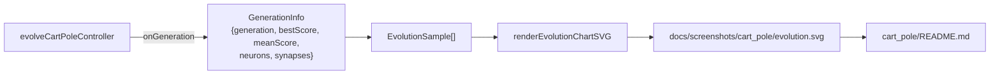

## Summary

Wired the cart-pole example to capture per-generation
`{generation, score, neurons, synapses}` samples and render a
dual-axis evolution chart at `docs/screenshots/cart_pole/evolution.svg`,
embedded in `cart_pole/README.md`. Closes #107.

- Extended `GenerationInfo` in `cart_pole/cart_pole.ts` with
  `neurons` and `synapses` fields, populated from the generation's
  champion creature.
- Main runner now collects `EvolutionSample[]` via the existing
  `onGeneration` callback and calls
  `renderEvolutionChartSVG(...)` from `common/evolution_chart.ts`.
- Added `EVOLUTION_CHART_PATH = "docs/screenshots/cart_pole/evolution.svg"`
  and `ensureDirSync` for the output directory.
- `cart_pole/run.sh` re-formats the new SVG so `deno fmt --check`
  stays clean.
- `cart_pole/README.md` lists the new artefact in the "Artefacts"
  section and embeds the chart with descriptive alt-text.

## Evidence

CLI/back-end change — no UI screenshot. Verified with the test
suite and by running `./cart_pole/run.sh`, which produced
`docs/screenshots/cart_pole/evolution.svg` (~31 KB).

## Test Plan

- Added `evolveCartPoleController emits GenerationInfo with neurons
  and synapses counts` in `cart_pole/cart_pole_test.ts`. The test
  asserts the new shape (5 neurons, 4 synapses for the fixed linear
  topology) and non-negative scores.
- Existing `cart_pole_test.ts` tests continue to pass (19/19).
- Full suite passes: `deno test ... 747 passed | 0 failed`.
- `deno lint`, `deno fmt --check`, and `deno check` all clean.
