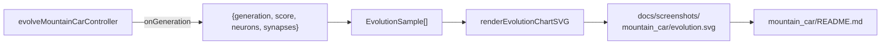

## Summary

Wire `mountain_car` to the shared evolution chart helper. The
per-generation `GenerationInfo` callback now reports the champion
creature's `neurons` and `synapses` counts alongside scores; the main
runner collects those samples and renders a deterministic dual-axis
chart at `docs/screenshots/mountain_car/evolution.svg`, embedded in
`mountain_car/README.md` with descriptive alt-text. Closes #109.

## Evidence

CLI/example change — verified by running the example end-to-end and by
the unit test added below.



Run output:

```
🧬 Evolving controller...
   Gen   0  best=   310.0  mean=   -64.7  neurons=5  synapses=6

✅ Solved after 1 generations (steps=138, score=310.00).
🖼️  Wrote screenshot docs/screenshots/mountain_car.svg (139 frames captured)
📈 Wrote evolution chart docs/screenshots/mountain_car/evolution.svg
```

`./quality.sh < /dev/null` passes cleanly: "All examples passed!".

## Test Plan

- Added `mountain_car/mountain_car_test.ts ::
  evolveMountainCarController emits neurons and synapses on each
  generation event` — asserts the new `GenerationInfo` shape and that
  the linear genome reports `INPUT_COUNT + OUTPUT_COUNT` neurons and
  `INPUT_COUNT * OUTPUT_COUNT` synapses on every event.
- Existing reproducibility/solve tests continue to cover the evolver
  itself; no behavioural change to scoring or selection.
- `./quality.sh < /dev/null` — full suite green (lint, fmt, type-check,
  unit tests, every example runner).
