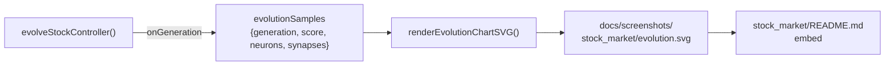

## Summary

Wire the stock_market example to the shared dual-axis evolution chart at the
canonical per-example path `docs/screenshots/stock_market/evolution.svg`,
matching the convention already adopted for `xor_classification`,
`snake_game`, `lunar_lander`, and `mnist_classification`. The chart plots
champion **balanced validation accuracy** (left axis) against champion
**neuron and synapse counts** (right axis) over the captured generations,
giving readers a single picture of "score climbed while topology grew" for
the noise → competent narrative.

The previous flat `docs/screenshots/stock_market_evolution_chart.svg` is
moved to the new sub-directory location so external links break in one
predictable place. `GenerationInfo` already carried `neurons` and
`synapses` from PR #152; this PR finalises the path convention and the
README embed.

Closes #112.

## Evidence

`./quality.sh < /dev/null` passes — every test in the suite (including
`evolveStockController emits GenerationInfo with sensible neuron and synapse
counts`) is green and every example runner completes successfully.

The runner emits a deterministic SVG at the new path; the existing
byte-deterministic test in `common/evolution_chart_test.ts` covers the
renderer's determinism guarantee.

## Test Plan

- `evolveStockController emits GenerationInfo with sensible neuron and
  synapse counts` — already in `stock_market/stock_market_test.ts`,
  asserts `info.neurons === 6` and `info.synapses === 5` for the minimal
  seed and confirms `bestAccuracy` / `meanAccuracy` are non-negative.
- `./quality.sh < /dev/null` (full suite) — all 32 stock_market unit
  tests plus every example runner pass with the new path in place.
