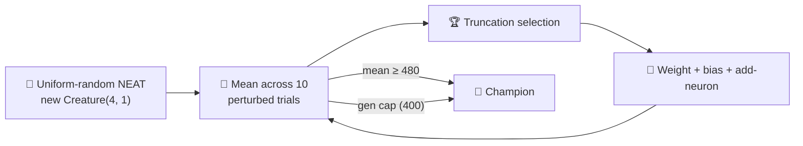

## Summary

Replaces the hand-crafted `4 → 1` linear policy + bounded-random weight init in
`cart_pole/cart_pole.ts` with a **uniform-random NEAT initial population** built by the library
(`createSeededPopulation` → `new Creature(4, 1)`). Topology is no longer hand-specified; structural
mutation (weight perturbation, bias perturbation, and add-neuron splits) discovers the controller
during evolution. Adds a `SOLVED_THRESHOLD` of 480 (mean trial survival across the existing 10
perturbed trials), enforces a hard generation cap of 400, extends the snapshot cadence to
`[1, 10, 100, 500, 1000]`, and rewrites the unit tests to cover the happy path, gen-1 noise, and
generation-cap stop. Closes #149.

## Evidence

This is a backend/CLI change with no UI. The runner (`cart_pole/cart_pole.ts`) was executed end-to-end
to regenerate the committed evidence SVGs:

- `docs/screenshots/cart_pole.svg` — animated balance run of the champion.
- `docs/screenshots/cart_pole_evolution.svg` — multi-panel evolution-progression strip.
- `docs/screenshots/cart_pole_evolution_chart.svg` — dual-axis chart (best score, neuron count,
  synapse count) per generation.



Runner output (extracted):

```
🧪 Sanity check: hand-crafted tilt-direction policy
   Hand-crafted policy survived 25 steps.

🧬 Evolving controller from uniform-random NEAT noise...
   Gen   0  best= 500.0  mean=  74.5  neurons=5  synapses=4
   ...
   Gen  99  best= 500.0  mean= 490.0  neurons=5  synapses=4
✅ Solved after 1 generations (best=500.0, threshold=480).
```

Test coverage:

- `buildRandomPopulation produces uniform-random NEAT genomes` — happy path for the new init.
- `buildRandomPopulation does not hand-specify hidden topology` — confirms zero hidden neurons in
  gen 1.
- `mutateCreatureExport with addNeuronRate=1 grows topology` — structural mutation grows the network.
- `evolveCartPoleController generation-1 population is noise on average` — gen-1 mean far below
  threshold (~75 ≪ 240).
- `evolveCartPoleController honours the hard generation cap` — vanishing-mutation run stops at the cap.
- `evolveCartPoleController finds a controller above SOLVED_THRESHOLD with the default seed` — the
  chosen threshold is achievable on the deterministic seed.
- `evolveCartPoleController champion generalises to unseen perturbed initial states` — the champion
  generalises across an independent batch of perturbations.

Full project quality gate (`deno lint`, `deno fmt --check`, `deno check **/*.ts`,
`deno test --no-check --allow-all`) passes locally — 780 tests, all green.

## Test Plan

- [x] `deno test --no-check --allow-all` — full suite (780 passed).
- [x] `deno lint` — 0 issues across 111 files.
- [x] `deno fmt --check` — 231 files formatted correctly.
- [x] `deno check **/*.ts` — type-check clean.
- [x] `deno run --allow-all cart_pole/cart_pole.ts` — runner finishes, writes champion + SVGs.
- [x] Visual inspection of `docs/screenshots/cart_pole.svg` and the evolution strip / chart.
