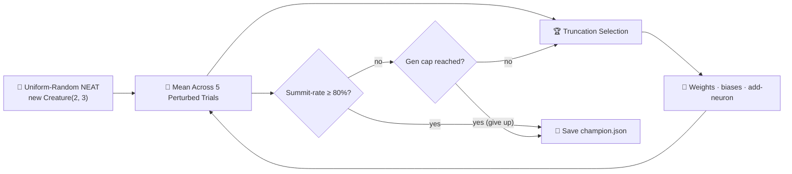

## Summary

Replaced the fixed-architecture, bounded-random seed creature in `mountain_car` with a
uniform-random NEAT initial population built from `createSeededPopulation(...)`. Hidden topology now
arises from structural mutation (add-neuron splits), candidates are scored across a fixed batch of
five perturbed-start trials, and the run is "solved" when the champion's summit-reached fraction
reaches **0.8** within the **300-generation hard cap**. Closes #154.

The legacy fixed-topology helpers (`buildInitialCreatureJSON`, `randomCreatureJSON`,
`genesFromCreatureJSON`, `mutateCreatureJSON`) are gone — replaced by `buildRandomPopulation` and
`mutateCreatureExport` modelled on the cart-pole pattern (issue #147 / cart-pole #143).
`physics.ts` gains `perturbedInitialState` so the multi-trial scoring stays inside `physics.ts`.

The runner now also writes a multi-panel evolution-progression strip
(`docs/screenshots/mountain_car_evolution.svg`) at checkpoint generations
`[1, 10, 50, 150, 300]`, telling the noise → competent story end-to-end.

## Evidence

Example run on the default seed (`12345`):

```
🧬 Evolving controller from uniform-random NEAT noise...
   Gen   0  best=  -53.0  mean=  -65.6  summit=  0%  neurons=5  synapses=6
   ...
   Gen  56  best=  471.0  ...  summit=100%
✅ Solved after 56 generations (summit=100%, score=471.00, threshold=80%).
```

Gen 1 mean score sits at the failure baseline (~−65) and zero of the perturbed-start trials reach
the summit — true noise. The champion at gen 56 hits a 100% summit rate (5 / 5 trials) and an
average score of 471, well above the 80% threshold.

Regenerated artefacts:

- `docs/screenshots/mountain_car.svg` — animated SVG of the champion's swing-up to the flag.
- `docs/screenshots/mountain_car_evolution.svg` — five-panel evolution-progression strip
  (gens 1, 10, 50, 150, 300).
- `docs/screenshots/mountain_car/evolution.svg` — dual-axis chart of best score and champion
  neuron / synapse counts vs. generation.



## Test Plan

Updated tests in `mountain_car/mountain_car_test.ts` and `mountain_car/physics_test.ts`:

- `buildRandomPopulation produces uniform-random NEAT genomes` — verifies population shape and that
  every member is a valid `Creature` with finite outputs.
- `buildRandomPopulation does not hand-specify hidden topology` — guards the no-warm-start policy
  by asserting zero hidden neurons in gen 1.
- `mutateCreatureExport with addNeuronRate=1 grows topology` — exercises the structural mutation
  operator.
- `evolveMountainCarController generation-1 population is noise on average` — gen-1 mean per-trial
  score sits well below `SUCCESS_BONUS / 4`, and the gen-1 best summit rate is below the threshold.
- `evolveMountainCarController honours the hard generation cap` — with a vanishing mutation rate
  the search runs to the cap and reports `solved=false`.
- `evolveMountainCarController finds a champion that meets SOLVED_THRESHOLD with the default seed`
  — happy path: champion crests the flag on at least 80% of perturbed-start trials.
- `evolveMountainCarController writes evolution snapshots and the strip SVG embeds one panel per
  snapshot` — checkpoint capture pipeline.
- `perturbedInitialState samples x in [-magnitude, +magnitude] around the valley centre` and
  `perturbedInitialState is deterministic for the same PRNG seed` — physics-level coverage.

Removed tests covered legacy fixed-topology helpers (`buildInitialCreatureJSON`,
`genesFromCreatureJSON`, `randomCreatureJSON`, `mutateCreatureJSON`) that no longer exist; the test
file header documents this explicitly.

Verified locally:

- `deno lint` — clean.
- `deno fmt --check` — clean (239 files).
- `deno check **/*.ts` — clean.
- `deno test --no-check ...` — 796 passed, 0 failed.
- `./mountain_car/run.sh` — solves at gen 56 with 100% summit rate, regenerates all three SVGs.
