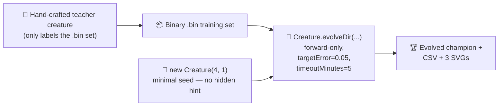

## Summary

Rewires `evolution_showcase` to the audit-mandated minimal-seed flow: NEAT-AI is seeded with
`new Creature(INPUT_COUNT, OUTPUT_COUNT)` — no hidden hint, no warm start, no pre-built
`network.json` — trained via `Creature.evolveDir` over the existing binary `.bin` training set in
forward-only mode, and stops when the per-example `targetError` is reached or the audit-mandated
`timeoutMinutes: 5` backstop fires. Per-generation telemetry is captured via `onTrainingEvent` and
committed as a CSV plus three SVG charts. The README quotes only **measured** numbers from the
latest run. Closes #211.

## Evidence

**Measured run (`./evolution_showcase/run.sh`)**

| Metric                    | Value                                              |
| ------------------------- | -------------------------------------------------- |
| Total generations         | 3000                                               |
| Wall-clock                | 30.2 s                                             |
| Final best fitness        | -0.533                                             |
| Final per-record error    | 1.533 (target 0.05 not yet reached)                |
| Seed neurons / synapses   | 5 / 4                                              |
| Final neurons / synapses  | 15 / 43                                            |
| Stop condition that fired | `maxIterations` cap (well inside the 5-min budget) |

Topology genuinely changes: NEAT-AI added **10 hidden neurons** and **39 synapses** on top of the
minimal seed, and best fitness improved roughly seven-fold from **-3.698 at gen 1** to **-0.533 at
gen 3000**.

**Committed artefacts**

- `docs/data/evolution_showcase/evolution.csv` (3000 rows, schema
  `generation,best_fitness,mean_fitness,neuron_count,synapse_count`)
- `docs/screenshots/evolution_showcase/fitness.svg` (best vs mean fitness)
- `docs/screenshots/evolution_showcase/topology.svg` (score / neurons / synapses)
- `docs/screenshots/evolution_showcase_evolution.svg` (multi-panel snapshot strip)

## Test Plan

- Updated `evolution_showcase/evolution_showcase_test.ts` to cover the new minimal-seed flow:
  teacher creature shape & determinism, dataset preparation idempotence, audit stop-condition
  contract, CSV schema, telemetry adapters, end-to-end `runMinimalSeedShowcase` (rejects bad config,
  captures per-generation rows, mutates the in-place creature), checkpoint snapshot capture,
  multi-panel SVG renderable, telemetry rows render into both audit-mandated chart helpers, and a
  regression test asserting the committed CSV's gen-1 vs final-gen topology changes.
- All 1069 unit tests pass
  (`deno test --no-check --allow-read --allow-write --allow-env
  --allow-net --allow-ffi`).
- `deno fmt --check`, `deno lint`, and `deno check **/*.ts` all pass.
- Ran `./evolution_showcase/run.sh` end-to-end to produce the committed CSV and SVGs.
