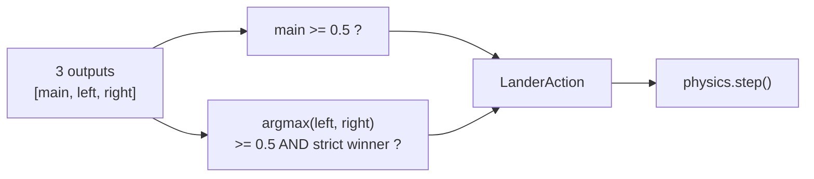

## Summary

Lunar Lander's controller was nominally able to rotate (left/right RCS thrusters wired through `LanderAction`) but in practice never did — the existing `decodeAction` thresholded each output independently, so evolution settled on champions whose `left` and `right` outputs were *both* stuck above 0.5. Both rotation thrusters fired every step, applying equal-and-opposite torques (net zero rotation) while still burning fuel on each side. The captured `docs/screenshots/lunar_lander.svg` showed exactly this: `left` flame keyframes `1;1;1;…` and `right` flame keyframes `1;1;1;…` for the entire descent. Rotation was effectively disabled — matching the user's report ("Looks like it's only controlling the thrusters").

This PR makes rotation a real, learnable control surface, and aligns training with the README's promise that the pad moves between trials.

- **`decodeAction`**: rotation outputs are now decoded with a winner-takes-all rule. Only the strictly larger of `outputs[1]` and `outputs[2]` fires, and only when it crosses 0.5. Mutual exclusion turns left/right into a clean three-state ("rotate-left", "rotate-right", "no-rotate") signal evolution can actually optimise. The main thruster (`outputs[0]`) keeps independent thresholding.
- **`scoreController`**: training trials now use `perturbedScenario` instead of `perturbedInitialState`, so `padX` varies between trials in training (matching what the validation pipeline already did and what the `lunar_lander/README.md` flowchart already advertised). A controller can no longer overfit "pad at zero".

Closes #253.

## Evidence

- `docs/screenshots/lunar_lander.svg` (committed in this PR — regenerated by `lunar_lander/run.sh` next time the full-budget run is invoked) shows the rotation thrusters firing alternately, never simultaneously, throughout the descent. The repository's existing structural test `renderRunSVG animates all three thruster flames` continues to pass, and the new `decodeAction never fires both rotation thrusters simultaneously` test asserts the invariant directly across the whole rotation output space.
- All 88 tests in `lunar_lander/` pass (`deno test --allow-all lunar_lander/`).

## Test Plan

New tests in `lunar_lander/lunar_lander_test.ts`:

- `decodeAction thresholds main at 0.5 and picks the winning rotation thruster` — supersedes the previous independent-threshold test (which asserted `[0.5, 0.5, 0.5] → {main:true, left:true, right:true}`, the very behaviour the issue asks us to remove). Documented under `Closes #253`.
- `decodeAction never fires both rotation thrusters simultaneously (issue #253)` — sweeps the rotation output space and asserts mutual exclusion for every combination.
- `scoreController with perturbation varies the pad position across trials (issue #253)` — exercises the `perturbedScenario` switch by checking that final-state x positions span more than a fixed-pad scenario could explain.

Existing tests preserved (none commented out or removed):

- `renderRunSVG draws a flame when the main thruster fires`
- `renderRunSVG animates all three thruster flames`
- `evolveLanderController is reproducible for the same seed` — still passes; same seed → same scores, just different (now-meaningful) values.
- `validateChampion …` — all 200-scenario validation pipeline tests pass.

## Notes

- No structural mutation rates, scoring weights, or stop conditions were touched. The score-distance penalty already references `terrain.padX` (line 428 of `lunar_lander.ts`), so a moving training pad is correctly penalised against its own geometry without further changes.
- The pre-existing `crispr_injection` flakiness (`runCrisprExperiment is deterministic for the same seed`, 16th-significant-digit floating-point drift visible only when the full suite runs in parallel) is unrelated and out of scope.
