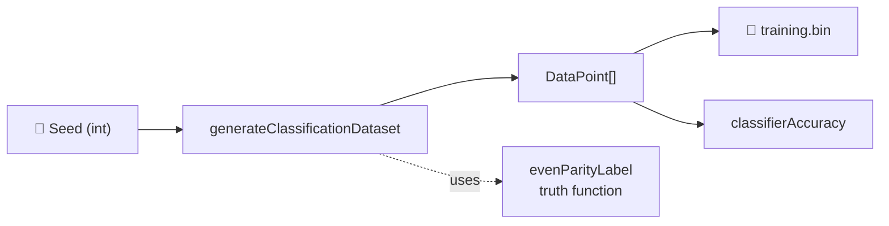

# adaptive_mutation: add binary classification task primitives

## Summary

Adds a self-contained classification-task module under `adaptive_mutation/`
that provides the data generator, scoring/fitness primitives, and tests
for a concrete common AI problem the adaptive-mutation demo can solve
from scratch. The chosen task is **4-bit even parity** — the textbook
XOR generalisation, full 16-row truth table, and **not linearly
separable**, so it demands at least one hidden neuron (which is exactly
what the adaptive-mutation policy must invent). Closes #262.

The new module is currently **unused** by `adaptive_mutation.ts` — wiring
it into the evolution loop is deferred to the follow-up sub-issue from
#254. The existing `adaptive_mutation.ts`, `svg.ts`, `README.md`,
`run.sh`, and `AGENTS.md` are intentionally untouched.

### Task selection

The issue offered three candidates in order of preference; this PR
picks #1 (4-bit even parity). Reasoning, recorded in the module header:

- 6-bit multiplexer (64 rows): richer, but overkill for a demo whose
  narrative is *growth from a tiny seed*.
- Symmetry / palindrome detection: variable-width input is more
  flexible but less canonical. Parity is the textbook XOR
  generalisation.

Parity keeps the truth table small enough to converge inside the
5-minute backstop, clearly differs from `xor_classification` (4 rows)
and `mnist_classification` (real 14×14 images), and fills a useful
middle ground.

### Why hidden neurons are required

Parity is the prototypical *not-linearly-separable* problem. A direct
input → output layer cannot fit the 4-bit truth table for any choice of
weights and bias. The minimal NEAT seed `new Creature(4, 1)` has zero
hidden neurons, so the adaptive-mutation policy must **invent** at
least one hidden neuron (and the inter-layer synapses to connect it)
before the network can score above chance. That structural growth is
the visible signal of the policy at work — which is the narrative the
parent issue (#254) asked for.

## Evidence

This is a backend module addition with no UI — verification is via the
unit-test suite. All 17 new tests pass:

```text
deno test --no-check --allow-read --allow-write --allow-env \
  --allow-net --allow-ffi adaptive_mutation/classification_task_test.ts

ok | 17 passed | 0 failed (63ms)
```

### Data flow



## Test Plan

New file `adaptive_mutation/classification_task_test.ts` adds 17 "what"
tests covering every exported function:

- **Metadata** — `INPUT_COUNT`, `OUTPUT_COUNT`, `TRUTH_TABLE_SIZE`,
  `TASK_NAME` exported and well-formed.
- **`evenParityLabel`** — returns 1 for even count of 1-bits, 0 for
  odd; rejects malformed input (wrong arity, non-binary values).
- **`targetVectorFor`** — encodes `0` / `1` as a single-element
  `Float32Array`; rejects non-binary labels.
- **`generateClassificationDataset`**:
  - Default size returns the full unique truth table.
  - Rejects non-positive / non-integer / NaN sizes.
  - Same seed → field-equal AND byte-equal datasets (determinism,
    verified via the binary writer's actual bytes).
  - Different seeds → different per-record inputs; labels still follow
    `evenParityLabel`.
  - Full truth table is perfectly class-balanced (8 / 8) across
    multiple seeds.
  - Sampled sets stay within ±1 of perfect balance.
  - Sub-truth-table subsets have no duplicate rows.
- **`writeBinaryClassificationDataset`**:
  - File length is exactly `(INPUT_COUNT + OUTPUT_COUNT) * 4 * size`
    bytes, written to a `Deno.makeTempDirSync` and cleaned up in
    `finally`.
  - Re-interpreting the bytes as Float32 records reproduces the
    dataset's first record.
  - Rejects empty datasets and records with the wrong input/target
    arity.
- **`classifierAccuracy`**:
  - Returns `1.0` for a hand-built reference creature that perfectly
    classifies the truth table. The reference creature uses one
    LOGISTIC hidden neuron per truth-table row with high-gain weights
    so its activation approaches 1 for the matched input and 0
    otherwise; the output neuron then sums the parity-labelled hidden
    contributions through a LOGISTIC squash with a negative bias. The
    reference is built **only for this test** — it does not seed the
    evolution.
  - Returns `0` for the empty dataset.
  - Returns a value close to `0.5` (within ±0.25) for a
    randomly-initialised `new Creature(4, 1)` seed with LOGISTIC
    output. The seed RNG is pinned via `setRandomNumberGenerator` for
    reproducibility, and the random creature's accuracy must differ
    from the reference creature's `1.0`.

### Quality-gate status

`deno fmt`, `deno lint`, and `deno check` all pass on the two new
files. The two new files alone also pass `deno test` cleanly (17/17).

The repository-wide `./quality.sh` run reports one pre-existing
failure in `docs/archive_test.ts` ("No PR summary files remain in
docs/ root") caused by stale `docs/pr-summary-{236,237,239,240,253}.md`
files left in place after their PRs merged. These files are present on
`origin/Develop` and the failure is independent of this change — none
of the 17 new tests fail. Archiving those orphans is out of scope of
this sub-issue (per the issue acceptance criteria, no existing files
are touched).

### Confirmation — chosen task requires hidden neurons

4-bit parity is the canonical generalisation of XOR. A direct-only
network with four inputs and one output (`new Creature(4, 1)` — zero
hidden neurons) **cannot** represent the 16-row truth table for any
choice of weights and bias, so NEAT-AI must grow at least one hidden
neuron before the evolved creature can score above chance. This is
explicitly documented in the module header and verified by the
"reasonable bounds for a randomly-initialised seed creature" test.
