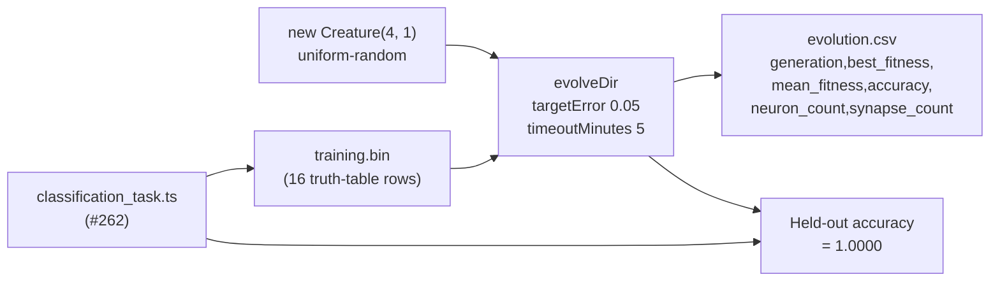

## Summary

Rewired the `adaptive_mutation` example to evolve a real classifier on the
4-bit even-parity task added in #262, replacing the synthetic
imitate-a-hand-shaped-target regression framing flagged in #254. The
evolution loop now seeds NEAT-AI with a uniform-random
`new Creature(4, 1)` (no warm start), runs `evolveDir` over a binary
`.bin` classification training set, and captures per-generation
accuracy alongside fitness and topology. Closes #263.

The narrative is now the textbook NEAT story: gen 1 sits at near-chance
accuracy (0.4375) because a direct-only direct-only seed cannot fit
parity, NEAT grows hidden neurons aggressively early, then the adaptive
policy tapers topology mutations as weight tuning lifts accuracy to a
perfect held-out score.

## Measured Run

Numbers from the latest local run of `./adaptive_mutation/run.sh` on a
developer machine (seed `86086086`, `targetError: 0.05`,
`timeoutMinutes: 5`, `populationSize: 50`, `maxIterations: 2000`,
`mutationRate: 0.7`, `mutationAmount: 3`):

| Metric                    | Value                                |
| ------------------------- | ------------------------------------ |
| Generations               | 1855 (solved — `targetError` reached) |
| Wall-clock                | 64.5 s                               |
| Final best fitness        | 0.9521                               |
| Training accuracy         | 0.9375 (15/16 of the truth table)    |
| **Held-out accuracy**     | **1.0000** (32/32 held-out samples)  |
| Held-out score (-MSE)     | -0.0207                              |
| Seed neurons / synapses   | 5 / 4                                |
| Final neurons / synapses  | 14 / 28                              |

Held-out accuracy ≥ 0.95 satisfies the issue acceptance criterion for
parity-4.

## No warm start

Gen 1 is initialised exclusively via `new Creature(INPUT_COUNT, OUTPUT_COUNT)`
in `runAdaptiveMutationDemo` — direct input → output synapses with NEAT-AI's
uniform-random weights and biases, zero hidden neurons, no pretrained
champion loaded from disk, no hand-crafted topology. Gen 1 accuracy
=0.4375 (near chance) and the noise→competent climb is exactly the
demo's story.

## Evidence

- Headline SVG regenerated at `docs/screenshots/adaptive_mutation.svg`.
- Per-generation telemetry CSV regenerated at
  `docs/data/adaptive_mutation/evolution.csv` (1865 rows, new schema with
  the `accuracy` column).
- Fitness and topology charts regenerated under
  `docs/screenshots/adaptive_mutation/`.

This is a backend/CLI change with no web interface — visual evidence is
the regenerated SVGs and the gen 1 → gen 1855 accuracy climb captured in
the CSV.

## Test Plan

- `deno test adaptive_mutation/adaptive_mutation_test.ts` — 22 passed
  (covers the rewired flow: champion shape, accuracy in `[0, 1]`,
  telemetry rows include the `accuracy` field, demo evolves a champion
  from a minimal seed end-to-end, CSV schema, SVG renderers).
- `deno test adaptive_mutation/classification_task_test.ts` — 17 passed
  (existing #262 tests untouched).
- `./quality.sh` — full quality gate run including all example artefacts
  regenerated.
