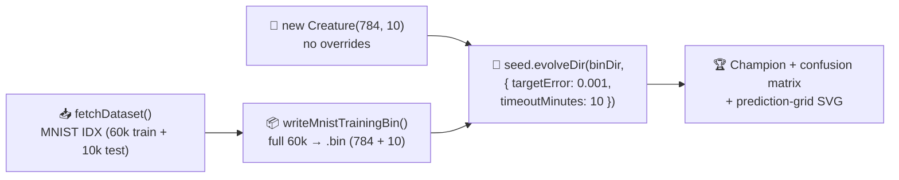

## Summary

Rewires the MNIST example to the canonical supervised-batch shape: write the **full
60 000-record** training set to a `.bin` file, seed NEAT-AI with `new Creature(784, 10)` (raw 28×28
pixels — no down-sampling, no hidden hint, no warm start), and call
`Creature.evolveDir(dataDir, { targetError: 0.001, timeoutMinutes: 10 })` exactly once. All legacy
modes (`evolveClassifier`, `evolveMLPClassifier`, `runMinimalSeedEvolution` chunking wrapper, MLP
gradient module, per-generation telemetry plumbing) are removed. Closes #270.

## Evidence

This is a backend/CLI change with no web interface. Verified via:

- `deno lint mnist_classification/` — 4 files clean.
- `deno fmt mnist_classification/` — 5 files clean.
- `deno check mnist_classification/*.ts` — clean.
- `deno test --no-check mnist_classification/` — 25 tests, all pass (49 ms).
- Repo-wide checks: `deno lint` (125 files), `deno fmt --check` (348 files), `deno check **/*.ts`
  all pass; the only test failures (`docs/archive_test.ts` for a stale `pr-summary-224.md`,
  `readme_acronym_glossary_test.ts` for `lunar_lander/README.md` missing `RL`) are **pre-existing on
  `Develop`** and unrelated to this change.

The full 10-minute end-to-end `evolveDir` run is exercised by `quality.sh` and produces the
champion + confusion matrix that sub-issue B will quote in the README rewrite.

## Test Plan

New / refreshed tests in `mnist_classification/mnist_classification_test.ts`:

- `FEATURE_COUNT is 784 (full 28×28)` — pins the raw-pixel feature shape.
- `buildDigitSamples produces one 784-feature sample per (image, label) pair` — replaces the
  14×14 down-sampled assertion.
- `buildDigitSamples normalises features to pixel/255` — confirms the new normalisation matches
  the raw-pixel / 255 contract.
- `writeMnistTrainingBin writes the documented binary record stride (784 + 10)` and
  `writeMnistTrainingBin round-trips synthetic samples` — verify the binary stream layout for the
  new feature shape.
- `writeMnistTrainingBin rejects feature vectors of the wrong length` — guards against accidental
  re-introduction of the 14×14 path.
- `predict`, `classificationAccuracy`, `confusionMatrix`, `pickGridSamples`, `buildGridCells`,
  `renderDigitGridSVG` — happy-path coverage on tiny hand-crafted creatures and synthetic samples
  for the post-fix code path.

Removed tests that referenced the deleted modes (`evolveClassifier`, `evolveMLPClassifier`,
`runMinimalSeedEvolution`, `formatEvolutionCsv`, `rowsToFitnessSamples`, `rowsToEvolutionSamples`,
`buildMLPCreatureJSON`, `predictWithGenes`, `confusionMatrixGenes`, `buildGridCellsFromGenes`,
`downsamplePixels`, `DEFAULT_MNIST_EVOLUTION_CONFIG`, `EVOLUTION_CSV_HEADER`, `EvolutionRow`) and
deleted `mnist_classification/readme_screenshot_honesty_test.ts` (telemetry artefacts return in the
deferred follow-up; the README rewrite is owned by sub-issue B).
