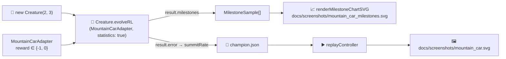

## Summary

Replaces the legacy per-generation telemetry plumbing in `mountain_car/mountain_car.ts` with the
milestone-only pattern already adopted by `cart_pole`. `evolveMountainCarController()` now reads the
`EvolveRLMilestone[]` array surfaced by `Creature.evolveRL(..., { statistics: true })`, drops the
snapshot strip, evolution chart, fitness chart, topology chart, evolution CSV, and every
`onGeneration` / `onTrainingEvent` / `onEpisodeTrials` hook, and emits a single dual-axis
`renderMilestoneChartSVG` at `docs/screenshots/mountain_car_milestones.svg`. Aligns with the #298
decision record that NEAT-AI only supports milestone-cadence telemetry. Closes #290.

## Evidence

End-to-end runner output on `seed=12345`:

```
✅ Solved after 2855 generations (summit=100%, score=1000.00, threshold=80%, stop=target, wallclock=53.7s).
💾 Saved champion to .synthetic-mountain-car/creatures/champion.json
🖼️  Wrote screenshot docs/screenshots/mountain_car.svg (154 frames captured)
📈 Wrote milestone chart docs/screenshots/mountain_car_milestones.svg (10 milestones)
```

Both required artefacts are produced.



## Test Plan

- `deno test mountain_car/mountain_car_test.ts` — **22 passed, 0 failed (43s)**.
- New / migrated tests:
  - `evolveMountainCarController gen-1 milestone sits well below the threshold` — replaces the old
    per-generation noise test; reads from `result.milestones[0]`.
  - `evolveMountainCarController collects milestone samples and the chart SVG round-trips` —
    renders `renderMilestoneChartSVG` over the run output and asserts every series is present.
  - `MILESTONE_SVG_PATH points at the documented milestone chart`.
- Adapter-level tests (`observationLength`, `maxSteps`, deterministic `reset`, terminal-step reward
  shaping, `decodeAction`, `assertContract` compliance) kept green.
- Snapshot / evolution-strip / fitness-chart / topology-chart / CSV tests removed alongside the
  surfaces they tested (per #290 acceptance criteria).
- Gen-1 still seeds from `new Creature(2, 3)` — no warm start, per the no-warm-start policy.

## Notes

- Removed deprecated artefacts: `docs/screenshots/mountain_car/`,
  `docs/screenshots/mountain_car_evolution.svg`, `docs/data/mountain_car/evolution.csv`.
- Common helpers (`evolution_snapshot.ts`, `evolution_progress_svg.ts`, `evolution_chart.ts`,
  `fitness_chart.ts`) are still used by `snake_game` and `lunar_lander`, so they remain in
  `common/`.
- `EvolveOptions` keeps its `mutationStrength` / `addNeuronRate` / `trialSeed` fields for
  backwards-compatible call sites; the values are documented as ignored under `evolveRL()` (matches
  the `cart_pole` convention).
