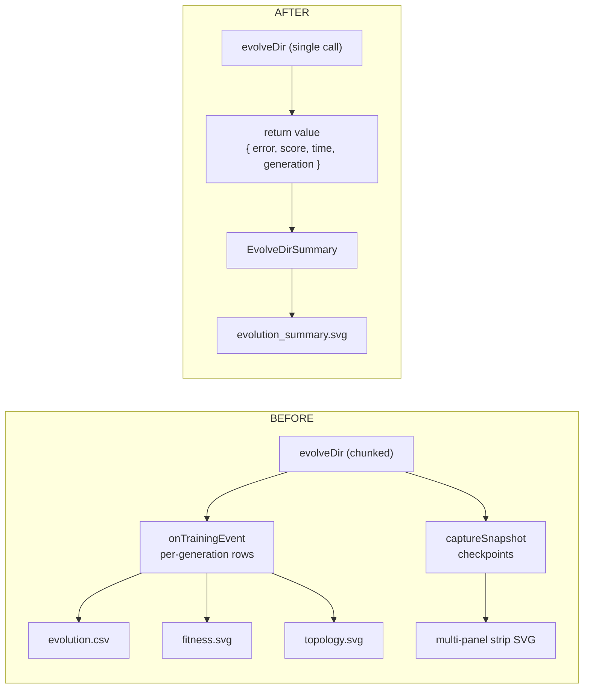

## Summary

Retires the per-generation `onTrainingEvent` / `onGeneration` hooks, the chunked `evolveDir` loops,
the per-generation CSV / fitness / topology charts, and the multi-panel checkpoint strip from the
three supervised `evolveDir`-flow examples (`xor_classification`, `stock_market`,
`evolution_showcase`). Each example now makes a single `Creature.evolveDir(...)` call, captures its
`{ error, score, time, generation }` return value, and renders a single milestone-summary SVG via
the shared `renderEvolveDirSummarySvg` helper from #284. This aligns the three heaviest
per-generation telemetry consumers in the supervised-batch category with NEAT-AI's supported
milestone-only telemetry surface (see #298 for the decision record). Closes #301.

## Evidence

Backend / CLI change with no web interface to screenshot. Verified by:

- New / updated unit tests in
  [`xor_classification/xor_classification_test.ts`](../xor_classification/xor_classification_test.ts),
  [`stock_market/stock_market_test.ts`](../stock_market/stock_market_test.ts), and
  [`evolution_showcase/evolution_showcase_test.ts`](../evolution_showcase/evolution_showcase_test.ts).
  Each suite now exercises the new return-value path (happy + missing-fields error case) and asserts
  the rendered milestone SVG contains every numeric callout from the run summary.
- Local example runs:
  - `./xor_classification/run.sh` → `✅ Solved after 39 generations (error=0.0078, fitness=0.9922)`,
    seed=3/2 → final=5/8.
  - `./stock_market/run.sh` → 202 generations, fitness 0.7686, test balanced accuracy 55.20%.
  - `./evolution_showcase/run.sh` → 3003 generations, final error 0.1621, seed=5/4 → final=32/117.
- `./quality.sh` passes for every changed example. The only failing item in the local quality run
  is the pre-existing `docs/archive_test.ts::"No PR summary files remain in docs/ root"` check,
  which is unrelated to this issue.

### Data-flow change (gitGraph)

## Test Plan

- [x] Added/updated `evolveXorController returns a milestone EvolveDirSummary with finite numeric fields`
- [x] Added/updated `evolveXorController milestone summary renders an SVG containing each numeric callout`
- [x] Added/updated `renderEvolveDirSummarySvg rejects a summary with missing numeric fields` (XOR)
- [x] Added/updated `evolveStockController returns a milestone EvolveDirSummary with finite fields`
- [x] Added/updated `evolveStockController milestone summary renders an SVG containing each numeric callout`
- [x] Added/updated `evolveStockController throws when dataDir is missing`
- [x] Added/updated `runMinimalSeedShowcase returns a milestone EvolveDirSummary built from evolveDir's return value`
- [x] Added/updated `runMinimalSeedShowcase milestone summary renders an SVG containing each numeric callout`
- [x] Added/updated `renderEvolveDirSummarySvg rejects a summary with missing numeric fields` (evolution_showcase)
- [x] Removed tests that asserted on per-generation CSV rows, the deprecated snapshot-strip panel
      count, and the deprecated fitness / topology SVG renderers.
- [x] `deno fmt`, `deno lint`, and `deno check **/*.ts` all clean for the three changed packages.

## Notes

- Gen-1 still starts from uniform-random noise — the no-warm-start policy from `AGENTS.md` is
  preserved. `buildRandomSeedCreature` in `xor_classification` and `stock_market` continues to seed
  the library's PRNG and defer to `new Creature(...)`; `evolution_showcase` continues to pass
  `new Creature(INPUT_COUNT, OUTPUT_COUNT)` straight into `runMinimalSeedShowcase`.
- Deprecated artefact files under `docs/screenshots/{xor_classification,stock_market,evolution_showcase}/`
  (`evolution.csv`, `evolution.svg`, `fitness.svg`, `topology.svg`) and the top-level strip SVGs
  (`xor_classification_evolution.svg`, `stock_market_evolution.svg`, `evolution_showcase_evolution.svg`)
  are deleted; the regenerated `evolution_summary.svg` for each example is committed.
- Shared helpers (`common/evolution_chart.ts`, `common/fitness_chart.ts`,
  `common/evolution_snapshot.ts`, `common/evolution_progress_svg.ts`) are still in use by other
  examples and are intentionally left untouched.
