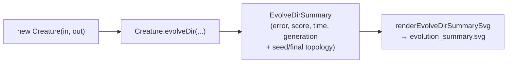
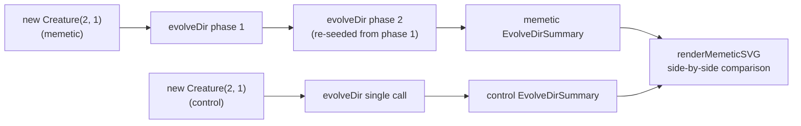

## Summary

Drops per-generation `onTrainingEvent` telemetry from `mcmc_acceptance`, `memetic_evolution`,
`neuron_pruning`, and `synthetic_synapse`. Each example now uses NEAT-AI's supported milestone-only
telemetry surface — `Creature.evolveDir`'s return value — and renders a single milestone summary
SVG via the shared `renderEvolveDirSummarySvg` helper from #284. Closes #303.

- `mcmc_acceptance.ts` keeps its **acceptance-rate cooling toward 23.4%** chart (driven by the
  analytical Metropolis-Hastings sampler, not NEAT-AI telemetry). The previous secondary
  per-generation `evolveDir` curve is removed; the run is summarised via a single milestone SVG
  at `docs/screenshots/mcmc_acceptance/evolution_summary.svg`.
- `memetic_evolution.ts` keeps its **memetic vs control fitness comparison**, re-sourced from two
  `EvolveDirSummary` records (one per run). The headline SVG is now a side-by-side milestone-panel
  comparison; the previous green-dashed "memetic seed applied" marker is replaced by an annotation
  strip on each summary panel naming the seeding event.
- `neuron_pruning.ts` keeps its topology before/after panel — the held-out score callouts are now
  sourced from the new `EvolveDirSummary` exposed on the demo result, with the milestone summary
  SVG written to `docs/screenshots/neuron_pruning/evolution_summary.svg`.
- `synthetic_synapse_example.ts` keeps its three-panel topology + bar chart — the held-out score
  callouts are now sourced from the two `EvolveDirSummary` records (sparse + refine) exposed on
  the demo result, with the refine-phase milestone summary SVG written to
  `docs/screenshots/synthetic_synapse/evolution_summary.svg`.
- Removed all `onTrainingEvent` blocks, `EvolutionRow` helpers, chunked `evolveDir` loops,
  `formatEvolutionCsv`, `renderEvolutionChartSVG`, `renderFitnessChartSvg`,
  `renderTopologyChartSvg`, and the associated path constants (`EVOLUTION_CSV_PATH`,
  `FITNESS_SVG_PATH`, `TOPOLOGY_SVG_PATH`, `EVOLUTION_CSV_HEADER`).
- For `memetic_evolution`, the analytical fixed-topology weight-vector simulation
  (`runMemeticEvolution` and its `FitnessRecord` / archive helpers) was replaced by a real
  two-run `evolveDir` comparison (`runMemeticAndControlEvolution`), so the headline narrative is
  expressed through the same telemetry surface as the other migrated examples.
- Deleted deprecated artefacts under `docs/data/<example>/` and
  `docs/screenshots/<example>/fitness.svg|topology.svg` for all four examples.

## Evidence

Generated milestone SVGs from real `./<example>/run.sh` invocations:

- `docs/screenshots/mcmc_acceptance/evolution_summary.svg` — minimal-seed evolved champion in
  980 generations / 5.5s, final score 0.9805 (target error reached), topology 4/3 → 11/34.
- `docs/screenshots/memetic_evolution.svg` — memetic vs control milestone-comparison panel;
  memetic finished at score 0.9801 in 256 gens / 1.7s, control at 0.9755 in 253 gens / 1.1s,
  fitness lift +0.0046.
- `docs/screenshots/neuron_pruning/evolution_summary.svg` — single evolveDir run, 119 gens / 1.7s,
  final score 0.9957 (target error reached); pre-prune topology 12/18 → post-prune 9/16 with no
  held-out score regression (-0.0362 both sides).
- `docs/screenshots/synthetic_synapse/evolution_summary.svg` — refine-phase milestone summary
  from 253 gens / 5.2s, final score 0.9300; sparse phase 31 synapses → refine 43 → pruned 37,
  pruned-phase held-out score -0.1499 (improves over sparse -0.1579).

Memetic variant — two evolveDir runs feeding one comparison SVG:

## Test Plan

All 75 tests across the four affected examples pass. Tests updated to exercise the new return-value
path; deprecated per-generation row / CSV / topology-and-fitness chart tests removed.

- `mcmc_acceptance_test.ts` — added `runMinimalSeedEvolution evolves from new Creature(input,
  output) and returns a milestone summary` and `renderEvolveDirSummarySvg renders a summary
  derived from runMinimalSeedEvolution`. Dropped `EvolutionRow`, `formatEvolutionCsv`,
  `rowsToFitnessSamples`, `rowsToEvolutionSamples` tests (those helpers were removed).
- `memetic_evolution_test.ts` — added `runMemeticAndControlEvolution returns two milestone
  summaries from minimal seeds`, `runMemeticAndControlEvolution rejects invalid configs`, and
  `renderMemeticSVG renders a milestone comparison panel with seeding annotations` /
  `... accepts a custom control seeding annotation`. Dropped the analytical `runMemeticEvolution`,
  archive, mini-batch, mutate-weights, and per-generation CSV / chart tests.
- `neuron_pruning_test.ts` — added `runNeuronPruningDemo returns a milestone summary from a
  single evolveDir call` and `renderEvolveDirSummarySvg renders the milestone summary derived
  from runNeuronPruningDemo`. Dropped per-generation telemetry, CSV, fitness / topology chart
  tests.
- `synthetic_synapse_example_test.ts` — added `runSyntheticSynapseDemo returns milestone summaries
  from sparse and refine phases` and `renderEvolveDirSummarySvg renders the refine milestone
  summary`. Dropped per-generation telemetry, CSV, fitness / topology chart tests.

End-to-end verification:

- `deno test mcmc_acceptance/ memetic_evolution/ neuron_pruning/ synthetic_synapse/` — 75 passed.
- `deno check`, `deno lint`, and `deno fmt --check` are clean for all four directories.
- `./mcmc_acceptance/run.sh`, `./memetic_evolution/run.sh`, `./neuron_pruning/run.sh`,
  `./synthetic_synapse/run.sh` all complete successfully and regenerate the canonical artefacts
  in seconds on a developer machine.
