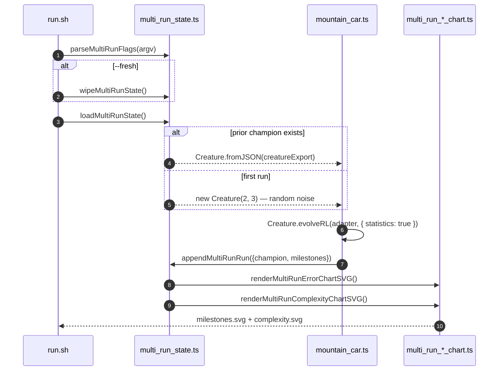

## Summary

Wires the `mountain_car` example to the shared multi-run persistence helper and aggregate chart
renderers (issues #318 / #319 / #320), simultaneously subsuming the single-run milestone migration
from #290. Each invocation now reloads the previously-saved champion via `loadMultiRunState`,
parses `--fresh` / `--timeout=<minutes>` / `--target-error=<value>` flags with
`parseMultiRunFlags`, evolves further via `Creature.evolveRL(... statistics: true)`, and appends
fresh milestones to the merged history. The runner re-renders both multi-run chart SVGs
(`docs/screenshots/mountain_car/milestones.svg` + `complexity.svg`) on every run. Closes #323.

## Evidence

- `./quality.sh` reports `SUCCESS: Mountain Car Control Example` and all 27 mountain_car unit tests
  pass (Deno fmt, lint, type-check, and the mountain_car suite). Pre-existing failures in
  `snake_game` and `docs/archive_test.ts` are unrelated to this issue.
- Canonical artefacts committed from a real ~2m24s training run via
  `./mountain_car/run.sh --fresh`:
  - `docs/data/mountain_car/creature.json`
  - `docs/data/mountain_car/milestones.json` — 10 cumulative milestones at gens
    1, 2, 5, 10, 20, 50, 100, 200, 500, 1000
  - `docs/screenshots/mountain_car/milestones.svg` (multi-run error chart)
  - `docs/screenshots/mountain_car/complexity.svg` (multi-run complexity chart)
  - Refreshed `docs/screenshots/mountain_car.svg` champion replay

🌱 **Gen 1 is uniform-random noise.** A `--fresh` invocation seeds evolution from
`new Creature(2, 3)`; resume invocations load the prior champion via `Creature.fromJSON` so the
multi-run chart shows one continuous noise → competent → polished arc across every run combined.

## Test Plan

Mountain-car test suite (`mountain_car/mountain_car_test.ts`, 27 tests):

- Existing adapter / scoring / replay / evolve / SVG tests retained.
- Replaced the retired `MILESTONE_SVG_PATH` test with `multi-run chart paths sit under the
  mountain_car slug directory` (asserts both chart paths + slug + multi-run defaults).
- Added `milestoneToMultiRunSample maps cumulative reward to normalised error`.
- Added `milestoneToMultiRunSample clamps error into [0, 1]`.
- Added `evolveMountainCarController honours seedCreatureExport — accepts the export and
  produces a valid run` (resume-path smoke test).
- Added `runMultiRunMountainCar resume flow loads prior creature, appends milestones, and renders
  charts` (end-to-end resume integration test using a temp `baseDir`).
- Added `runMultiRunMountainCar --fresh wipes prior artefacts before running` (verifies the
  `--fresh` flag resets `runIndex` to 1 and drops prior champion).

CI/quality gating: `quality.sh` now invokes the runner with `MOUNTAIN_CAR_QUICK=1` (mirroring the
cart-pole / snake-game / maze-navigation idiom) so the section finishes in seconds, writes its
artefacts under a temp directory, and never overwrites the canonical docs creature / milestones /
charts.
