## Summary

Wired `lunar_lander` to the shared multi-run persistence helper (`common/multi_run_state.ts`) and
the multi-run chart pair (`common/multi_run_error_chart.ts` + `common/multi_run_complexity_chart.ts`),
subsuming the single-run milestone-chart migration tracked by #292. Each invocation now resumes
from the previously-saved champion under `docs/data/lunar_lander/`, appends its milestones to the
merged history, and re-renders `docs/screenshots/lunar_lander/milestones.svg` plus
`docs/screenshots/lunar_lander/complexity.svg`. `--fresh` wipes prior state; `--timeout=<minutes>`
and `--target-error=<value>` override the stop conditions (defaults: 5-minute timeout, target error
0.01). Quick mode (`LUNAR_QUICK=1` / `--quick`) still works — it routes multi-run state into a
temp directory and forces an `iterations=3` cap. Closes #324.

## Evidence

- New tests in `lunar_lander/lunar_lander_test.ts` exercise the resume path
  (`runMultiRunLunarLander resume flow loads prior creature, appends milestones, and renders
  charts`) and the wipe (`runMultiRunLunarLander --fresh wipes prior artefacts before running`),
  plus a `seedCreatureExport` smoke test on `evolveLanderController`, a constants test asserting
  the new artefact paths, and `milestoneToMultiRunSample` mapping/clamping tests.
- Committed canonical artefacts from a real 5-minute training run:
  `docs/data/lunar_lander/creature.json`, `docs/data/lunar_lander/milestones.json`,
  `docs/screenshots/lunar_lander/milestones.svg`, `docs/screenshots/lunar_lander/complexity.svg`.
- `deno fmt`, `deno lint`, `deno check`, and the lunar_lander test suite (59 tests) pass.

The control flow now matches `mountain_car`, `cart_pole`, `snake_game`, and `maze_navigation`:

```mermaid
flowchart LR
    ARGS["CLI args: --fresh / --timeout / --target-error"] --> PARSE["parseMultiRunFlags"]
    PARSE -->|--fresh| WIPE["wipeMultiRunState(slug)"]
    PARSE --> LOAD["loadMultiRunState(slug)"]
    WIPE --> LOAD
    LOAD --> EVOLVE["evolveLanderController<br/>(seedCreatureExport = prior champion)"]
    EVOLVE --> CONVERT["milestones → MultiRunMilestone[]<br/>(error = -bestScore, clamped)"]
    CONVERT --> APPEND["appendMultiRunRun(slug)"]
    APPEND --> CHARTS["renderMultiRunErrorChartSVG<br/>renderMultiRunComplexityChartSVG"]
    CHARTS --> DOCS["docs/screenshots/lunar_lander/{milestones,complexity}.svg"]
```

## Test Plan

- [x] `deno test lunar_lander/lunar_lander_test.ts` — 59 tests pass, including new resume,
  `--fresh`, constants, and milestone-mapping coverage.
- [x] `deno fmt`, `deno lint`, `deno check` clean.
- [x] `./lunar_lander/run.sh --fresh` runs end-to-end and writes the four canonical multi-run
  artefacts (champion JSON, merged milestones JSON, error chart SVG, complexity chart SVG).
- [x] `LUNAR_QUICK=1 ./lunar_lander/run.sh` exits via the iterations cap inside seconds without
  touching canonical docs artefacts.

### Notes

The pre-existing `docs/archive_test.ts → "No PR summary files remain in docs/ root"` failure is
unrelated to this change — historic `docs/pr-summary-*.md` files in the repository's `docs/` root
were already tracked before this issue began. All lunar_lander tests pass.
