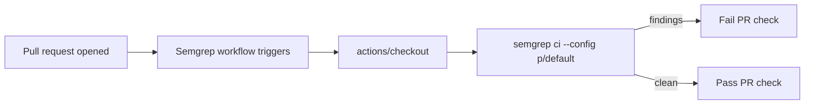

## Summary

Adds a Semgrep SAST scanning GitHub Actions workflow that runs on every pull
request. The job runs the Semgrep CLI inside the official `semgrep/semgrep`
container image against the `p/default` community ruleset, with results
optionally uploaded to Semgrep AppSec Platform when `SEMGREP_APP_TOKEN` is
configured. Closes #34.

## Evidence

This change is a CI configuration only — there is no UI to screenshot.
Verification was done by:

- Adding `.github/workflows/semgrep_test.ts` (TDD) with 9 tests that parse
  the workflow YAML and assert on its structure (name, triggers,
  permissions, jobs, container image, semgrep invocation, and SHA-pinned
  actions). All tests pass:

  ```
  ok | 9 passed | 0 failed
  ```

- Running `./quality.sh` end-to-end — lint, format, full test suite, and
  every example program completed successfully.



## Test Plan

- Added `.github/workflows/semgrep_test.ts` covering:
  - Workflow file exists and parses as valid YAML
  - Workflow has a descriptive `name`
  - Workflow triggers on `pull_request` events
  - Workflow declares read-only `contents` permission
  - Workflow defines at least one job
  - Workflow checks out the repository
  - Workflow runs `semgrep` to perform SAST scanning
  - Workflow uses the `semgrep/semgrep` container image
  - Workflow pins all `uses:` actions to 40-character commit SHAs
- Re-ran the full project quality gate (`./quality.sh`) — all checks pass.
