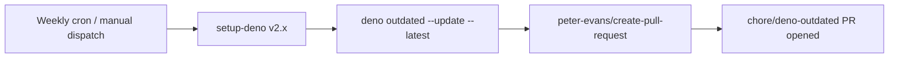

## Summary

Adds a new GitHub Actions workflow, `.github/workflows/deno-outdated.yml`, that runs
`deno outdated --update --latest` weekly (and on demand) and opens a pull request with
the refreshed `deno.json` / `deno.lock`. Closes #36.

## Evidence

This is a CI/configuration change with no UI to screenshot. Verification is via the
new YAML-parsing tests in `.github/workflows/deno_outdated_test.ts` and the full
`./quality.sh` run, both of which pass cleanly.

## Test Plan

- Added `.github/workflows/deno_outdated_test.ts` covering:
  - file is valid YAML and has a name
  - schedule + workflow_dispatch triggers are present
  - `contents: write` and `pull-requests: write` permissions are declared
  - `denoland/setup-deno` step is present
  - a step runs `deno outdated --update --latest`
  - `peter-evans/create-pull-request` is used to open the PR
- All seven new tests pass under `deno test`.
- `./quality.sh` passes end-to-end (lint, fmt, unit tests, all example runs).
