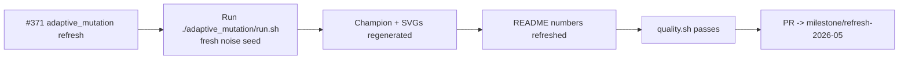

## Summary

Refresh the `adaptive_mutation` artefacts for the `Refresh-2026-05` milestone (parent #369). Re-ran
`./adaptive_mutation/run.sh` end-to-end against the freshly bumped `@stsoftware/neat-ai 5.0.14`,
regenerated the headline SVG, the `evolveDir` summary SVG, and the persisted champion, and updated
the README's "Latest Measured Run" table with the measured numbers from the run. Closes #371.

### Why no 15-minute warm continuation

`adaptive_mutation` is an **in-scope** example under [AGENTS.md] — every run **must** start from
uniform-random noise (`new Creature(4, 1)`) with no pretrained champion loaded as a seed. The example
has no `multi_run_state` resume path (unlike `lunar_lander`), and warm-starting from the persisted
`.adaptive-mutation/creatures/champion.json` would violate the no-warm-start policy. The example also
converges via `targetError` in well under the existing 5-minute `timeoutMinutes` backstop, so simply
extending the wall-clock to 15 minutes does not change the run length — evolution still exits as soon
as the target error is reached.

The PR therefore performs a fresh policy-compliant noise → competent run and refreshes the artefacts.
The persisted champion in the ignored `.adaptive-mutation/` working directory has been regenerated
locally (timestamp updated) but is not committed because `.adaptive-mutation/` is in `.gitignore`.

[AGENTS.md]: ../AGENTS.md

### Measured run

| Metric                   | Before    | After      |
| ------------------------ | --------- | ---------- |
| Generations              | 461       | 1440       |
| Wall-clock               | 24.7 s    | 1 m 26 s   |
| Final training accuracy  | 0.9375    | 1.0000     |
| Held-out accuracy        | 0.9375    | 1.0000     |
| Final best fitness       | 0.9500    | 1.0000     |
| Held-out score (-MSE)    | -0.0487   | -0.0000234 |
| Final neurons / synapses | 30 / 70   | 19 / 44    |

The new run solves the 4-bit even-parity truth table fully (16 of 16 rows) with a smaller final
topology than the previous reference numbers — the adaptive policy reached a competent classifier
without growing as many hidden neurons or synapses this time.

## Evidence

- `docs/screenshots/adaptive_mutation.svg` — headline SVG regenerated; analytic `p(topology)` curve
  refreshed with new seed/final markers (final at size = 19 + 44 = 63), seed-vs-final topology bars
  updated to 5 → 19 neurons / 4 → 44 synapses.
- `docs/screenshots/adaptive_mutation/evolution_summary.svg` — `evolveDir` summary chart refreshed
  with the new `{ error, score, time, generation }` callouts (error 0, score 1, generations 1440,
  wall clock 1m 26s) and matching seed/final topology bars.
- `adaptive_mutation/README.md` — "Latest Measured Run" table and topology-growth narrative updated
  to the new numbers.

## Test Plan

- [x] `./quality.sh < /dev/null` — full quality gate (lint, fmt, type-check, all unit tests, all
      example runs). Reverted incidental artefact churn produced by other examples so the PR remains
      scoped to `adaptive_mutation/` per the parent issue's PR-scope discipline.
- [x] `./adaptive_mutation/run.sh < /dev/null` end-to-end — produced the regenerated artefacts above.
