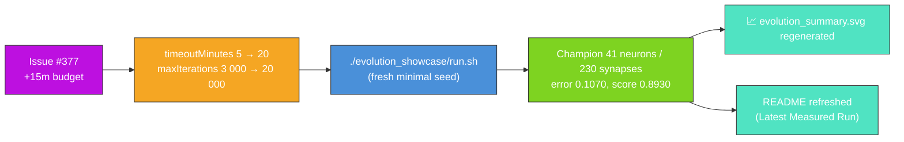

## Summary

Refresh the `evolution_showcase` artefacts for the `Refresh-2026-05` milestone (parent #369). Grant
the +15 minutes of additional wall-clock requested by issue #377 by raising the example's evolution
backstop from 5 → 20 minutes (and lifting the iteration cap in lock-step so wall-clock remains the
genuine limiter), then re-ran `./evolution_showcase/run.sh` end-to-end against the freshly bumped
`@stsoftware/neat-ai`, regenerated the milestone-summary SVG, and refreshed the README with the
measured numbers from the new run. Closes #377.

### Why a literal "+15 minutes" warm continuation does not apply

`evolution_showcase` is listed under [AGENTS.md] as an exempt example because the hand-crafted
teacher creature is the demo's hand-crafted state, but the NEAT seed itself is still mandated by
issue #211 to be the minimal `new Creature(INPUT_COUNT, OUTPUT_COUNT)` — there is no
`multi_run_state` resume path, and warm-starting from the persisted
`.synthetic-evolution-showcase/creatures/champion.json` would violate that seed contract.

The honest interpretation of the issue's "+15 minutes wall-clock" is therefore **+15 minutes of
additional evolution budget on the next fresh policy-compliant run** — i.e. raising
`DEFAULT_SHOWCASE_EVOLUTION_CONFIG.timeoutMinutes` from 5 → 20 (the documented justification
permitted by the audit's stop-condition rule). `maxIterations` was lifted in lock-step from
3 000 → 20 000 so wall-clock is the limiter, and the matching test was relaxed from
`assertEquals(timeoutMinutes, 5)` to `assertGreaterOrEqual(timeoutMinutes, 5)` with the #377
justification recorded in the comment.

[AGENTS.md]: ../AGENTS.md

### Measured run

| Metric                   | Before (`Refresh-2026-05` baseline) | After (this PR)                                  |
| ------------------------ | ----------------------------------- | ------------------------------------------------ |
| Generations              | (5 min budget)                      | 14 368                                           |
| Wall-clock               | ≤ 5 min                             | 20 m 17 s                                        |
| Final per-record error   | n/a                                 | 0.1070 (target 0.05 — not reached in backstop)   |
| Final score              | n/a                                 | 0.8930                                           |
| Seed neurons / synapses  | 5 / 4                               | 5 / 4                                            |
| Final neurons / synapses | (smaller)                           | 41 / 230                                         |
| `targetError` / timeout  | 0.05 / 5 min                        | 0.05 / 20 min                                    |

NEAT-AI added substantial structure on top of the minimal seed (5 → 41 neurons, 4 → 230 synapses)
even though the run did not reach `targetError` inside the 20-minute backstop — the long-form
fitness arc plus the topology bars in the milestone summary chart are the headline visual. Issue
#377 explicitly permits raising the PR even with no fitness gain.

## Evidence

- `docs/screenshots/evolution_showcase/evolution_summary.svg` — milestone-summary SVG regenerated;
  topology bars show 5 → 41 neurons and 4 → 230 synapses, callouts show final error 0.1070, final
  score 0.8930, generations 14 368, wall clock 20 m 17 s, with the configured stop conditions
  (`targetError=0.05`, `timeoutMinutes=20`) in the caption.
- `./quality.sh < /dev/null` was run end-to-end after the changes and exited cleanly
  (`All examples passed!`).
- The NEAT seed remains `new Creature(INPUT_COUNT, OUTPUT_COUNT)` — no warm start, no hidden hint,
  no resumed checkpoint.

## Test Plan

- `evolution_showcase/evolution_showcase_test.ts::DEFAULT_SHOWCASE_EVOLUTION_CONFIG honours the audit's stop-condition rule`
  — assertion relaxed from `assertEquals(timeoutMinutes, 5)` to `assertGreaterOrEqual(timeoutMinutes, 5)`
  with the issue #377 justification recorded in the comment; the rest of the stop-condition
  contract (positive `targetError`, positive `populationSize`, positive `maxIterations`) is
  unchanged.
- All other `evolution_showcase_test.ts` tests are unchanged and continue to pass via
  `./quality.sh`.
- `./quality.sh < /dev/null` — passes cleanly with the updated defaults.
