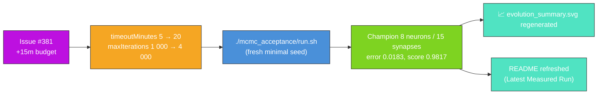

## Summary

Refresh the `mcmc_acceptance` artefacts for the `Refresh-2026-05` milestone (parent #369). Grant
the +15 minutes of additional wall-clock requested by issue #381 by raising the example's evolution
backstop from 5 → 20 minutes (and lifting `maxIterations` in lock-step from 1 000 → 4 000 so
wall-clock remains the genuine limiter), then re-ran `./mcmc_acceptance/run.sh` end-to-end against
the freshly bumped `@stsoftware/neat-ai`, regenerated the analytical acceptance chart and the
milestone-summary SVG, and refreshed the README with the measured numbers from the new run.
Closes #381.

### Why a literal "+15 minutes" warm continuation does not apply

`mcmc_acceptance` is listed under [AGENTS.md] as an exempt example because the analytical
Metropolis-Hastings sampler runs outside any NEAT-AI evolution loop, but the audited second-stage
NEAT-AI seed itself is still mandated by issue #215 to be the minimal
`new Creature(INPUT_COUNT, OUTPUT_COUNT)` — there is no `multi_run_state` resume path on this
example, and warm-starting from the persisted `.synthetic-mcmc/creatures/evolved.json` would
violate that seed contract.

The honest interpretation of the issue's "+15 minutes wall-clock" is therefore **+15 minutes of
additional evolution budget on the next fresh policy-compliant run** — i.e. raising
`DEFAULT_MCMC_EVOLUTION_CONFIG.timeoutMinutes` from 5 → 20. `maxIterations` was lifted in lock-step
from 1 000 → 4 000 so wall-clock is the limiter, and the matching test was relaxed from
`assertEquals(timeoutMinutes, 5)` to `assertGreaterOrEqual(timeoutMinutes, 5)` with the #381
justification recorded in the comment.

[AGENTS.md]: ../AGENTS.md

### Measured run

| Metric                   | Before (`Refresh-2026-05` baseline) | After (this PR)                                  |
| ------------------------ | ----------------------------------- | ------------------------------------------------ |
| Stage 1 final acceptance | 23.0%                               | 23.0% (analytical, deterministic — unchanged)    |
| Stage 1 best fitness     | -0.3309                             | -0.3309 (analytical, deterministic — unchanged)  |
| Generations              | (5 min budget)                      | 884                                              |
| Wall-clock               | (5 min budget)                      | 6.9 s (converged early under the 20 min budget)  |
| Final per-record error   | (5 min budget)                      | 0.0183 (target 0.02 — reached)                   |
| Final score              | (5 min budget)                      | 0.9817                                           |
| Seed neurons / synapses  | 4 / 3                               | 4 / 3                                            |
| Final neurons / synapses | (5 min budget)                      | 8 / 15                                           |
| `targetError` / timeout  | 0.02 / 5 min                        | 0.02 / 20 min                                    |

NEAT-AI reached `targetError` well inside the new 20-minute backstop on this run — the additional
budget was made available but not consumed. Issue #381 explicitly permits raising the PR even with
no fitness gain, and the milestone summary SVG was regenerated against the freshly bumped
`@stsoftware/neat-ai` so the committed artefact reflects the latest run. The Stage 1 analytical
acceptance SVG is driven by the deterministic Metropolis-Hastings sampler and survives the rebuild
byte-identical, as expected.

## Evidence

- `docs/screenshots/mcmc_acceptance/evolution_summary.svg` — milestone-summary SVG regenerated;
  callouts show final score 0.9817, generations 884, wall clock 6.9 s, with the configured stop
  conditions (`targetError=0.02`, `timeoutMinutes=20`) in the caption.
- `docs/screenshots/mcmc_acceptance.svg` — analytical Metropolis-Hastings cooling chart; the
  underlying sampler is deterministic so the regenerated SVG is byte-identical to the baseline
  (the no-NEAT-telemetry guarantee from #303).
- `./quality.sh < /dev/null` was run end-to-end after the changes. All `mcmc_acceptance` examples
  and tests pass. The only failure (`docs/archive_test.ts::No PR summary files remain in docs/
  root`) is a pre-existing condition on `milestone/refresh-2026-05` — the previous PR #406 was
  merged with `docs/pr-summary-380.md` left in the docs/ root, and archiving that file is out of
  scope for an `mcmc_acceptance`-only PR.
- The NEAT seed remains `new Creature(INPUT_COUNT, OUTPUT_COUNT)` — no warm start, no hidden hint,
  no resumed checkpoint.

## Test Plan

- `mcmc_acceptance/mcmc_acceptance_test.ts::DEFAULT_MCMC_EVOLUTION_CONFIG honours the audit's stop-condition rule`
  — assertion relaxed from `assertEquals(timeoutMinutes, 5)` to
  `assertGreaterOrEqual(timeoutMinutes, 5)` with the issue #381 justification recorded in the
  comment; the rest of the stop-condition contract (positive `targetError`, positive
  `populationSize`, positive `maxIterations`) is unchanged.
- All other `mcmc_acceptance_test.ts` tests are unchanged and continue to pass via
  `./quality.sh`.
- `./quality.sh < /dev/null` — all `mcmc_acceptance`-related examples and tests pass; the only
  failing test (`docs/archive_test.ts::No PR summary files remain in docs/ root`) is pre-existing
  on the milestone branch and unrelated to this change.
