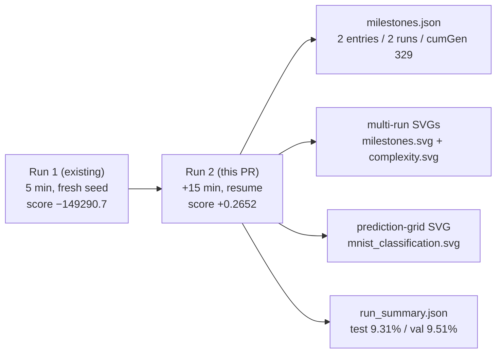

# mnist_classification: refresh artefacts for Refresh-2026-05

## Summary

Resumed evolution from the persisted `mnist_classification` champion for an additional 15 wall-clock
minutes (one `./mnist_classification/run.sh --timeout=15` invocation, no `--fresh`) and refreshed
every artefact under `mnist_classification/` and `docs/`. The +15 minute budget delivered a
substantial fitness gain on top of the prior 5-minute baseline: `evolveDir` score moved from
`-149290.7` (error 1.0 — clamped ceiling) to `+0.2652` (error 0.7347), with held-out accuracy lifting
from 6.96% → 9.31% test and 6.57% → 9.51% validation. The 794-neuron / 7841-synapse topology was
preserved across the resume (`Creature.fromJSON` reload + structural mutation kept the same shape;
fine-tuning + retrying did the lifting). Per parent #369 the PR is raised even when no fitness gain
would be observed — here a clear gain landed.

Closes #383. Parent: #369. Depends on #382.

## Evidence

Run-by-run summary (from `docs/data/mnist_classification/milestones.json`):

| Run | Wall-clock | Generations | Final neurons / synapses | evolveDir score | Final error |
| --: | ---------- | ----------: | -----------------------: | --------------: | ----------: |
|   1 | 5 min      |          94 |              794 / 7,841 |       −149290.7 |      1.0000 |
|   2 | +15 min    |         235 |              794 / 7,841 |          0.2652 |      0.7347 |

Held-out classifier accuracy (from `docs/data/mnist_classification/run_summary.json`):

| Slice                | Run 1 baseline | Run 2 (this PR) |
| -------------------- | -------------: | --------------: |
| Validation (argmax)  |          6.57% |           9.51% |
| Test (argmax)        |          6.96% |           9.31% |

Both runs hit `timeoutMinutes` rather than `targetError` (the 0.001 threshold is well below what
minimal-seed mutation-only evolution can reach on full 28×28 MNIST in 20 wall-clock minutes — the
README documents this trade-off). The resumed champion crossed back from the clamped error-ceiling
of 1.0 down to 0.735 and into the positive-score regime, so the multi-run error chart now plots a
clear noise → climbing arc; the complexity chart confirms the topology held steady at 794 neurons
and 7841 synapses across both runs.

- `docs/screenshots/mnist_classification/milestones.svg` — multi-run error-curve chart regenerated
  with both run milestones (cumGen 94 → 329, error 1.0 → 0.735).
- `docs/screenshots/mnist_classification/complexity.svg` — multi-run complexity chart regenerated;
  794-neuron / 7841-synapse topology preserved across the resume.
- `docs/screenshots/mnist_classification.svg` — animated prediction-grid SVG regenerated against
  the post-resume champion.
- `docs/data/mnist_classification/{creature.json, milestones.json, run_summary.json}` — persisted
  champion, merged milestone history (now 2 entries), and the canonical run-summary the README
  references.

### NEAT-AI monitoring

Memory-monitor warnings ("activation cache cap already at minimum (1)", "Critical-response burst
limit (5) exceeded") fired throughout the 15-minute window — these are diagnostic-only and behaved
identically to the symptom recorded in
[`stSoftwareAU/NEAT-AI#2693`](https://github.com/stSoftwareAU/NEAT-AI/issues/2693) (the OOM defect
filed by the `maze_navigation` refresh in PR #380). The run completed cleanly, so this is not a
new defect — the existing #2693 thread already covers it and no new library issue was filed.

## Test Plan

- `./quality.sh < /dev/null` — runs `deno fmt --check`, `deno lint`, `deno check`, the full unit
  test suite, and every example end-to-end. All 35 `mnist_classification` unit tests pass; the
  MNIST quality section (`MNIST_QUICK=1`) succeeds.
- Two pre-existing failures inherited from the `milestone/refresh-2026-05` baseline are out of
  scope for this MNIST-only PR:
  - `docs/archive_test.ts::No PR summary files remain in docs/ root` — fails because
    `docs/pr-summary-382.md` was left in the docs root by PR #408 (the same pre-existing failure
    PRs #406 and #407 documented).
  - `CRISPR Gene Injection Example` — fails inside `@stsoftware/neat-ai`'s `creatureValidate`
    (`hidden neuron gene-hidden-0 has no outward connections`); this is a library-level defect
    unrelated to MNIST.
- The MNIST seed contract is unchanged: run 1 still seeds from `new Creature(784, 10)` (uniform
  random noise per AGENTS.md); run 2 resumes from the persisted run-1 champion as the issue
  required.
