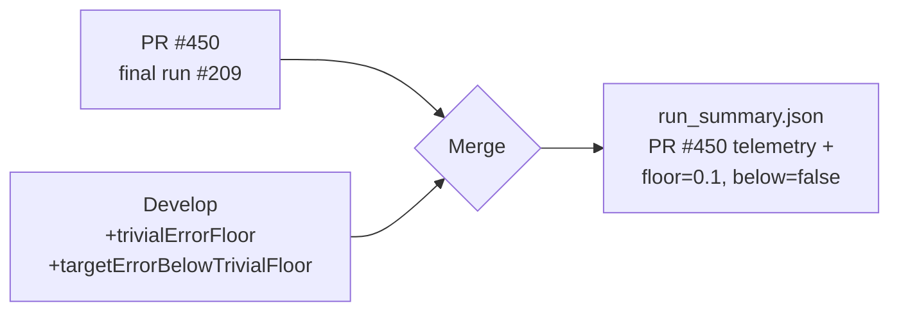

## Summary

Resolved the merge conflict between PR #450 (`mnist-evolution-90pct`) and
`Develop`. Develop's issue #446 work added two schema fields
(`trivialErrorFloor`, `targetErrorBelowTrivialFloor`) to
`docs/data/mnist_classification/run_summary.json`, which conflicted with the
final 209-run campaign artefact in PR #450.

Resolution preserves PR #450's measured final-run telemetry and adds the new
schema fields with values derived from those measurements:

- `trivialErrorFloor`: `0.1` — MNIST has 10 classes, so `1 / CLASS_COUNT = 0.1`.
- `targetErrorBelowTrivialFloor`: `false` — the campaign used
  `--target-error=0.1`, which equals (not below) the trivial floor, matching
  the warning emitted by `mnist_classification.ts` on Develop.

All other Develop changes (`common/multi_run_state.ts`,
`mnist_classification.ts`, `mnist_classification_test.ts`, `AGENTS.md`,
archive notes) merged cleanly without conflicts.

Closes #451.

## Evidence

CLI / data-only change — no UI to screenshot.

- `./quality.sh < /dev/null` passes after the merge (exit code 0; "All
  examples passed!").
- The resolved `run_summary.json` is valid JSON and conforms to the
  Develop-side schema in `common/multi_run_state.ts` (issue #446).

## Test Plan

- [x] `./quality.sh < /dev/null` — all examples pass, including the MNIST
  suite which loads `run_summary.json`.
- [x] Manual schema check: resolved JSON contains every key from the
  Develop schema and parses cleanly.
- [x] PR #450 remaining files (`creature.json`, `milestones.json`, SVGs)
  required no merge — they were modified only on the PR branch.
