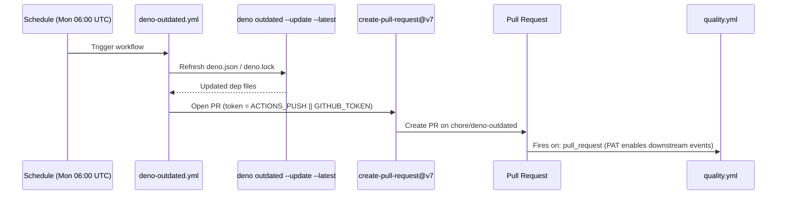

## Summary

Aligned the existing Deno Dependency Updates workflow (`.github/workflows/deno-outdated.yml`) with the template specified in issue #50 by adding the `token: ${{ secrets.ACTIONS_PUSH || secrets.GITHUB_TOKEN }}` field to the `peter-evans/create-pull-request` step. Without an org-level PAT, PRs opened by `GITHUB_TOKEN` do not trigger downstream `on: pull_request` workflows (e.g. `quality.yml`); the fallback to `GITHUB_TOKEN` keeps the workflow functional when the secret is unset (Issue #1636). Closes #50.

## Evidence

CLI workflow change — no UI to screenshot. Verified via TDD:

1. Added `deno-outdated workflow uses ACTIONS_PUSH PAT with GITHUB_TOKEN fallback` test that asserts the `token` field is present in the create-pull-request step and references both `secrets.ACTIONS_PUSH` and `secrets.GITHUB_TOKEN`.
2. Confirmed the test failed against the unmodified workflow.
3. Updated the workflow with the token line and verified all 8 tests pass.

```text
ok | 8 passed | 0 failed (11ms)
```

The remaining `quality.sh` failures (Deno type-check errors in `intelligent_design/` and a WASM error in the crossover example) are pre-existing on `Develop` and unrelated to this change — confirmed by running `quality.sh` against the unmodified base branch.



## Test Plan

- Added `deno-outdated workflow uses ACTIONS_PUSH PAT with GITHUB_TOKEN fallback` to `.github/workflows/deno_outdated_test.ts`.
- All 8 tests in `deno_outdated_test.ts` pass.
- All 61 workflow tests in `.github/workflows/` pass.
